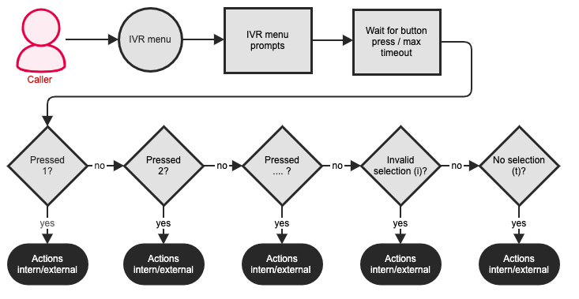


 




## Concept

IVRs (Interactive Voice Response Menus) are used to route a caller through the phone system by selecting menu options via their telephone keypad. For example, 50 % of all calls to the central switchboard might actually be intended for the marketing or support department. In this case, using an IVR to direct calls to the relevant department directly could be beneficial in taking some load of off the [central switchboard](https://www.pascom.net/en/call-center/ "pascom ContactCenter Tools").

The IVR could then offer the following options to the user:

> "Press **1** to talk to the **sales department** or **2** if you wish to talk to our **support staff**. If you would like to be directed to the **central office**, please **hold** ..."

### Process flow of an IVR

When a IVR menu is entered, the following procedures are executed:  

As the first step of the IVR flow, an announcement you choose is played. To learn how to record your own announcements, please see Custom Prompts and Music On Hold. Your announcement could be structured similar to this example:

> "Press 1 for sales department or 2 for the support department. If you do not select any option, you will automatically be directed to the central office..."

After the announcement, the system waits for the user to press a key for as long for a specified amount of time which you can set using the **timeout** function in the IVR menu. In our experience, a 5 second timeout is usually enough.

If the caller presses a button with a corresponding **entry**, the associated actions will then be carried out.

If the caller presses a button with **no corresponding entry**, the entry with the special number i (as in Invalid) is called. Actions associated with this number should make the caller aware of the invalid key that was pressed and should offer the IVR menu to the caller again.

If the caller **doesn't press any button** during the **timeout**, the entry with the special number t (as in Timeout) is called. Actions associated with this number should make the caller aware that no key was pressed and should offer the IVR menu to the caller again or the caller should be put through to the central office.

### Multi-Stage IVRs

In many scenarios it makes sense to ask several questions in a row to put callers through to their desired destination. Firstly, you could ask the callers if they wished to be put through to the support department and then ask for a more specific support category (problems concering Windows, Linux, etc.) to select the appropriate staff member they can then talk to.

To create multi-stage IVRs, you can create any number of IVRs and forward calls from one IVR to another. This way, an arbitrary number of IVRs can be implemented.

{}
Preferably, you should not create nested IVRs that are deeper than two levels. Higher complexity leads to confusion and this is usually frustrating for the caller and therefore is not desirable.
{}

## Configuration

### Maintaining IVRs

In the pascom web interface, select  > . To add a new IVR, press . To modify an existing IVR, select it from the list and press .

|Parameter|Explanation|
|---------|---------|
|Title|The title of the IVR menu.
|Answer channel|Usually, the channel is answered immediately if there is hold music to be played or an announcement to be made. This option allows you to configure a delay (in milliseconds). In some cases, immediate answering of a call leads to the first syllable being skipped. The delay time mitigates this problem..|
|Timeout|The time in seconds that pascom waits for the caller to press a key after playing the announcements.
|Extension|The extension number for this IVR menu.|
|Upstream prompt|This announcement is played when the menu is entered and should contain text similar to "Press 1 to ..., 2 for ..., etc". To learn how to record your own announcements, please see Custom Prompts and Music On Hold.|

### Creating entries

In the pascom web interface, select  > . Select the IVR you wish to config / edit options for and press the  button. Here, you can define the available options (and configure the corresponding key) and how they should be handled once selected by the caller:

Press the  button to create a new entry.

|Parameter|Explanation|
|---------|---------|
|Title|General title for the entry.|
|Number| The key pressed by the caller. Valid keys are arbitrary **numbers** or **sequences of numbers**. Special numbers are **t** for timeout and **i** to signal that an invalid key was pressed (note that these two are characters and not numbers). To avoid overlapping keys either use single, double or triple digit combinations and avoid mixing these numbers.|

### Adding Actions to an Entry

For each entry, corresponding actions must exist that are to be carried out if and when a certain button is pressed.

In the pascom web interface, select  > , select the desired IVR and click the **Entries** button. Select the entry you want to modify and press the  button. Actions pertaining to the entry can be found in the **Intern** and **Extern** tabs.
