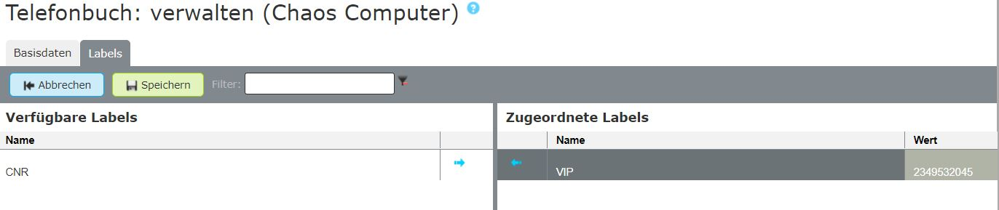
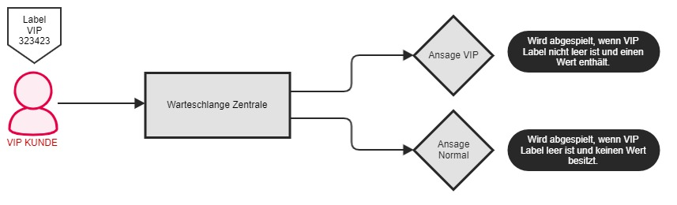
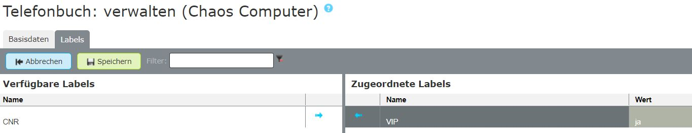
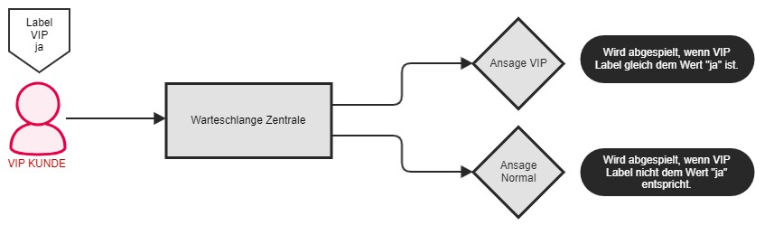
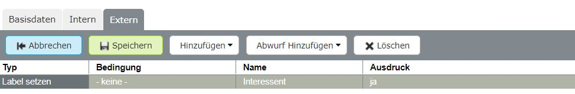
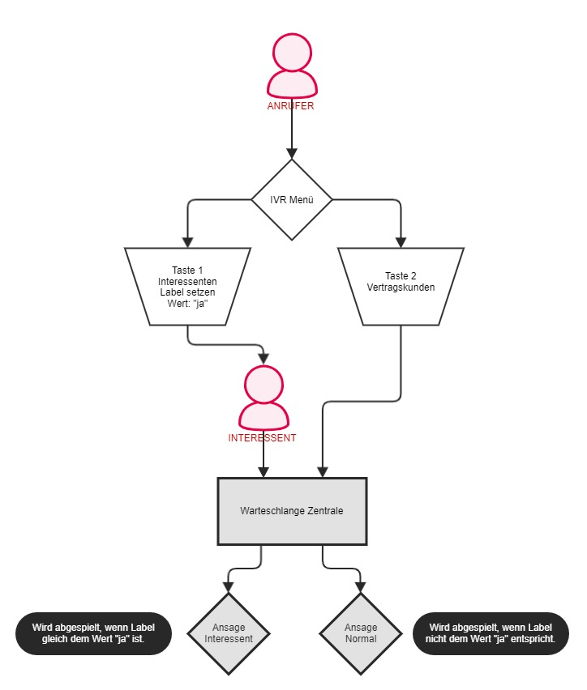


 


## Trainingsvideo
 

## Konzept

Labels sind sogenannte **"Container"** die Informationen beinhalten wie z.B. Kundennummer, VIP, Blacklist etc., welche die pascom Telefonanlage weiter verarbeiten kann. Labels unterscheiden sich in ***statische*** und ***dynamische*** Labels und finden an unterschiedlichsten Bereichen Ihre Anwendung.  

Wie unterscheiden sich Labels:

+ **Statisch:** Dienen nur als Container für Informationen wie z.B. Kundennummer, Mandatsnummer usw. die dann im Software Client für die Benutzer angezeigt werden. Wie Sie Labels einem Telefonbucheintrag hinzufügen, erklären wir Ihnen in dieser [Anleitung]()  
+ **Dynamisch:** Sind verknüpft mit einer [Aktionsbedingung]() wodurch die pascom Telefonanlage auf Labels reagieren kann. Zudem können Labels mit Bedingungen nicht nur Telefonbucheinträgen zugewiesen werden, sondern an jeder beliebigen Stelle Ihres Anrufverlaufs gesetzt und entsprechend geprüft werden. 

### Labels mit Aktionsbedingung anlegen

{}
Zur besseren Verständlichkeit, werden wir in diesem Beispiel einen VIP Kunden in einer Warteschlange anders begrüßen, als z.B. einen Interessenten.
{}

Zunächst benötigen Sie ein neues Label, dass Sie unter  >  mit einem Klick auf  anlegen können.

Wählen Sie ein **Generisches Label** und geben Sie dem Label den Namen **VIP**. Soll das Label für Benutzer im Client angezeigt werden, setzen Sie den entsprechenden Haken. Zusätzlich muss nun das Label mit einer **Aktionsbedingung** verknüpft werden. Abschließend klicken Sie auf .

- Wie Sie das Label einem Kunden im Telefonbuch zuweisen, erklären wir Ihnen in dieser [Anleitung]().
- Wie Sie Labels automatisiert importieren können, finden Sie in den Anleitungen zum [Telefonbuch]().

### Aktionsbedingung konfigurieren

Aktionsbedingungen lassen sich auf unterschiedliche Weise konfigurieren. In der Regel soll eine Aktionsbedingung auf einen bestimmten Wert reagieren. Hier lassen sich unbestimmte Werte aber auch explizite Werte abfragen. Wie das genau funktioniert, erklären wir Ihnen in den nachfolgenden Schritten. 

### Auf unbestimmte Werte reagieren

In dieser Art der Wertabfrage ist es egal, welchen Wert das Label hat. Hier wird nur geprüft, ob das Label überhaupt einen Wert hat oder nicht. Bei unserem VIP Kunden benutzen wir daher eine VIP-Kundennummer die eine beliebige Zeichenfolge besitzen kann. 

Die dazugehörige Aktionsbedingung finden Sie unter  >  die Sie nun mit einem Klick auf  anpassen können.

**Erklärung der Parameter**

|Parameter|Beschreibung|
|---|---|
|**MDC_Label-6**|Variable die hinter dem Label steckt und abgefragt wird.|
|**!=**|Ist der Operator der verwendet wird. In diesem Fall bedeuted das, wenn unser Wert in MDC_Label-6 **nicht gleich** dem abgefragten Wert entspricht.|
|**" "**|Platzhalter für den abgefragten Wert. In diesem Fall ist der Platzhalter leer.|

**Zusammenfassung**

Die Aktionsbedingung reagiert nun mit **true / false** wenn das MDC_Label-6 **nicht gleich** leer ist. Das erlaubt einen unbestimmten Wert in der VIP Variable, nämlich die VIP Kundennummer. Hat ein Anrufer (Telefonbucheintrag) ein leeres VIP Label zugewiesen, ergibt die Abfrage der Aktionsbedingung **false**.

**Beispiel**

In unserer Beispiel Warteschlange wurden 2 [Ansagen]() platziert. Kommt ein VIP Anrufer mit zugewiesenem VIP Label welches nicht leer ist, in die Warteschlange, wird die VIP Ansage für den Anrufer abgespielt. Ist das VIP Label leer oder wurde kein Label gefunden, wird die normale Ansage abgespielt. 

{}
Sofern beim Anlegen des Labels berücksichtigt, wird das Anruf Label den Benutzern im pascom Software Client mit dem entsprechenden Wert angezeigt.
{}

### Auf explizite Werte reagieren

In dieser Art der Wertabfrage wird ein Label auf einen bestimmten Wert abgefragt. Hier wird geprüft, ob der Wert des Anruf Label genau mit dem Wert in der Aktionsbedingung übereinstimmt. In folgendem Beispiel besitzt das VIP Label den Wert **ja**.

Die dazugehörige Aktionsbedingung finden Sie unter  >  die Sie nun mit einem Klick auf  anpassen können.

**Erklärung der Parameter**

|Parameter|Beschreibung|
|---|---|
|**MDC_Label-6**|Variable die hinter dem Label steckt und abgefragt wird.|
|**==**|Ist der Operator der verwendet wird. In diesem Fall bedeuted das, wenn unser Wert in MDC_Label-6 **gleich** dem abgefragten Wert entspricht.|
|**"ja"**|Platzhalter für den abgefragten Wert. In diesem Fall ist der Wert **ja**.|

**Zusammenfassung**

Die Aktionsbedingung reagiert nun mit **true / false** wenn das MDC_Label-6 **gleich** dem Wert in der Bedingung entspricht. Das erlaubt die Abfrage eines expliziten Wertes in der VIP Variable, nämlich ob VIP Label gleich **ja** ist. Hat ein Anrufer (Telefonbucheintrag) ein VIP Label zugewiesen, dessen Wert nicht mit der Aktionsbedingung übereinstimmt, ist der Rückgabewert **false**.

**Beispiel**

In der Beispiel Warteschlange wurden 2 [Ansagen]() platziert. Kommt ein VIP Anrufer mit zugewiesenem VIP Label, dessen Wert genau dem Wert der Aktionsbedingung entspricht, in die Warteschlange, wird die VIP Ansage für den Anrufer abgespielt. Stimmt der Wert des VIP Label nicht mit dem Wert der Bedingung überein, wird die normale Ansage abgespielt. 

{}
Sofern beim Anlegen des Labels berücksichtigt, wird das Anruf Label den Benutzern im pascom Software Client mit dem entsprechenden Wert angezeigt.
{}

### Labels dynamisch setzen und prüfen

Sie haben erfahren, dass Labels angehängt an Telefonbucheinträge Ihrer Kunden Informationen anzeigen und abgefragt werden können. Anruf Labels können noch vielseitiger eingesetzt werden und dynamisch an jedem Ort Ihres Anrufverlauf platziert werden. Die Verknüpfung eines Labels mit einer Aktionsbedingung bleibt über das gesamte pascom System persistent. Somit können Labels nicht nur abgefragt werden, sondern auch an einem bestimmten Punkt dem Anrufer mitgegeben werden. 

{}
Zur besseren Verständlichkeit, werden wir in diesem Beispiel einen Interessenten in einer Warteschlange anders begrüßen, als z.B. einen Vertragskunden.
{}

### Labels dynamisch setzen

Labels mit Aktionsbedingung können wie normale [Aktionen]() gesetzt werden. In folgendem Beispiel wurde das Label in einem IVR Menü gesetzt. Über  >  platzieren Sie das entsprechende Label.

|Parameter|Beschreibung|
|---|---|
|**Typ**|Label setzen|
|**Name**|Wählen Sie hier aus einem Dropdown Feld das entsprechende Label aus|
|**Ausdruck**|Geben Sie hier dem Label den Wert **ja** mit.|

**Zusammenfassung**

Wenn nun Ihre Kunden in das IVR Menü gelangen und die Taste 1 für Interessenten drücken, wird dem Anrufer für die Dauer des Anrufs das Label **Interessent** mitgegeben/angehängt. In der Warteschlange sind wieder 2 [Ansagen]() gesetzt. Gelangt nun der Anrufer mit dem **Interessenten Label** in die Warteschlange, hört dieser eine andere Ansage als z.B. Vertragskunden. 

**Beispiel**

{}
Das Label, welches in Ihrem Anrufverlauf gesetzt wurde, wird dem Anrufer nur für die Dauer des Anrufs mitgegeben und verschwindet nach dem Auflegen wieder. Wollen Sie Informationen dauerhaft Ihren Kunden zuweisen, hinterlegen Sie diese direkt in den Telefonbucheinträgen.
{}