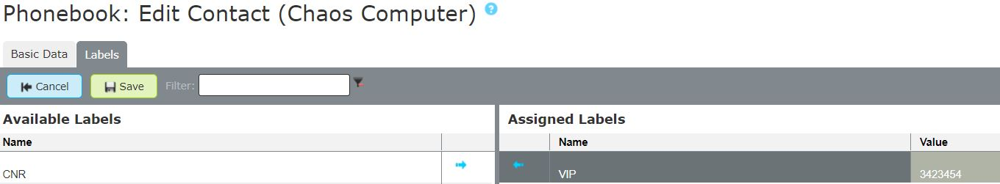
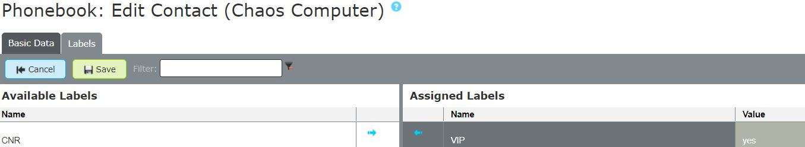
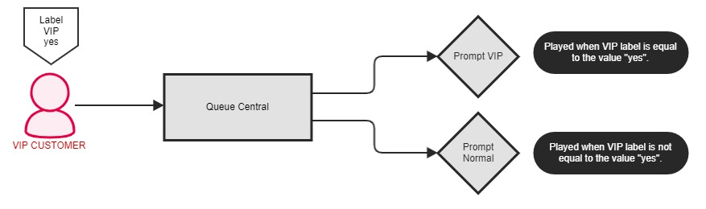
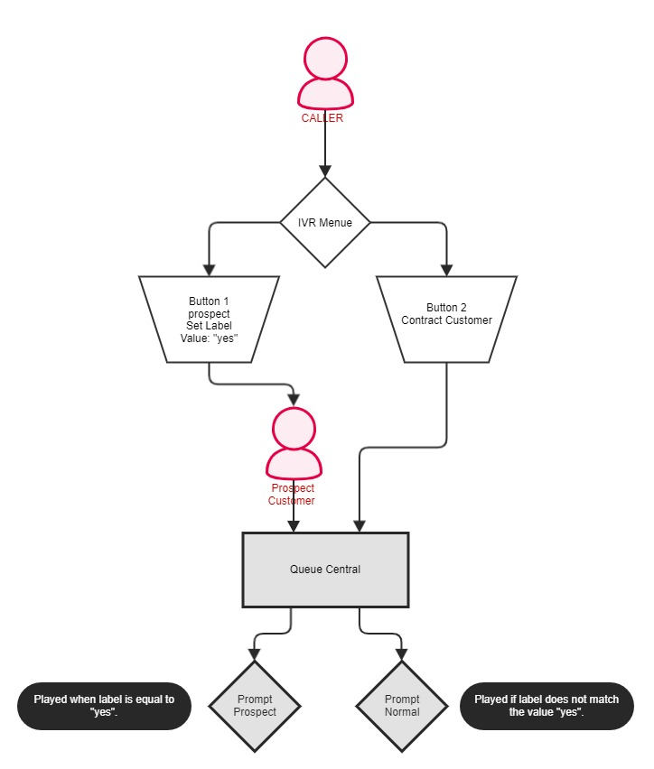


 


## Trainingsvideo
 

## Concept

Labels are so-called **"containers"** that contain information such as Customer number, VIP, blacklist etc., which the pascom telephone system can process. Labels are divided into ***static*** and ***dynamic*** labels and are used in various areas. 

How do labels differ:

+ **Static:** Only serve as a container for information such as Customer number, mandate number etc. which are then displayed in the software client for the users. We explain how to add labels to a phonebook entry in this [Tutorial] () 
+ **Dynamic:** Are linked to an [Action Condition]() whereby the pascom telephone system can react to labels. In addition, labels with conditions can not only be assigned to phonebook entries, but can also be set at any point in your call flow and checked accordingly.. 

### Create Labels with Conditions

{}
For better understanding, in this example we will greet a VIP customer in a queue differently than e.g. a normal costumer.
{}

First you need a new label that you can create with a click on >  and .

Choose a **generic label** and give the label the name **VIP**. If the label should be displayed to users in the client, check the corresponding box. In addition, the label must now be linked to an **action condition**. Finally click on .

- We explain how to assign the label to a customer in the phone book in this [Tutorial]().
- How to import labels automatically can be found in the tutorials for the [phonebook]().

### Configure the Action Condition

Action conditions can be configured in different ways. An action condition should react to a certain value. Here indefinite values ​​but also explicit values ​​can be queried. We'll explain exactly how this works in the following steps.

### React to indefinite values

In this type of value query, it doesn't matter what value the label has. Here it is only checked whether the label has any value or not. For our VIP customer we therefore use a VIP customer number which can have any character string.

The associated action conditions can be found under >  which you can now click on  and adjust.

**Explanation of the parameters**

|Parameter|Description|
|---|---|
|**MDC_Label-8**|Variable that is behind the label and is queried.|
|**!=**|Is the operator that is used. In this case this means if our value in MDC_Label-8 **does not equal** the queried value.|
|**" "**|Placeholder for the queried value. In this case the placeholder is empty.|

**Summary**

The action condition now returns **true / false** if the MDC_Label-8 Variable **is not** empty. This allows an indefinite value in the VIP label, namely the VIP customer number. If a caller (phonebook entry) has assigned an empty VIP label, the query of the action condition results in **false**.

**Example**

In our example queue, 2 [prompts] () were placed. If a VIP caller with an assigned VIP label that is not empty, comes into the queue, the VIP announcement is played for the caller. If the VIP label is empty or no label was found, the normal prompt is played.

{}
If considered when creating the label, the corresponding value is displayed to the users in the pascom software client.
{}

### React to explicit Values

In this type of value query, a label is queried for a specific value. Here it is checked the value of the call label exactly matches the value in the action condition. In the following example, the VIP label has the value **yes**.

The associated action conditions can be found under >  which you can now click on  and adjust.

**Erklärung der Parameter**

|Parameter|Beschreibung|
|---|---|
|**MDC_Label-8**|Variable that is behind the label and is queried.|
|**==**|Is the operator that is used. In this case this means if our value in MDC_Label-8 **equals** the queried value.|
|**"yes"**|Placeholder for the queried value. In this case the value is **yes**.|

**Summary**

The action condition now returns **true / false** if the MDC_Label-8 **equals** the value in the condition. This allows you to query an explicit value in the VIP label, namely whether VIP label is **yes**. If a caller (phonebook entry) has assigned a VIP label whose value does not match the action condition, the return value is **false**.

**Example**

In the example queue, 2 [prompts] () were placed. If a VIP caller with an assigned VIP label, whose value corresponds exactly to the value of the action condition, comes into the queue, the VIP prompt is played for the caller. If the value of the VIP label does not match the value of the condition, the normal prompt is played.

{}
If considered when creating the label, the corresponding value is displayed to the users in the pascom software client.
{}

### Set and Check Labels dynamically

You have learned that labels attached to your customers phonebook entries can display and be queried. Call labels can be used even more versatile and can be placed dynamically at any place in your callflow. The link between a label and an action condition remains persistent across the entire pascom system. This means that labels can not only be queried, but also given to the caller at a certain point.

{}
For better understanding, in this example we will greet a prospect in a queue differently than e.g. a contract customer.
{}

### Set Labels dynamically

Labels with an action condition can be set like normal [actions] (). In the following example, the label was set in an IVR menu. Use >  to place the corresponding label.

|Parameter|Description|
|---|---|
|**Typ**|Set a Label|
|**Name**|Select the appropriate label from a dropdown box|
|**Expression**|Enter/set the value **yes**|

**Summary**

If your customers now enter the IVR menu and press the 1 key for prospective customers, the caller will be given the **prospective** label for the duration of the call. In the queue there are again 2 [prompts] (). If the caller comes into the queue with the **prospective label**, he hears a different announcement than e.g. Contract customers.

**Example**

{}
The label that was set in your Callflow is only given to the caller for the duration of the call and disappears after hanging up. If you want to permanently assign information to your customers, store the label directly in the phonebook entries.
{}