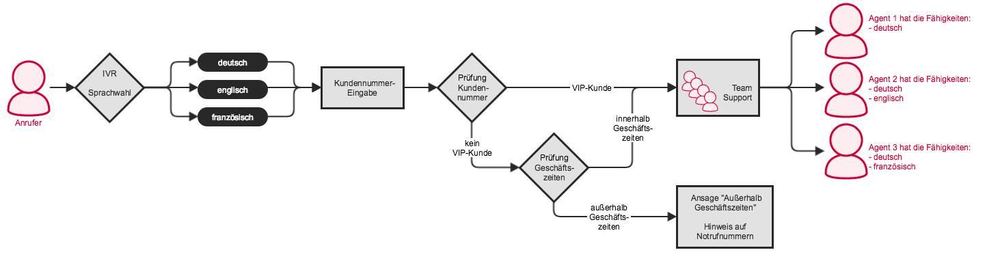


 


## Konzept

*Skill Based Routing* ermöglicht die Verteilung von Anrufern anhand von Fähigkeiten der Benutzer.

Funktionen:

* Definition von Fähigkeiten für Agenten eines Team;
* Warteschlagen mit *Skill Based Routing*-Unterstützung;
* Inline Skripte (Einzeilige Skripte, die in einer Aktion vorher/nachher durch Hinzufügen integriert werden können);
* Generische Labels (Labels, die für einen Anrufer gesetzt werden, z. B. als Information für den Agenten, Priorisierung eines Anrufers...)
* Anrufverteiler (prüft Bedingungen und löst Aktionen aus)

## Beispiel 1

### Übersicht

Der Anrufer muss über ein IVR-Menü die Sprache auswählen, anschließend gelangt er zum Team Support. Es klingelt nur bei den Agenten, die den Support in der ausgewählte Sprache anbieten.

### Konfiguration

#### 1. Fähigkeiten anlegen

Als erstes müssen Fähigkeiten für die Sprachen definieren werden:  >  > . Als Label wählen Sie *Fähigkeit*:

|Parameter|Beschreibung|
|---|---|
|Label Name|Vergeben Sie einen Namen für das Label|
|Im Client anzeigen|Ja/Nein - legt fest, ob die Client-Benutzer das Label sehen oder nicht.|
|Aktionsbedingung anlegen|Ja/Nein - legt fest, ob eine Aktionsbedingung angelegt wird. Falls ja, kann diese Aktionsbedingung bei Aktionen verwendet werden.|

#### 2. Benutzer zuweisen

Im Tab  kann das neu angelegte Label Benutzern zugewiesen werden.

Die Fähigkeiten können auch über die Benutzerverwaltung zugewiesen werden:  >  >  >  im Tab .

Werden an einem Benutzern Fähigkeiten verteilt, muss auch ein Level angegeben werden.

*In unserem Beispiel bieten alle drei Agenten Support für deutsch-sprachige Anrufer. Aber nur Agent 1 hat als einzige Fähigkeit deutsch, die beiden anderen Agenten haben noch eine weitere Fähigkeit.
So macht es Sinn dem Agenten 1 ein höheres Level für die Fähigkeit deutsch zu geben, damit ein deutschsprachiger Anrufer bevorzugt zu ihm durchgestellt wird.*

Damit in einem Team Fähigkeiten berücksichtigt werden, muss beim Anlegen des Teams das schon vorhandene Skript "Skill based routing" ausgewählt werden:  >  >  >  -> im Tab , das vierte Auswahlfeld "Routing Skript".

{}
Die Verwendung von Fähigkeiten hat den Vorteil, dass z. B. nur eine Warteschlange angelegt werden muss, obwohl man Anrufer hat, die verschiedene Sprachen sprechen. Es werden nur die Agenten angeklingelt, die die benötigte Fähigkeit haben.
{}

#### 3. IVR für Sprachauswahl

Für die Sprachauswahl erstellen wir ein [IVR-Menü]():  >  > .
Ist das IVR angelegt, müssen noch die Einträge angelegt werden und für diese: das gerade angelegte IVR markieren und auf  klicken.

Legen Sie am besten drei weitere Einträge an: Nummer **1** für *deutsch*, Nummer **2** für *englisch*, Nummer **3** für *französisch*. **i** für *invalid* (Ungültige Eingabe) und **t** für *timeout* (Zeit ist abgelaufen) sind bereits angelegt und müssen nur noch bearbeitet werden.

Nun müssen die Einträge bearbeitet und mit Aktionen befüllt werden. Als Beispiel sehen wir hier den Eintrag *deutsch*:

Zuerst wird das Label gesetzt:  > :
Als Name wählen Sie die Fähigkeit *deutsch*. Der Ausdruck gibt das kleine Level an, dass der Agent, der den Anruf bekommt, haben soll.

Sie können eine Channel-Sprache angeben, damit der Anrufer sonstige Ansagen in seiner ausgewählten Sprache hört.

{}
Wird für einen Anrufer ein Label gesetzt, gilt das Label bis zur Beendigung des Anrufs.
{}
{}
Labels werden (falls so eingestellt) einem Warteschlangen-Agenten als Information im Client angezeigt. Es können beliebig viele Labels pro Anrufer gesetzt werden.
{}

## Beispiel 2
### Übersicht

Nun wird das vorherige Beispiel erweitert. Nach der Sprachauswahl wird die Kundennummer abgefragt um zwischen VIP- und Nicht-VIP-Kunden zu unterscheiden. VIP-Kunden werden gleich zum Team Support weiterlgeleitet, bei Nicht-VIP-Kunden werden Geschäftszeiten geprüft.
 

### Konfiguration

#### 1. Generisches Label für Kundennummer
Nach der Sprachauswahl muss der Anrufer seine Kundennummer eingeben. Das wird mit einem *Generichen Label* realsiert: unter  >  >  > .

Das *Generische Label* hat eine **Kanalvariable** (in diesem Fall MDC_LABEL-9), die wir uns für die weitere Konfiguration merken müssen. Den Variablennamen erhalten wir durch markieren des Labels in der Übersicht und Klick auf Bearbeiten:

#### 2. Aktionsbedingung VIP-Kunde

Zur Unterscheidung von VIP- und Nicht-VIP-Kunden verwenden wir ein Generisches Label mit Aktionsbedingung:  >  >  >  > Aktionsbedingung anlegen auf JA setzten.

#### 3. Kundennummer abfragen

Bei den IVR-Einträgen wird nun nicht mehr gleich auf die Warteschlage Support abgeworfen. Es muss vorher noch die Kundennummer abgefragt werden. Der Anrufverteiler übernimmt diese Funktion.

#### 4. Bedingung prüfen mit dem Anrufverteiler

Der Anrufverteiler wird allgemein verwendet um Bedingungen zu prüfen und Aktionen auszulösen.
Als erstes wird mit einem *Inline Skript* die Kundennummer abgefragt.

{}
Ein Inline Skript erlaubt es einzeilige Asterisk-Skripte gleich in Aktionen einzubinden.
{}

Mit Hilfe z. B. eines Skripts kann die eingegeben Kundennummer überprüft werden, es setzt somit die Labels *VIP-Kunde* und *Nicht-VIP-Kunde*. Ein Anrufer mit dem Label und der daraus entstehende Aktionsbedingung VIP-Kunde würde dann gleich zum Support weitergeleitet werden. Für Anrufer mit dem Label Nicht-VIP-Kunde müssen noch Geschäftszeiten geprüft werden.

Die Geschäftszeiten-Prüfung wird ebenfalls mit einem Anrufverteiler realisiert:

