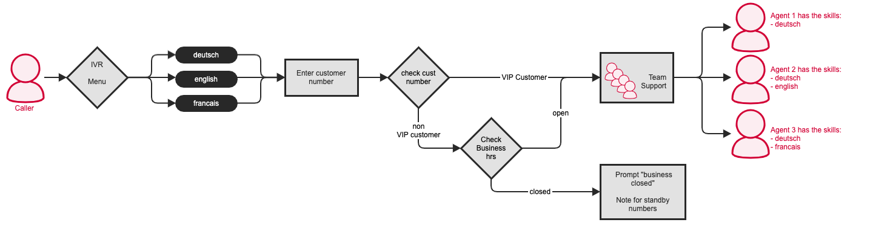


 


## Training Video

 

## Concept
Skills Based Routing is an Automated Call Distribution strategy often deployed in [Call Centers](https://www.pascom.net/en/call-center/ "pascom ContactCenter Tools") to route inbound callers to the agent(s) who are best qualified (skilled) to fulfill the callers requirements.

Functions:

* Skills of agents within a team
* Queues which support Skills Based Routing
* Inline Scripts (Single lined scripts which can be added and respectively integrated into an action before/after)
* Generic Labels (Labels which can be set for a caller, e.g. as information for the agents, prioritizing a caller, VIP customer etc...)
* Call Router (checked whether a condition triggers any actions)

## Example 1

### Overview

The caller selects their preferred language using an IVR menu and will then be forwarded onto the support team. With skill based routing, only phones belonging to support agents with the associated language skill will ring.

### Configuration

#### 1. The first step is to define the required skills, which in the example above is languages. To do this, select `ACD (Automatic Call Distribution) > Call Labels > Add` -> Skill.

|Parameter|Description|
|---|---|
|Label Name|Name given to the label|
|Display in client|Yes/no - determines whether a client user should be able to see the label or not.|
|Add action conditions|Yes/no - determines whether action conditions should be added or not. When yes, these action conditions can be used by actions themselves.|

#### 2. Assign Users

Under the `User Skills` tab you can assign that newly added lable to specific users.

Skills can also be assigned to users by following: `Users > User List` > Select required user(s) > `Edit > Skills Tab`.

If you assign a user with a particular skill, you must also assign a "skill level".

*In our example, all agents offer support for german speaking callers. But only 1 agent has the skill "German" assigned. The other two agents have other skills assigned. As such, we recommend providing Agent 1 with a higher level for the skill "German", ensuring german speaking calls are always routed to him as the first port of call.*

In order to ensure that skills are taken in account when distributing calls within a team, the team must be configured to use the script "Skill Based Routing": `Users > Teams` > `selecte Team / Queue` > `Edit` and under the `Basic Data` tab select **skill based routing** from the drop down menu under "Routing Script".

{}
Using skills has numerous benefits such as only needing one queue, even though your callers require different skills for example different languages. Through using skill based routing only the phones of those agents that fulfill the required skills will ring, ensuring improved customer care etc.
{}

#### 3. IVR Options Menus

In order set the caller's language, we need to set up an [IVR Menu](): `ACD > IVR > Add`

Für die Sprachauswahl erstellen wir ein [IVR-Menü](): `Anrufverteilung` > `IVR` > `Hinzufügen`.
Once the ***IVR*** menu has been added, you will now need to add the required option entries. To do this select the IVR you just created and then click on the ***Entries*** button.

Now add three further entries: Number **1** for *deutsch*, number **2** for *englich*, number **3** for *french*. **i** for *invalid* (invalid entry) and **t** for *timeout* have already been added and need only be edited.

Now the entries need to be edited and configured with actions. As an example, we are editing the *english* entry:

Firstly we need to set the label: `Add` > `Set Label`:
As the skill name, use *english*. The expression indiciates the minimum skill level that an agent must have before they have calls routed to them.

You can also set the channel language here, meaning your callers will only hear prompts / announcements in the language they have selected.

{}
Should a label be set for a caller, this label applies until the call is ended.
{}
{}
If so configured, labels can then be displayed to queue agents via the pascom client. Any number of labels can be set per caller.
{}

## Example 2

### Overview

This example scenario expands on the example above. After the language IVR, the customer number will also be requested which will be used to distinguish between VIP and non VIP customers. VIP customers will be connected directly to the support team, while calls from non VIP customers must be checked to see whether they are calling inside of normal business hours before being connected to the support team..
 

#### 1. Configuration

1. After selecting their language, a caller must be prompted to enter their customer number. This is achieved by using a **Generic Label** which can be configured under `ACD > Call Labels > Add > Generic Label`.

The generic label has a **Channel Variable** (in this case MDC_LABEL-9) which we need to note for further configurations. The variable name can be found by selecting the label in the overview and clicking on Edit:

#### 2. Action Conditions: VIP Customers

To differentiate between VIP and non-VIP customers, we need to use a **Generic Label with Action Conditions**: `ACD > Call Labels > Add > Generic Label` and set the ***Create Action Condition*** to **yes**

#### 3. Request Customer Number

The IVR entries will no longer directly route to the Support queue. Firstly, we need to request the customer number. This function is performed by using a Call Router:

#### 4. Checking Conditions with the Call Router

The **Call Router** is used in order to check conditions and trigger the corresponding actions.
The first step is to use an **Inline Script** that requests the customer number.

{}
An Inline Script allows a single line Asterisk script to be simultaneously integrated into actions.
{}

With help from, for example a script,the entered customer number can be verified in order to apply either the *VIP Customer* or *non VIP customer* label to the call. A caller assigned with the VIP call label (and therefore the associated action conditions) will directly connected to the support team. Callers with the non-VIP customer label attached must first go through the business hours time checks before being connected or not connected to the support team.

The business hours checks are also performed using a Call Router as shown below:

