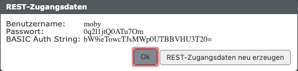
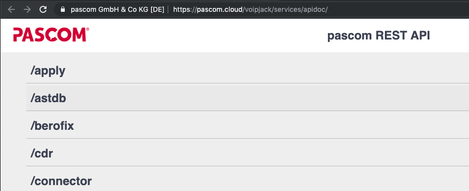


 


## Zugangsdaten ermitteln

Loggen Sie sich auf der Weboberfläche Ihrer pascom Telefonanlage ein. Klicken Sie unter  >  auf die Schaltfläche :




## API-URL Ermitteln

Die API-URL setzt sich aus folgenden Bestandteilen zusammen:

```
https://[SERVER]/[INSTANZ]/services/
```

### Beispiel pascom.cloud

Betreiben Sie die Instanz **voipjack** in der  **pascom.cloud** ist die API-URL:

```
https://pascom.cloud/voipjack/services/
```

### Beispiel onsite Server

Betreiben Sie die Instanz **voipjack** auf Ihrem eigenen Server **192.168.1.5** ist die API-URL:

```
https://192.168.1.5/voipjack/services/
```


## Daten abfragen

In diesem Beispiel fragen wir alle getätigten Anrufe (**cdr/**) ab (max 100 per Default):

```
curl -u moby https://pascom.cloud/voipjack/services/cdr/
```


Als Ergebnis erhalten wir eine Liste aller Anrufe (hier ein einziger) im **JSON-Format**:

```
[
  {
    "id": 1,
    "timestamp": 1562313497113,
    "time": "2019-07-05 09:58:17",
    "userId": 3,
    "userName": "mpasquay",
    "extension": "",
    "inbound": 0,
    "internal": 1,
    "duration": 5,
    "connected": 4,
    "deviceId": 1,
    "deviceName": "pascom Softphone [Mathias Pasquay]",
    "locationId": 2,
    "locationName": "Mathias Pasquay",
    "recordId": "",
    "voicemailId": "",
    "name": "System call",
    "number": "*104",
    "prefix": "",
    "phonebookEntryId": "",
    "result": "hangup",
    "resultDetails": "voicemail",
    "via": "",
    "viaDetails": "",
    "phonecallRecordId": 1,
    "chain": "1562313497222_1",
    "labelList": []
  }
]
```

## Daten senden

Als Beispiel senden wir der pascom den Befehlt mit dem Benutzer **mpasquay** das Ziel ***100** zu rufen:


```
curl -u moby \
  -d '{"action": "dial","destination": "*100","prefix": "auto"}' \
  -H "Content-Type: application/json" \
  -X POST https://pascom.cloud/voipjack/services/identity/mpasquay/defaultdevice/action
```


Als Bestätigung gibt die API folgende Ausgabe zurück und das bevorzugte Telefon von **mpasquay** beginnt ***100** zu rufen:

```
{"response":"dial commited"}
```


## REST-API Referenz Dokumentation

Alle verfügbaren Services, Dokumentation und eine Möglichkeit die Schittstelle zu testen finden Sie direkt auf der jeweiligen Instanz. 

Loggen Sie sich auf der Weboberfläche Ihrer pascom Telefonanlage ein. Klicken Sie unter  >  auf den Link :


