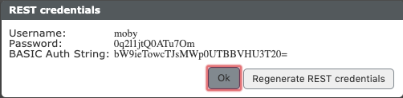


 


## Determine access data

Log in to the web interface of your pascom telephone system. Under  , click the  button:




## Determine API URL

The API-URL consists of the following components:

```
https://[SERVER]/[INSTANCE]/services/
```

### Example pascom.cloud

If you run the instance **voipjack** in the **pascom.cloud** the API URL is:

```
https://pascom.cloud/voipjack/services/
```

### Example onsite Server

If you run the instance **voipjack** on your own server **192.168.1.5** the API URL is:

```
https://192.168.1.5/voipjack/services/
```


## Query data

In this example, we query all calls made on the system (**cdr /**) (max 100 by default):

```
curl -u moby https://pascom.cloud/voipjack/services/cdr/
```


As a result we get a list of all calls (here a single one) in the **JSON format**:

```
[
  {
    "id": 1,
    "timestamp": 1562313497113,
    "time": "2019-07-05 09:58:17",
    "userId": 3,
    "userName": "mpasquay",
    "extension": "",
    "inbound": 0,
    "internal": 1,
    "duration": 5,
    "connected": 4,
    "deviceId": 1,
    "deviceName": "pascom Softphone [Mathias Pasquay]",
    "locationId": 2,
    "locationName": "Mathias Pasquay",
    "recordId": "",
    "voicemailId": "",
    "name": "System call",
    "number": "*104",
    "prefix": "",
    "phonebookEntryId": "",
    "result": "hangup",
    "resultDetails": "voicemail",
    "via": "",
    "viaDetails": "",
    "phonecallRecordId": 1,
    "chain": "1562313497222_1",
    "labelList": []
  }
]
```

## Send data

As an example, we send the pascom the command to call with the user **mpasquay** the target ***100**:

```
curl -u moby \
  -d '{"action": "dial","destination": "*100","prefix": "auto"}' \
  -H "Content-Type: application/json" \
  -X POST https://pascom.cloud/voipjack/services/identity/mpasquay/defaultdevice/action
```

As confirmation the API returns the following content and the preferred phone of **mpasquay** starts to call ***100**:

```
{"response":"dial commited"}
```


## REST API reference documentation

All available services, documentation and a way to test the interface can be found directly on the respective instance.

Log in to the web interface of your pascom telephone system. Under  > , click the link :


