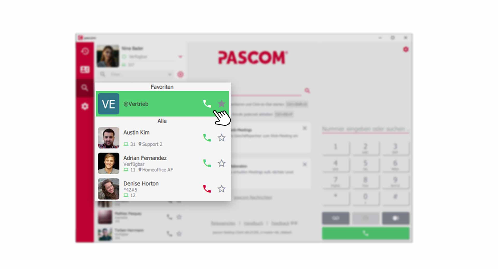
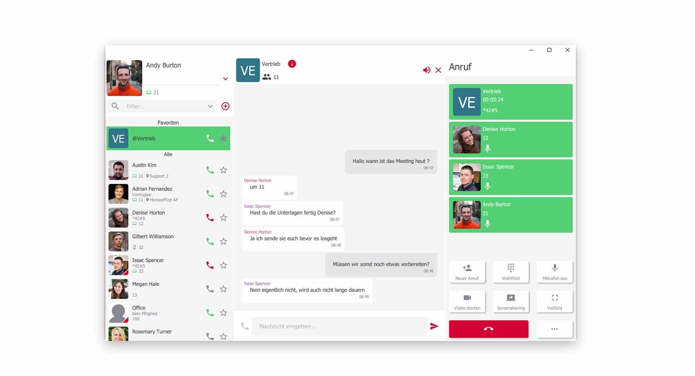
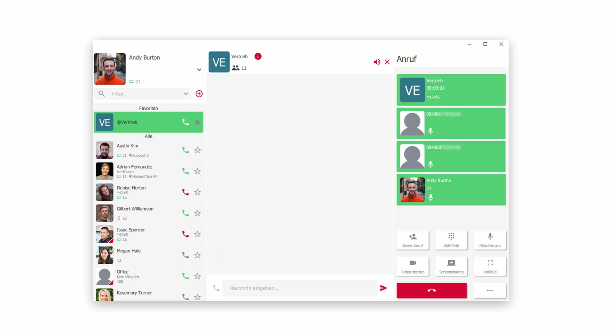


 


## Trainings Video

 

## Übersicht

Konferenzen sind ein wichtiger Bestandteil in der heutigen Geschäftswelt. Besprechen Sie Themen mit Ihren Kollegen oder Kunden in virtuellen Konferenzräumen. Besprechungen mit mehreren Teilnehmern, waren noch nie so einfach wie mit dem pascom Client. 

### Was wird benötigt?

Um Konferenzen im pascom Client abzuhalten, benötigen Sie eine pascom Gruppe. Nutzen Sie folgende [Anleitung](link zu pascom Gruppen) zum erstellen einer pascom Gruppe.

**Konferenz mit Kollegen**

1. Legen Sie sich eine pascom Gruppe an z.B. **virtueller Konferenzraum** oder **Meeting-Raum**. Sie können auch bestehende pascom Gruppen nutzen, die Sie bereits angelegt haben.   
 

**Konferenz mit Kunden**

2. Legen Sie sich eine pascom Gruppe an z.B. **virtueller Konferenzraum** oder **Meeting-Raum**. Aktivieren Sie zusätzlich den **Gastmodus** der pascom Gruppe, sodass Sie eine **Einwahlnummer** und **PIN** für Ihre Kunden erhalten. 

3. Geben Sie die **Einwahldaten** weiter an Ihre Kunden, um diese einzuladen.

### Die Gruppe leuchtet grün

Eine pascom Gruppe fängt **grün an zu leuchten**, wenn eine **aktive Konferenz** stattfindet, bzw. sich Teilnehmer in der Konferenz befinden. Tretten alle Teilnehmer aus der Gruppe aus, endet die Signalisierung.

*Aktive Konferenz in pascom Gruppe*
 

## Audio-Konferenz mit Ihren Kollegen

Um eine Konferenz zu starten oder beizutreten, rufen Sie die Gruppe über das **Höhrer-Symbol** an. Sie sind nun im Konferenzraum der Gruppe eingeloggt.

*Aktive Konferenz mit Ihren Kollegen*
 

Ihnen stehen nun alle **Funktionen** zur Verfügung, die Sie bereits aus der Anleitung zu den [Video- und Screensharing-Tools](link zu video screensharing) oder den [Telefonie Funktionen]( link zu telefonie mit pascom) kennen sollten. 

## Video - Screensharing Konferenz mit Ihren Kollegen

Befinden Sie sich in einer aktiven Konferenz, haben Sie die Möglichkeit die **Video-Funktionalität** sowie das **Screensharing** über das **Wählfeld** einzuschalten. 

{}
Bitte beachten Sie, sobald Sie in einer Konferenz das **Video** oder **Screensharing** einschalten, können alle Teilnehmer Ihr Video oder Ihren Bildschirminhalt sehen.
{}

*Aktive Video,-Screensharing Konferenz mit Ihren Kollegen*
 

1. Halten Sie so tolle Besprechungen oder Präsentationen, indem Sie die **Screensharing-Funktion** und **Video-Funktion** nutzen.

{}
Die **Screensharing-Funktion** kann immer nur von einem Teilnehmer verwendet werden. In der Regel ist das der Präsentator oder Moderator der Konferenz.
{}

## Audio-Konferenz mit Ihren Kunden

Eine **Audio-Konferenz** mit Ihren Kunden funktioniert genauso, wie mit Ihren Kollegen. Externe Teilnehmer gelangen über den **Gastmodus** in Ihre Gruppe und können So an der Konferenz teilnehmen. 

*Aktive Video Konferenz mit externen Teilnehmern*
 

{}
Externe Teilnehmer können Ihren Chat-Verlauf in einer Audio-Konferenz nicht sehen. 
{}

## Video,- Screensharing Konferenz mit Ihren Kunden

Um den visuellen Apsekt in eine Konferenz mit Ihren Kunden zu bringen, müssen Sie eine Web Konferenz starten. Wie Sie eine Online Konferenz in Verbindung mit dem pascom Web Client erstellen können, erfahren Sie in dieser [Anleitung](Link zu Web Konferenz Handbuch).
