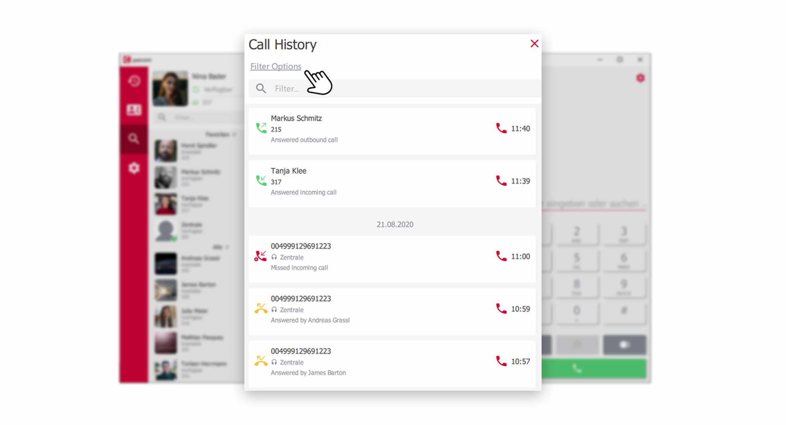


 


## Trainings Video

 

## Übersicht

In the call journal you will find the complete history of your calls. Filter options make it easy to find call records again and the detail function provides valuable information on each individual call.

## Open the Call History

Click on the **Call History** icon in the menu bar to access the journal.

*Open Call History via the pascom Menue*
 

## Use Filters of the Call History

Click on **Filter Options** in the upper part of the call history.

*The Call History within the pascom Client*
 

In the **Filter-Options** you have some setting options.

*Additional filter options in the call journal*
 

### Call Type

Filter the call history by **internal** / **external**, or by **both** call types.

### Call Direction

Filter the call history by **incoming** / **outgoing** or **both** call directions.

### Call Result

Filter the call history by **accepted** / **missed** calls, or view **All** call results.

### Show more Journal Entries

Show or hide more entries like **voicemailbox**, **system calls**, **faxes** etc. in your call history. 

### Integrate team history into the call history

You can choose from which queue (of which you are a member) call data is included in your journal. 

## Call history icons explained

In the call journal, you will find **symbols** on the right-hand side of each call record, which allow you to see at a glance how the **call direction** and the **call result** went.

*Icons in the call history show useful information*

**green handset** = Call that was answered.   
**yellow handset** = Call that was answered by a colleague.  
**red handset** = Call that was missed.  

Zudem zeigen kleine Pfeile die **Rufrichtung** an. **Eingehend / Ausgehend** oder **Verbunden**.

1. Mit Klick auf den **roten Höhrer** in jedem Anrufdatensatz, starten Sie einen **Rückruf**

## Weitere Anruf-Details anzeigen lassen.

Das Anrufjournal zeigt Ihnen noch mehr Daten zu jedem einzelnen Anruf. Klicken Sie auf den gewünschten Anrufdatensatz und Sie gelangen in die **Detail-Ansicht**

In der **Detail-Ansicht** können Sie den kompletten Verlauf durch das pascom Telefonsystem nachvollziehen.

*Noch mehr Daten, zu jedem Anruf*

Entnehmen Sie Daten zum **Anrufverlauf**, den letzten **3 Anrufen**, Details zum **Anrufer** und Daten aus dem **Telefonbuch**

{}
Tip: Klicken Sie auf das **rote Info-Symbol** bei den letzten 3 Anrufen. Damit gelangen Sie zu dem entsprechenden Anrufdatensatz und können diesen weiter auswerten.
{}

## Team-Journal nutzen

Das Team-Journal gibt Ihnen eine komplette Übersicht über alle Anrufe die im Team, in welchem Sie Mitglied sind, getätigt wurden. Weitere Infos zu pascom Teams, finden Sie in folgender [Anleitung](Link zu Teams).
