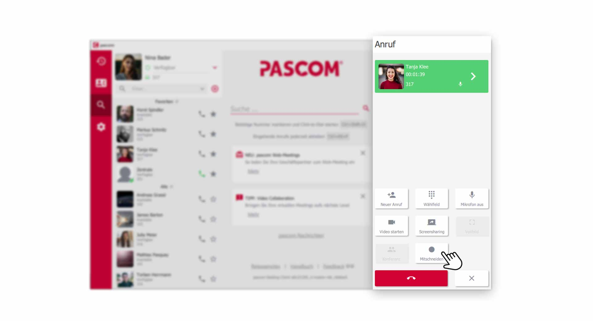
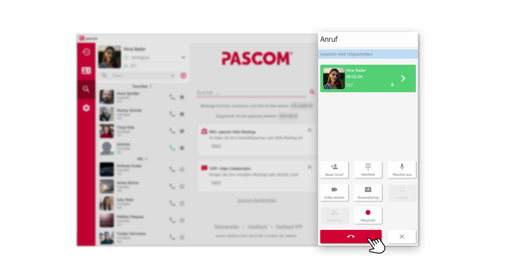
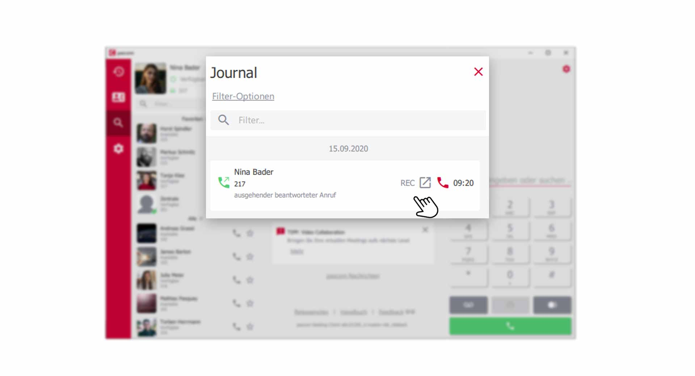
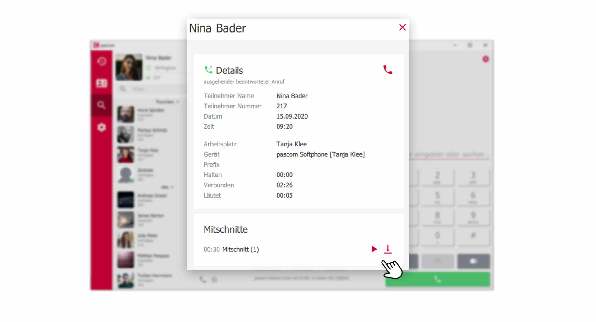


 


## Übersicht

Das Mitschneiden von Gesprächen ist ein gutes Instrument zur Verbesserung des Kundenservice. Aufgezeichnete Gespräche können zu einem späteren Zeitpunkt ausgewertet und analysiert werden. 

1. *Das Mitschnittsystem kann ohne Ihr Zutun im Hintergrund laufen. Gesprächsaufzeichnungen können aber auch manuell während eines aktiven Anrufs gestartet werden. Informieren Sie in diesem Fall Ihren Gesprächsteilnehmer darüber, dass Sie berechtigt sind Gespräche aufzuzeichnen und ob der Anrufer der Gesprächsaufzeichnung zustimmt.*

{}
Das Mitschnittsystem können nur Nutzer mit einer entsprechenden Berechtigung während einem aktiven Anruf benutzen. Sprechen Sie daher mit Ihrem Systemadministrator.
{}

## Gesprächsaufzeichnung starten

Klicken Sie während eines aktiven Anrufs im **Wählfeld**  auf  . Sollte der **Button** nicht zu sehen sein, klicken Sie auf die  für mehr **Optionen**

*Neue Gesprächsaufzeichnung im Wählfeld starten*
 

### Aktive Aufzeichnung des Gesprächs

Sobald Sie auf  drücken, beginnt die Aufzeichnung des Gesprächs. Während der Aufzeichnung werden Sie selbst und Ihr Gesprächsteilnehmer aufgenommen.

*Aktive Gesprächsaufzeichnung nimmt Sie selbst und Gesprächsteilnehmer auf*
 

### Beenden der Gesprächsaufzeichnung

Eine aktive Gesprächsaufzeichnung können Sie mit einem Klick auf  wieder stoppen und ohne Mitschnitt mit Ihrem Gesprächsteilnehmer weiter telefonieren. Sie können auch gleich das komplette Telefonat mit Klick auf den  beenden.

## Wo sind meine Gesprächsaufzeichnungen?

Die Aufzeichnungen finden Sie in Ihrem **Anrufjournal**. Klicken Sie dazu im **Menü** auf das .

*Im Anrufjournal finden Sie die Gesprächsaufzeichnungen*
 

1. Anrufe, deren Gespräch aufgezeichnet wurde, erkennen Sie an dem kleinen **REC** Symbol.

### Gesprächsaufzeichnungen anhören und runterladen

Um direkt zu der Aufzeichnung des Anrufs zu gelangen, klicken Sie auf den entsprechenden  um in die **Detailansicht** zu gelangen.

*Gesprächsaufzeichnung anhören und herunterladen*
 

1. In der Detailansicht können Sie beim Abschnitt **Mitschnitte** die Aufzeichnung mit Klick auf  abspielen. Klicken Sie auf  um die Aufzeichnung auf Ihrem Computer zu speichern.

 