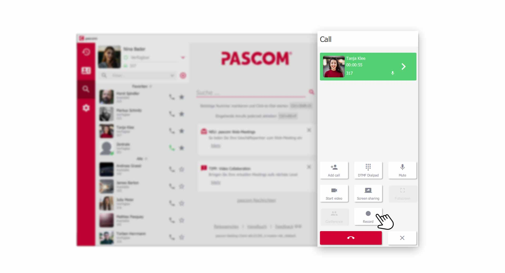
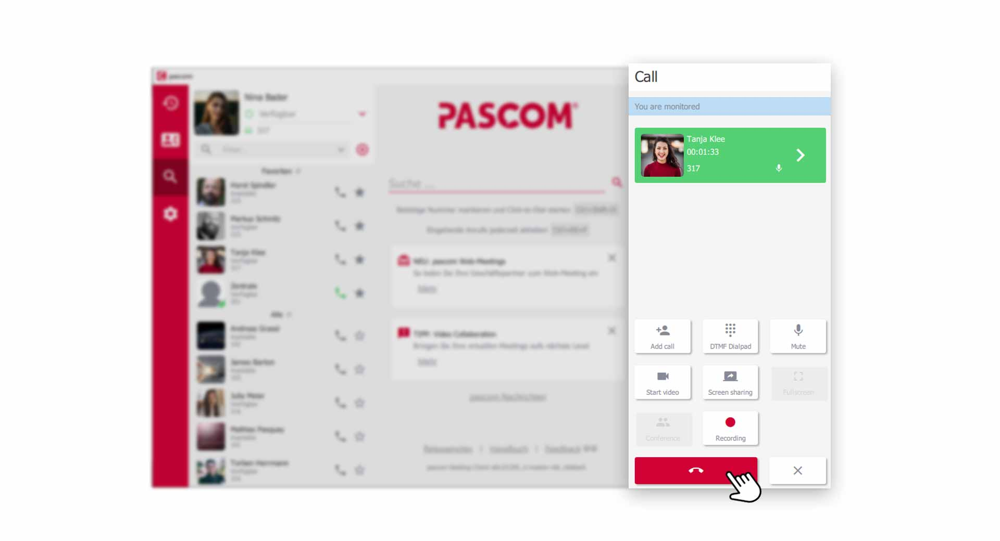
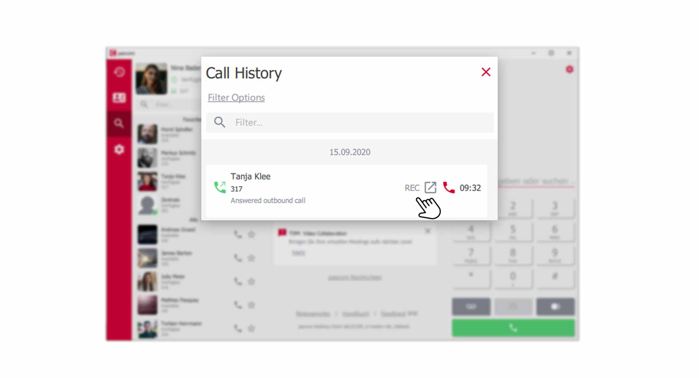
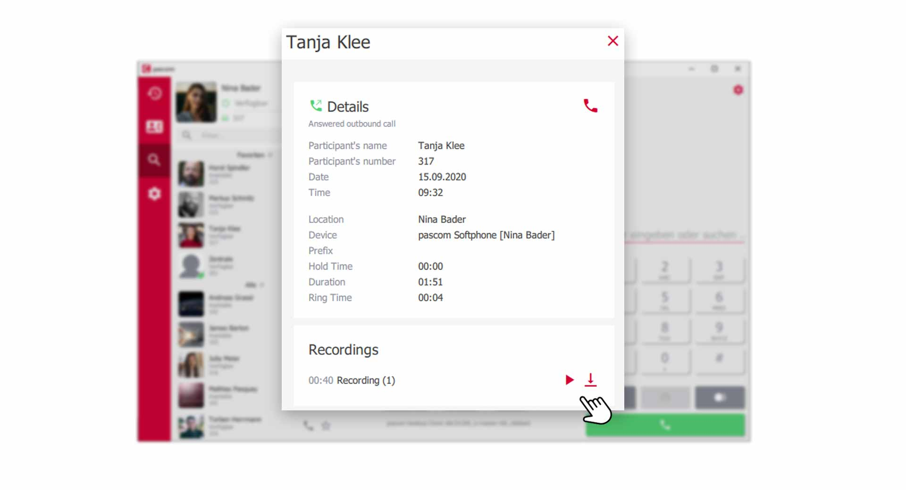


 


## Übersicht

Call recording is a good tool for improving customer service. Recorded calls can be evaluated and analyzed at a later date. 

1. *The recording system can run in the background without your intervention. Call recordings can also be started manually during an active call. In this case, inform your conversation partner that you are authorized to record conversations and whether the caller agrees to the recording.*

{}
The recording system can only be used by users with the appropriate authorization during an active call. Therefore, please speak to your system administrator.
{}

## Start Call Recording

During an active call, click  in the **dial field**. If the **button** is not visible, click on the  for more **options**

*Start new call recording in the dialing field*
 

### Active Recording of the Conversation

As soon as you press , the recording of the conversation starts. During the recording you and your conversation partner are recorded.

*Active call recording records you and your conversation partner*
 

### Stop the Call Recording

You can stop an active call recording by clicking on  and continue to talk to your call partner without recording. You can also end the entire call by clicking the .

## Where are my Call Records?

You will find the recordings in your **call journal**. To do this, click on the  in the **Menu**.

*In the call journal you will find the call recordings*
 

1. Calls whose conversation was recorded can be recognized by the small **REC** symbol.

### Listen and Download Call Recordings

To go directly to the recording of the call, click on the corresponding  to get to the **detail view**.

*Listen and Download Call Recordings*
 

1. In the detail view you can play the recording in the **Recording** section by clicking . Click on  to save the recording on your computer.

 