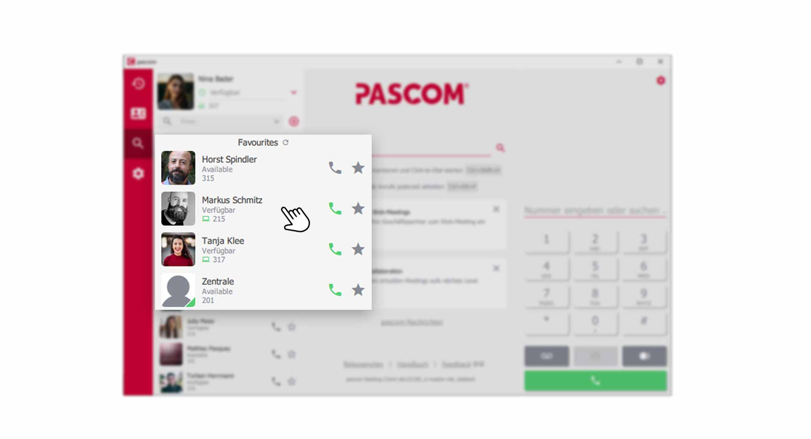
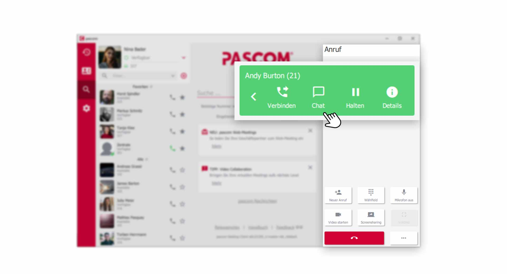
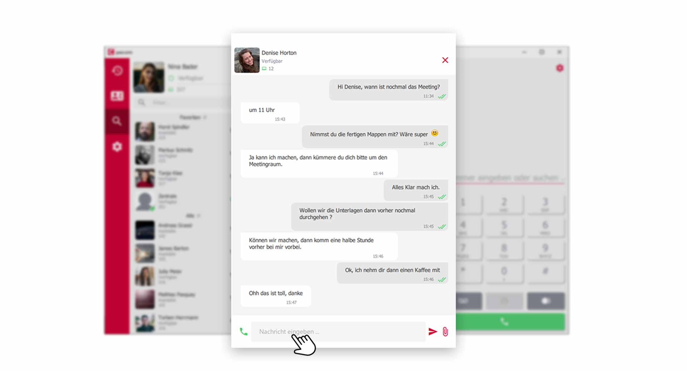
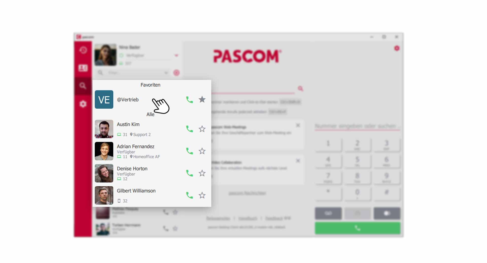
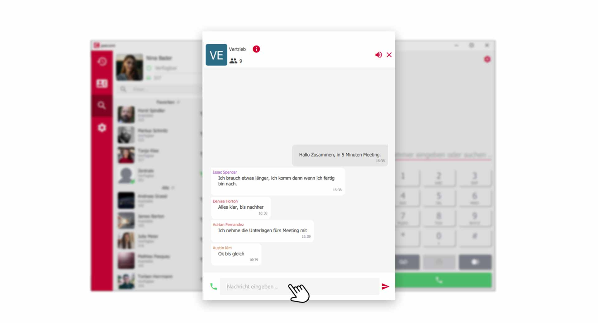
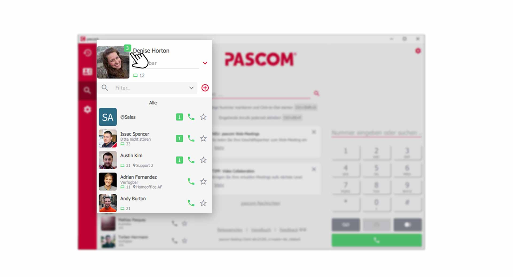
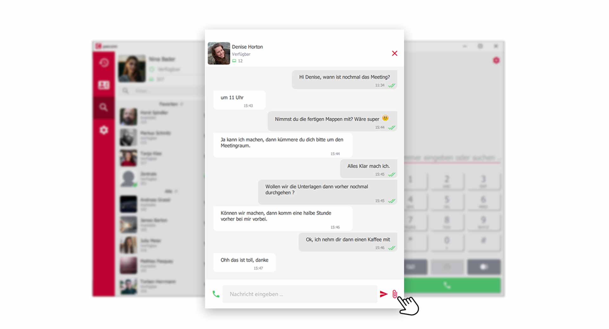
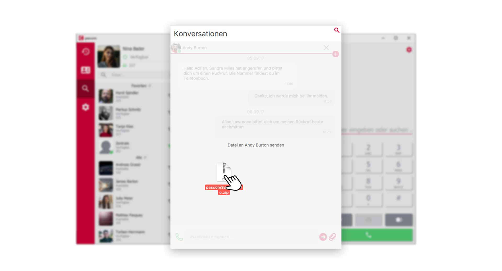
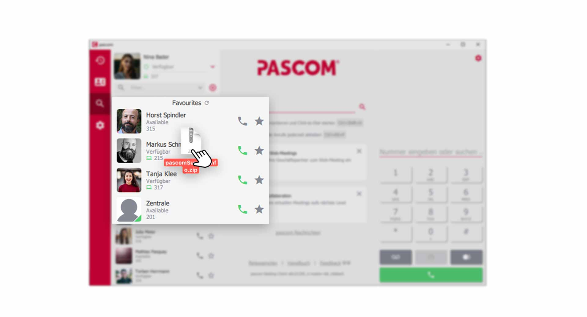


 


## Trainings Video

 

## Mit Kollegen chatten

Schnell Informationen mit einem Kollegen austauschen, ist heutzutage ein unverzichtbares Werkzeug in der Geschäftskommunikation geworden. Im pascom Client klicken Sie ganz einfach in der  auf einen Kollegen um die Chat-Konversation zu öffnen.

*Chat-Konversation öffnen aus der Kontaktliste heraus*
 

Alternativ können Sie während einem aktiven Telefonat mit Ihrem Kollegen, gleichzeitig mit einem Klick auf  im **Anruf Element** die Chat-Konversation öffnen.

*Chat-Konversation während einem Gespräch öffnen*
 

Der dynamische Kontentbereich bzw. das Ansichtsfenster zeigt Ihnen dann die Chat-Konversation an.

*Chat-Konversation geöffnet*
 

### Chat Nachricht verfassen

1. Geben Sie im unteren  Ihre Nachricht ein und senden Sie die Nachricht mit Klick auf den  oder durch drücken der **Enter-Taste**.

2. Möchten Sie einen Absatz in der Chat-Nachricht, drücken Sie die **Umschalt-Taste + Enter-Taste** um eine Leerzeile einzufügen.

## Gruppen-Chat mit mehreren Kollegen

Für Gruppen-Chat-Räume benötigen Sie zuerst eine pascom Gruppe die Sie mit folgender [Anleitung]() erstellen können.

Klicken Sie in Ihrer Kontaktliste auf die  um die Chat-Konversation zu öffnen.

*Gruppen-Chat öffnen über die Kontaktliste*
 

Der dynamische Kontentbereich bzw. das Ansichtsfenster zeigt Ihnen dann die Chat-Konversation der Gruppe an.

*Gruppen-Chat mit mehreren Teilnehmern*
 

1. Verfassen Sie wie gewohnt Ihre Nachricht im  und senden Sie diese mit Klick auf den  oder durch drücken der **Enter-Taste**.

## Chat schließen

1. Schließen Sie die aktuelle Chat-Konversation rechts oben mit Klick auf das . 

{}
Schließen Sie eine Chat-Konversation und haben bereits eine Nachricht verfasst, jedoch noch nicht abgeschickt, so speichert der pascom Client das bereits Geschriebene und Sie können später die Bearbeitung fortsetzten. So lässt sich zwischen Chat-Konversationen hin-und her springen.
{}

## Chat Benachrichtigungen

Ist der Konversations-Bereich nicht im Fokus, und Sie erhalten eine neue Nachricht, so erscheint in der **Kontaktliste am Profilbild** und am jeweiligen **Kontakt** eine Hinweismeldung. Am Profilbild erkennen Sie immer die gesamten, noch nicht gelesenen, Nachrichten. Kontakte mit neuen Nachrichten, rutschen in der Kontaktliste automatisch nach oben, sofern die Sortierung so eingestellt wurde.

*Chat-Hinweismeldung in der Kontaktliste*
 

## Dateien versenden (Filesharing)

Der Client bietet Ihnen die Möglichkeit mit Ihren Kollegen Dateien auszutauschen. Dies funktioniert auch während einem aktiven Gespräch ohne, dass Sie extra auflegen müssen. 

Es gibt mehrere Wege, eine Datei an Ihren Kollegen zu senden.  

1. Klicken Sie in der aktuellen Chat-Konversation auf die  und wählen Sie die Datei aus, welche Sie versenden möchten.

*Filesharing über Dateiauswahl*
 

2. Ziehen Sie die Datei, welche Sie versenden möchten aus einem Ordner direkt in den **Chat-Bereich**.

*Datei direkt in die Konversation verschieben*
 

3. Sie können auch eine Datei direkt auf Ihren **Kollegen** in der **Kontaktliste** ziehen/verschieben. 

*Datei auf einen Kollegen in der Kontaktliste ziehen*
 

