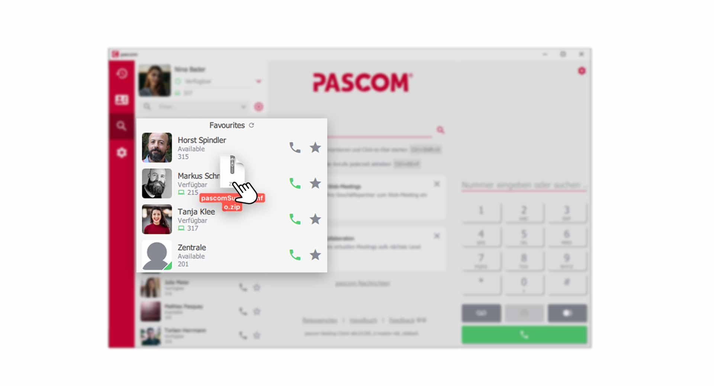


 


## Trainings Video

 

## Chat with colleagues

Quickly exchanging information with a colleague has become an indispensable tool in business communication today. In the pascom client, simply click on a colleague in the  to open the chat conversation window.

*Open chat conversation from the contact list*
 

Alternatively, during an active phone call with your colleague, you can simultaneously open the chat conversation by clicking on  in the **Call element**.

*Open chat conversation during a phone Call*
 

The dynamic content area or view window will then show you the chat conversation.

*Chat conversation open*
 

### Type a Chat message

1. Enter your message in the lower  and send the message by clicking on the  or by pressing the **enter key**.

2. If you want a paragraph in the chat message, press **Shift + Enter key** to insert a blank line.

## Group chat with several colleagues

For group chat rooms you first need a pascom group which you can create with the following [tutorial]().

Click on the  in your contact list to open the chat conversation.

*Open group chat via the contact list*
 

The dynamic content area or view window will then show you the chat conversation of the group.

*Group chat with multiple participants*
 

1. Type your message as usual in the   and send it by clicking on the  or by pressing the **enter key**.

## Close a Chat

1. Close the current chat conversation by clicking on the in the upper right corner. 

{}
If you close a chat conversation and have already written a message but have not yet sent it, the pascom client saves what you have already written and you can continue editing it later. This allows you to jump back and forth between chat conversations.
{}

## Chat Notifications

If the conversation area is not in focus and you receive a new message, a notification message appears in the **contact list** at the **profile picture** and at the respective **contact**. The profile picture always shows you the complete, not yet read, messages. Contacts with new messages will automatically move up in the contact list, if the sorting is set that way.

*Chat notification message in the contact list*
 

## Send Files (Filesharing)

The client offers you the possibility to exchange files with your colleagues. This also works during an active call without having to hang up the phone. 

There are several ways to send a file to your colleague.  

1. Click on the  in the current chat conversation and select the file you want to send.

*File sharing via file selection*
 

2. Drag the file you want to send from a folder directly into the **Chat area**.

*Move file directly into the conversation*
 

3. You can also drag/move a file directly onto your **colleague** in the **contact list**. 

*Drag file onto a colleague in the contact list*
 

## Filetransfer - The Rendering-Feature |BETA

Files, images and documents that you share with other users in the pascom client are displayed in the chat history. This gives you full control over the file transfer.

1. Documents and files are displayed during transfer as follows.

*Documents and files in pascom Client*
 

2. Via the **download icon** you can easily download the file. Via the **trash can icon** you delete the file. The chat window will still show that this file has been removed.

*Deleted files in pascom Client*
 

3. Images you share in the pascom client are rendered and displayed as a preview in the chat window.

*Images with preview in pascom Client*
 

### Useful tips for file transfer

1. Where can I find my downloaded images and files?
 
In the **Download folder** of the operating system.

2. What is the maximum file size?
 
**File size max. 100 MB**.

3. Why do images not have the original resolution?
 
Images are compressed during transmission to speed up data transfer. If you want to send your colleagues images in the **original resolution**, you must compress the image beforehand with a **ZIP program**.

4. Why do transparent PNG images have a black background in the preview?
 
Due to compression, **transparent PNG images** are converted to a smaller **JPG image format** for the preview image in the pascom client. **DON'T WORRY**: Download the image to your computer, it will have its original format.
 