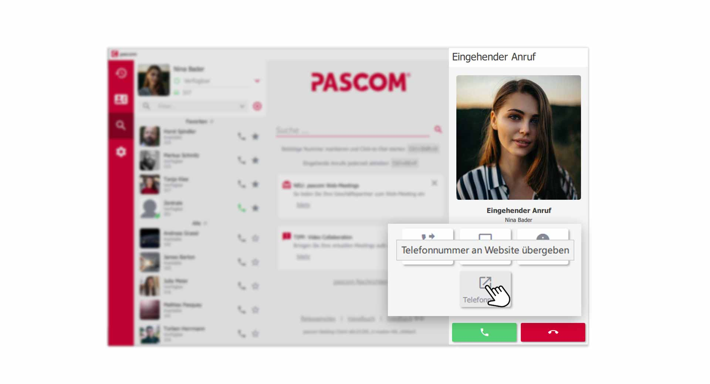
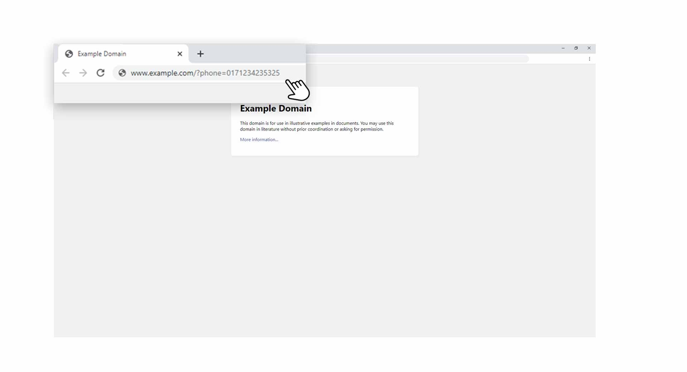


 


## Trainings Video

 

## Übersicht

Mit Client Aktionen können Sie Daten an Drittanwendungen übergeben, um diese weiter zu verarbeiten (z.B. ein CMS Web Anwendung mit Kundendaten). Client Aktionen können Sie manuell steuern oder auch automatisieren. 

## Neue Aktion anlegen

Die Client Aktionen finden Sie in den **Client-Einstellungen**.

1. Öffnen Sie die **Client-Einstellungen** über das pascom Menü

 

2. Klicken Sie im **Einstellungs-Menü** auf **Aktionen**

 

3. Erstellen Sie eine neue Aktion über **"Aktion hinzufügen"**.

### Daten an URL oder Anwendung übergeben

An diesem Punkt, müssen Sie sich entscheiden, ob Sie Daten an eine **URL** weitergeben wollen (z.B. einer Web-Anwendung) oder an eine **Anwendung** die auf Ihrem Computer installiert ist. 

 

## Aktion einrichten

Hier bestimmen Sie, welche Daten Sie übergeben möchten und wie sich Ihre Aktion verhalten soll. In unserem Beispiel übergeben wir die **Telefonnummer** des Anrufers an eine **URL** 

 

### Namen vergeben

Vergeben Sie beim Punkt **"Namen"** eine eindeutige Bezeichnung für die Aktion, da Sie sich mehrere Aktionen anlegen können und daher gleich erkennen was die Aktion macht. 

### URL hinterlegen

Setzen Sie beim Punkt **"URL"** die Adresse Ihrer Web-Anwendung, gefolgt von einer Variable und den Daten die Sie übergeben möchten.

**Beispiel**  

|Beschreibung|Parameter|
|---|---|
|URL|www.webadresse.com|
|Variable der Webanwendung|?phone=|
|Daten aus dem pascom Client|${number}|
|Ergibt|www.webadresse.com?phone=${number}|

{}
Bei der Zusammensetzung der **URL** haben Sie natürlich komplett freie Hand und können die Daten daher so übergeben, wie Sie benötigt werden.
{}

**pascom Parameter die verwendet werden können**

 

|Parameter|Beschreibung|
|---|---|
|${name}|Enthält den Namen des Anrufers, aufgelöst aus dem Telefonbuch|
|${number}|Enthält die Telefonnummer des Anrufers|
|${MDC_LABEL-X}|Enthält die Systemvariable eines Labels des Anrufers|
|${MDC_SKILL-X}|Enthält die Systemvariable eines Skills|

## Aktionen automatisch ausführen

Aktionen können in Verbindung mit der **Rufrichtung** und einem **Anrufergebnis** automatisch für folgende **Anruftypen** gestartet werden.

1. Interne Anrufe von Kollegen
2. Externe Anrufe auf der eigenen Durchwahl
3. Externe Anrufe über ein Team / Warteschlange

### Anrufrichtung bei automatischen Aktionen

Legen Sie bei der **"Rufrichtung"** fest, ob die Aktion bei **eingehenden**, **ausgehenden** oder **beiden** Rufrichtungen, automatisch starten soll.

### Anrufergebnis bei automatischen Aktionen

Stellen Sie beim Punkt **"Ergebnis"** ein, wann die Aktion automatisch starten soll. Schon beim **Klingeln**, nach dem **Annehmen** des Anrufs oder beim **Auflegen** des Anrufs.

## Aktionen manuell starten

Aktionen können Sie auch manuell zu jeder Zeit selbst ausführen bzw. starten. Bei Aktionen die beim jeweiligen Anruf zutreffen, finden Sie ein **Aktion-Öffnen** Symbol.

*Aktionen mit einem Klick manuell starten*
 

1. Klicken Sie bei einem eingehenden Anruf auf den **Aktion-Öffnen** Button. Ein PopUp zeigt Ihnen auch den Namen der Aktion an, welche ausgeführt wird.  
2. Aktionen können auch direkt aus dem **Anrufjournal** heraus gestartet werden. Dort finden Sie den selben **Aktionen-Öffnen** Button.

## Daten in Drittanwendung auslesen

Die Daten, welche Sie an eine Drittanwendung übergeben, sollten Sie natürlich auch weiter verarbeiten (z.B. Telefonnummer in einer CMS Webanwendung suchen). Hier können Sie kreativ werden. 

*Daten vom pascom Client in externe Anwendung übergeben*
 

1. Wie Sie in der oberen Grafik erkennen können, wurde der **URL** die **Telefonnummer** des Kunden mitgegeben, welche nun **extern** weiter genutzt werden kann. 

## Aktionen verwalten

In den **Client Einstellungen** können Sie Ihre Aktionen verwalten. Fügen Sie neue Aktionen hinzu, entfernen Sie bestehende Aktionen und favorisieren Sie Aktionen, welche standartmäßig genutzt werden sollen.

*Verwalten Sie Ihre Aktionen im pascom Client*
 

1. **Deaktivieren** Sie Aktionen, welche Sie vorübergehend nicht benötigen.
2. Klicken Sie auf eine **Aktion** um diese zu **bearbeiten**
3. Bitte beachten Sie, dass immer eine Aktion als **Favorit** markiert werden muss. Eine einzelne Aktion ist daher immer **favorisiert**.

 