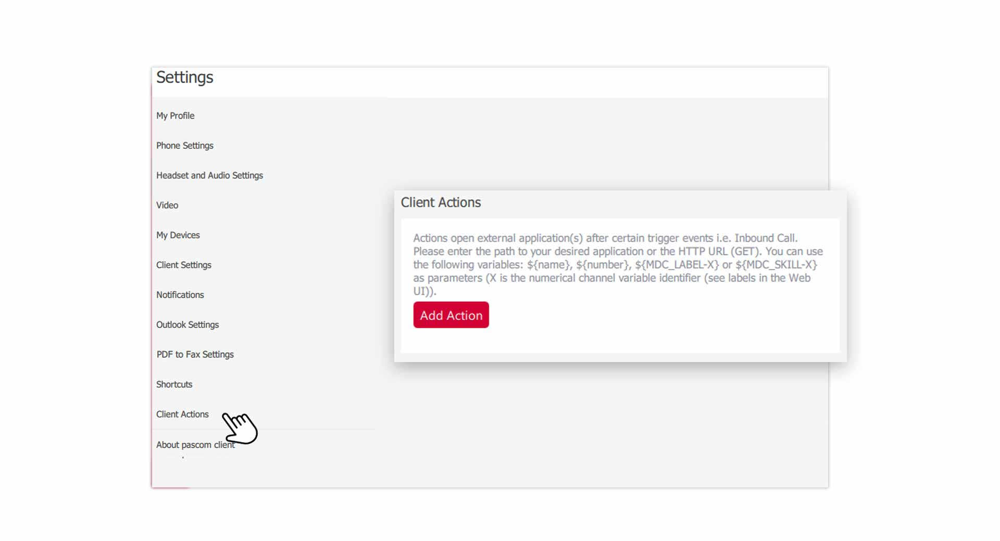
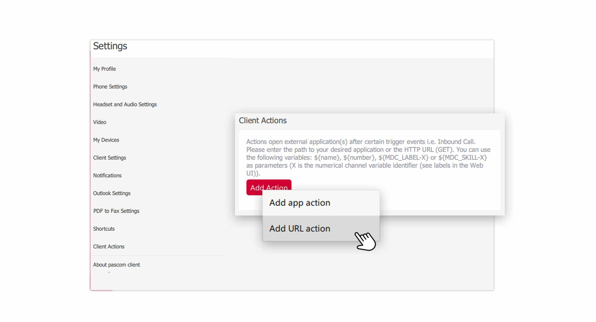
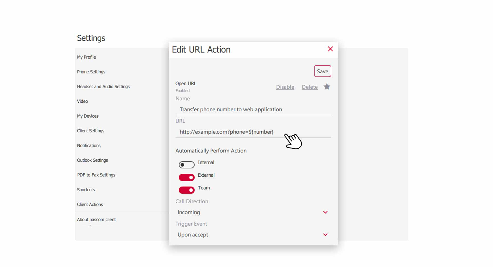
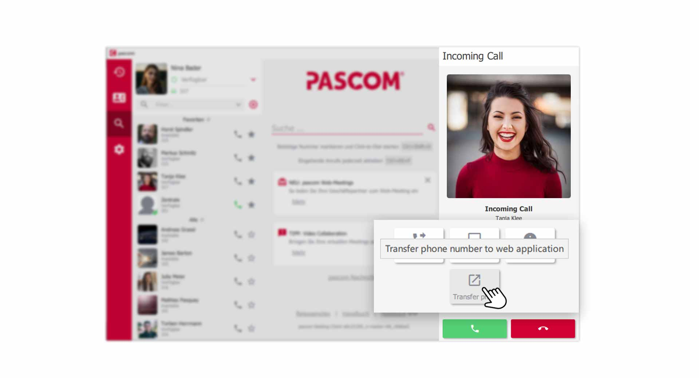
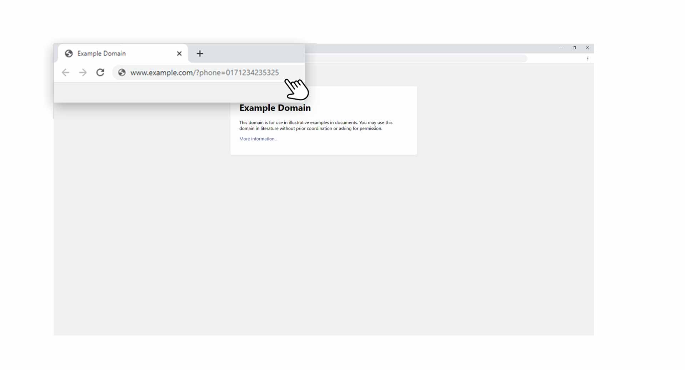
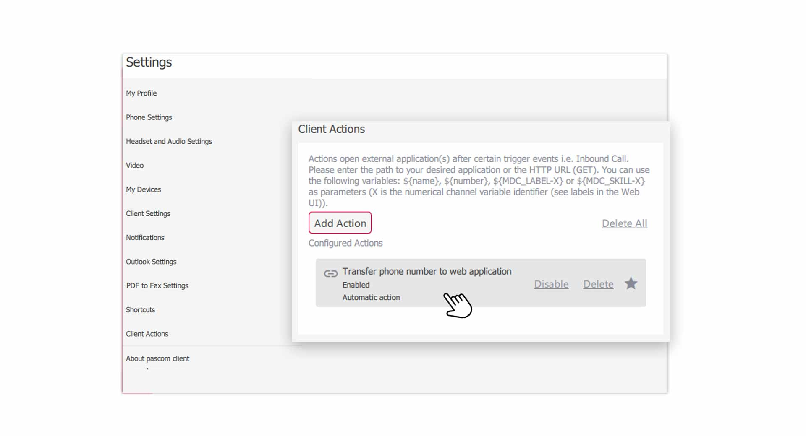


 


## Trainings Video

 

## Overview

Client actions allow you to transfer data to third-party applications for further processing (e.g. a CMS web application with customer data). Client actions can be controlled manually or work fully automated. 

## Create a new Action

The client actions can be found in the **Client Settings**.

1. Open the  via the pascom Menü

 

2. Click on  in the **Settings menu**

 

3. Create a new action using .

### Pass data to URL or application

At this point, you must decide whether you want to pass data to a **URL** (e.g. a web application) or to a **application** installed on your computer. 

 

## Edit an Action

Here you determine which data you want to pass and how your action should behave. In our example we transfer the **phone number** of the caller to a **URL**. 

 

### Set a Name

Assign a unique name to the action at , because you can create several actions and therefore you can see immediately what the action does. 

### Set the URL

At  set the address of your web application, followed by a variable and the data you want to pass.

**Example**  

|Description|Parameter|
|---|---|
|URL|www.webadress.com|
|Variable of the web application|?phone=|
|Data from the pascom client|${number}|
|Result|www.webadress.com?phone=${number}|

{}
The composition of the **URL** is of course completely up to you and you can therefore transfer the data as you need it.
{}

**pascom parameters that can be used**

 

|Parameter|Description|
|---|---|
|${name}|Contains the name of the caller, resolved from the phone book|
|${number}|Contains the phone number of the caller|
|${MDC_LABEL-X}|Contains the system variable of a label of the caller|
|${MDC_SKILL-X}|Contains the system variable of a skill|

## Run actions automatically

Actions can be started automatically in connection with the **call direction** and a **call result** for the following **call types**.

1. Internal calls from colleagues
2. External calls on the own extension
3. External calls via a team / queue

### Call direction for automatic actions

For , specify whether the action should start automatically for **incoming**, **outgoing** or **both** call directions.

### Trigger event for automatic actions

In the  item, set when the action should start automatically. Already during **ring**, after **accepting** the call or when **Hanging up** the call.

## Start actions manually

Actions can also be executed or started manually at any time. For actions that apply to the respective call, you will find a  Button.

*Start actions manually with one click*
 

1. Click on the  button for an incoming call and A popup will also show you the name of the action that will be executed.  
2. Actions can also be started directly from the **call journal**. There you will find the same  button.

## Work with data in a third-party application

Of course, you should also process the data that you transfer to a third-party application (e.g. search for phone numbers in a CMS web application). Here you can be creative. 

*Transfer data from pascom client to external application*
 

1. As you can see in the graphic above, the **URL** was given the **telephone number** of the customer, which can now be used **externally**. 

## Manage Actions

In the  you can manage your actions. Add new actions, remove existing actions and favor actions that should be used by default.

*Manage your actions in the pascom client*
 

1.  actions that you temporarily do not need.
2. Click on an  to **edit** it.
3. Please note that one action must always be marked as *. A single action is therefore always **favorite**.

 