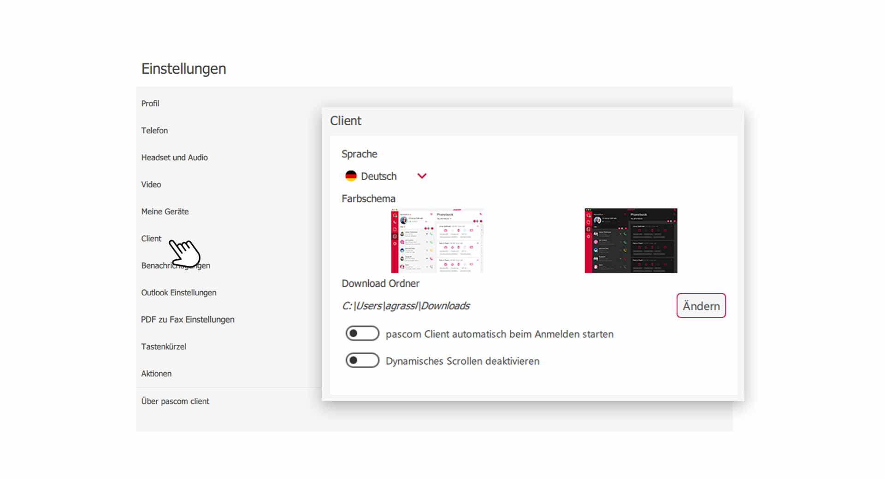
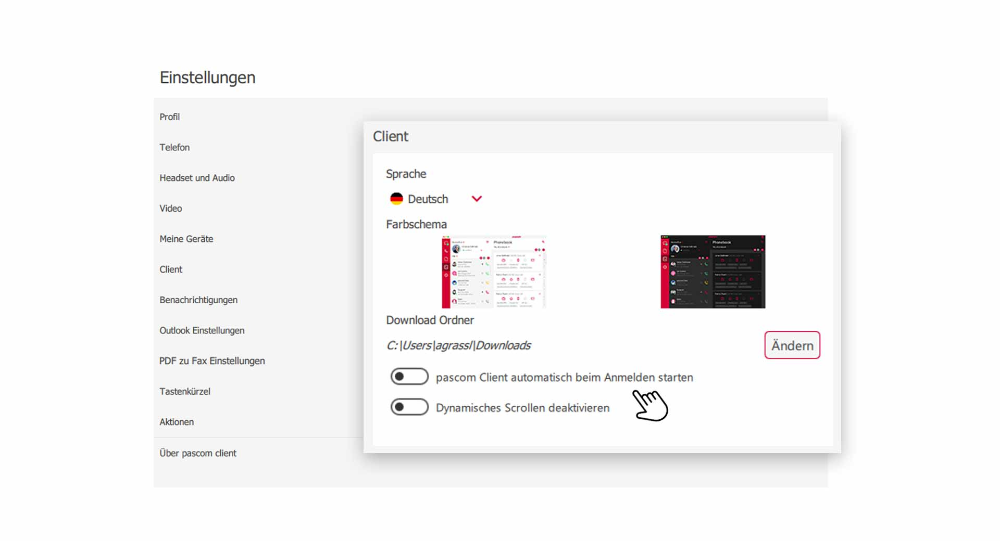
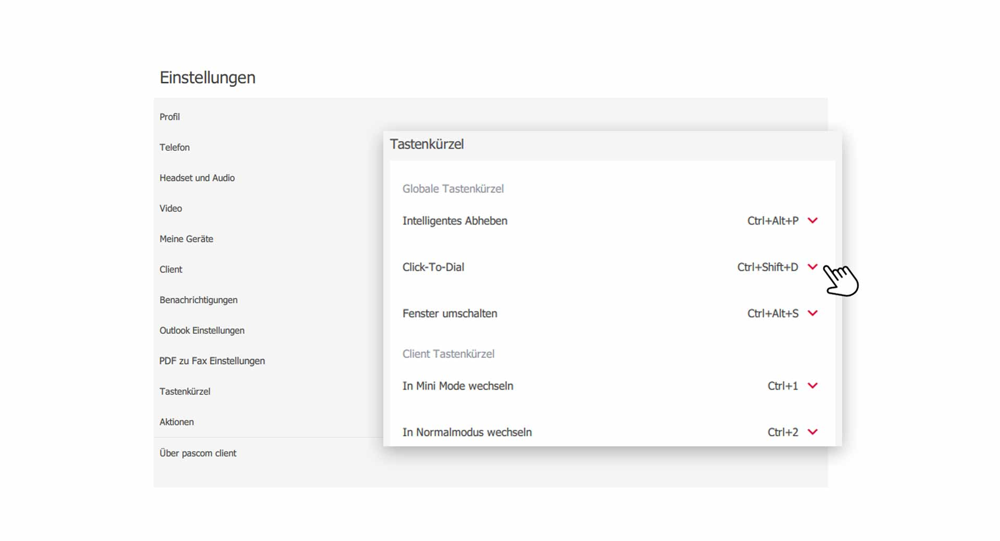
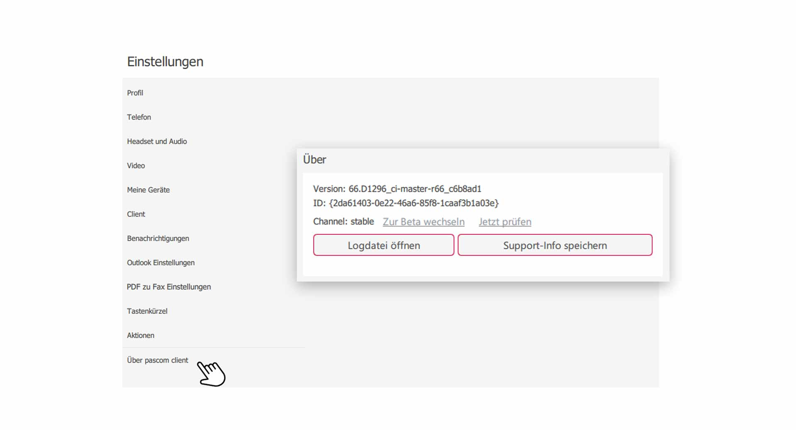


 


## Trainings Video

 

## Client Einstellungen öffnen

1. Öffnen Sie die **Client-Einstellungen** über das pascom Menü. Sie können auch in der oberen rechten Ecke des **Telefonie Bereichs** auf den **Optionen/Einstellungen** Button klicken.

 

2. Klicken Sie im **Einstellungs-Menü** auf **Client**.

 

## Sprache und Design ändern

Den pascom Client gibt es in verschiedenen Sprachen. Klicken Sie einfach auf **Sprache** und wählen Ihre bevorzugte Sprache aus. Nach Auswahl der Sprache, erscheint im unteren Bereich eine Meldung zum **Neustart** des pascom Client.

3. Sie können zwischen 2 verschiedenen **Design Themes** wählen. Ein **light** und ein **dark** Design Schema, stehen zur Auswahl.

## Download Ordner ändern

Alle Dateien die Sie von Ihren Kollegen zugesendet bekommen, werden in einen **Download-Ordner** herunter geladen. Standartmäßig ist dieser Ordner derselbe, wie der **Download-Ordner** Ihres Browsers. Sie können diesen Ordner jedoch ändern.

1. Klicken Sie bei dem Punkt **Download-Ordner** auf den Button **Ändern** und geben im Auswahlfenster einen neuen Ordner an. 

## pascom Client automatisch starten

Sie melden Sich bei Ihrem Betriebssystem an und der pascom Client startet automatisch, sodass Sie gleich einsatzbereit sind.

 

1. **Aktivieren** Sie dazu die "Option" - **pascom Client automatisch beim Anmelden starten**

## Dynamisches Scrollen deaktivieren

Das dynamische Scrollen bewirgt ein weicheres Navigieren durch Menüs und Listen. Beim Scrollen bemerken Sie, dass der bewegliche Kontent noch etwas nach rollt. 

1. Sollten Sie dieses Scroll-Verhalten nicht mögen, können Sie die Option mit Klick auf **Dynamisches Scrollen deaktivieren** ausschalten.

## Tastenkürzel (Shortcuts) anpassen.

Im pascom Client können Sie mit **Tastenkürzel** arbeiten, um sich z.B. das Navigieren zu erleichtern. 

2. Klicken Sie im **Einstellungs-Menü** auf **Tastenkürzel**.

 

2. Klicken Sie zum Ändern eines **Tastenkürzel** bei der gewünschten Funktion auf das Drop-Down-Feld und geben eine neue **Tastenkombination** ein.

{}
Tastenkürzel sind nur im Desktop Client unter Windows und macOS verfügbar.
{}

Im folgenden werden die globalen Tastenkürzel näher erklärt:

|Tastenkürzel|Beschreibung|
|---|---|
|Intelligentes Abheben|Sie können einen ankommenden Anruf unter Verwendung des Tastenkürzels annehmen, auch wenn der Client nicht im Fokus ist.|
|Click-to-Dial|Diese Funktion ermöglicht es mit einem Tastenkürzel aus dem Browser oder einem Dokument heraus eine Nummer zu wählen.|
|Fenster umschalten|Diese Funktion ermöglicht es mit einem Tastenkürzel den Client in den Vordergrund zu holen oder zu minimieren.|

## pascom Client Log und Support Informationen

Bei Fehlern oder Problemen mit dem pascom Client, können Sie Ihren Systemadministrator oder das pascom Support-Team unterstützen, indem Sie Log und Support Informationen bereitstellen. 

2. Klicken Sie im **Einstellungs-Menü** auf **Über pascom Client**.

 

1. Hier finden Sie die **Log-Dateien** des pascom Client, welche sich in einem **Text-Editor** öffnen.

2. Generieren Sie ein **Support-Packet** für Ihren Systemadministrator oder dem pascom Support. Klicken Sie dazu auf **Support-Info speichern**. Das Zip-Archiv finden Sie dann in Ihrem **Download-Ordner**

 