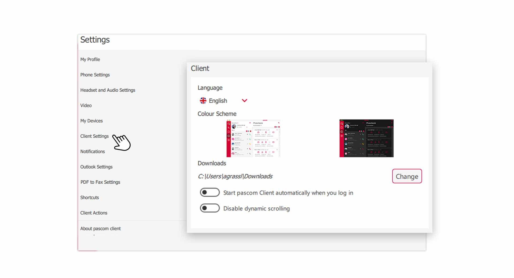
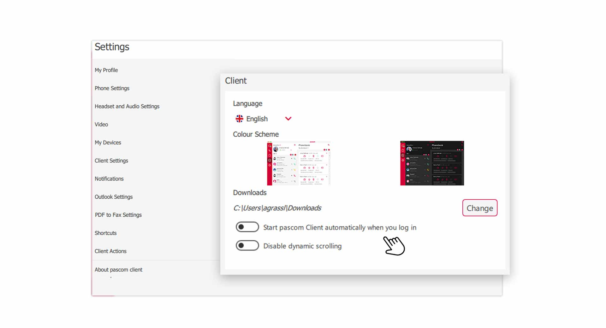
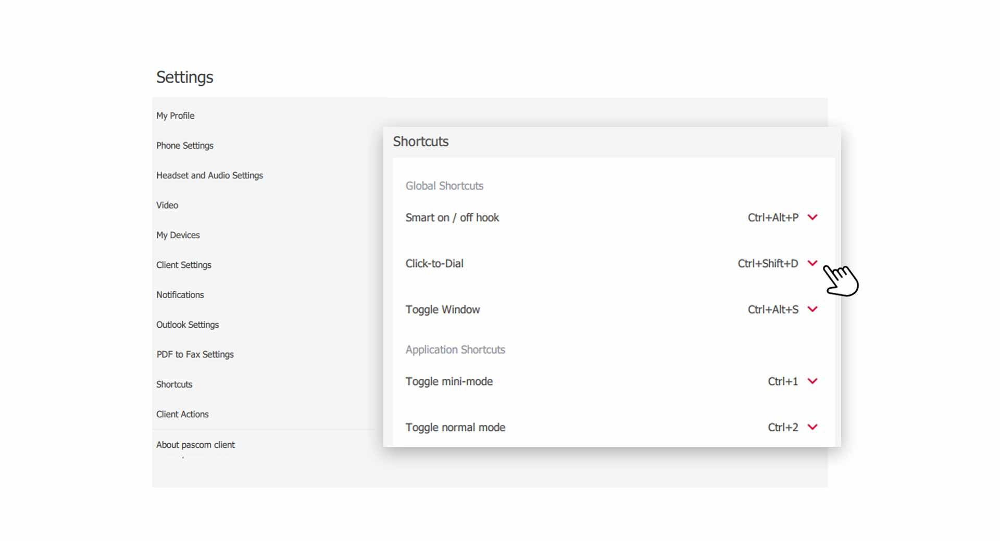
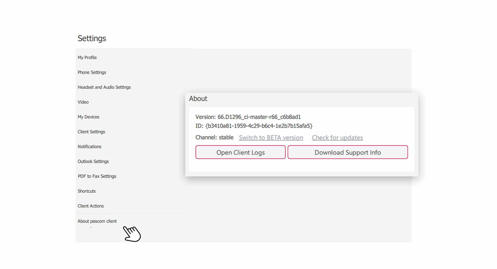


 


## Trainings Video

 

## Open Client Settings

1. Open the **Client Settings** via the pascom menu. You can also click on the **Options/Settings** button in the upper right corner of the **Telephony area**.

 

2. Click **Client Settings** on the **Settings menu**.

 

## Change language and design

The pascom client is available in different languages. Simply click on **Language** and select your preferred language. After selecting the language, a message will appear in the bottom area to **restart** the pascom Client.

3. You can choose between 2 different **Design Themes**. A **light** and a **dark** design scheme are available.

## Change download folder

All files sent to you by your colleagues are downloaded into a **Download folder**. By default, this folder is the same as the **Download folder** of your browser. However, you can change this folder.

1. Click on the **Change** button at the **Download Folder** item and specify a new folder in the selection window. 

## Start pascom Client automatically

You log on to your operating system and the pascom client starts automatically, so you are ready to use right away.

 

1. **Activate** the "Option" - **start pascom client automatically when you login**.

## Disable dynamic scrolling

Dynamic scrolling makes navigation through menus and lists smoother. When scrolling, you will notice that the moving content rolls a little bit more. 

If you do not like this scrolling behavior, you can turn off the option by clicking on **Deactivate dynamic scrolling**.

## Customize keyboard shortcuts.

In the pascom client you can work with **shortcuts** to make p.e. navigation easier. 

2. click on **shortcuts** in the **Settings menu**.

 

To change a **shortcut** for the desired function, click on the drop-down box and enter a new **key combination**.

{}
Shortcut keys are only available in the Desktop Client under Windows and macOS.
{}

**In the following the global keyboard shortcuts are explained in detail:**

|Shortcut Key|Description|
|---|---|
|Smart On / Off Hooking |Enables incoming call pickup via shortcut key, even when the client is not the active window.|
|Click-to-Dial|Enables dialing a number direct from a browser or document by highlight and pressing the shortcut keys.|
|Toggle Window|This function enables either bringing the client to the foreground or to minimise the client via a shortcut key.|

## pascom Client Log and Support Information

In case of errors or problems with the pascom client, you can assist your system administrator or the pascom support team by providing log and support information. 

2. Click on **About pascom Client** in the **Settings menu**.

 

1. Here you will find the **log files** of the pascom client, which opens in a **text editor**.

2. Generate a **support package** for your system administrator or pascom support. Click on **Download Support Info**. You will find the zip archive in your **Download folder**.

 