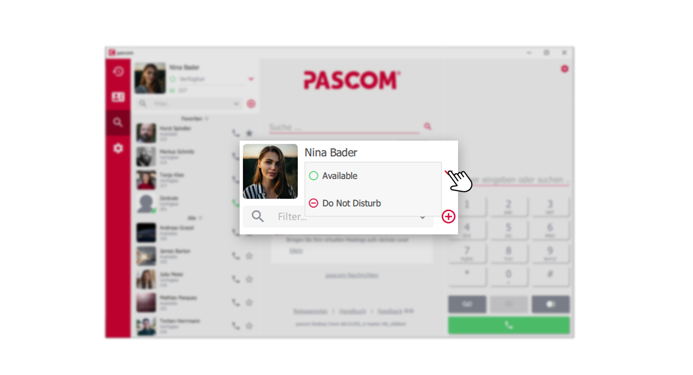
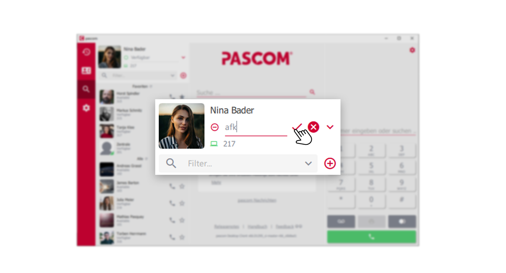
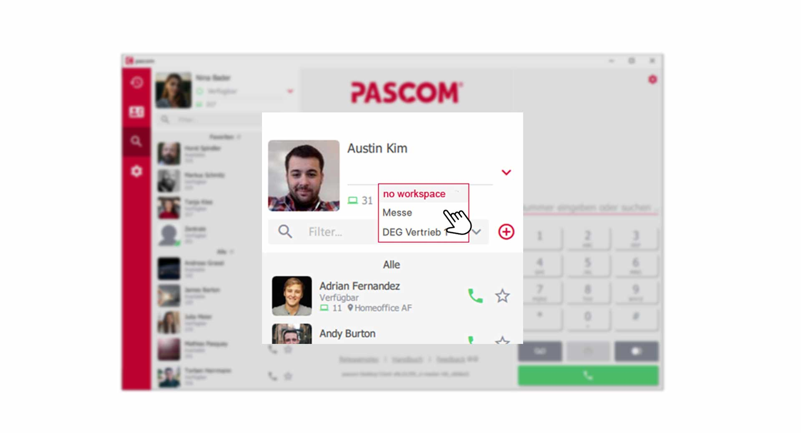
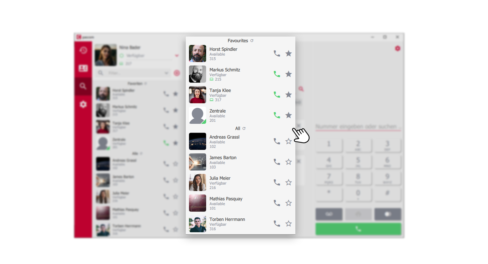
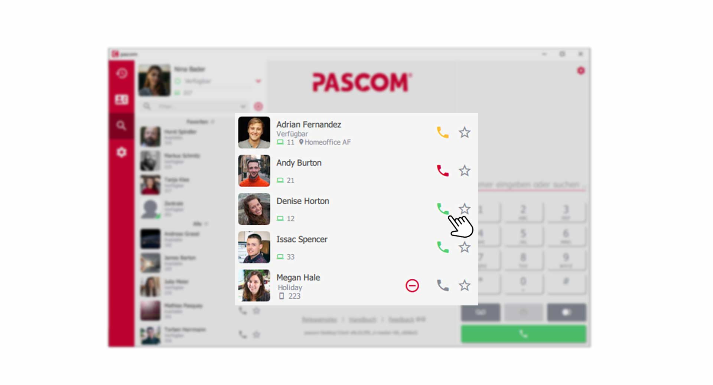
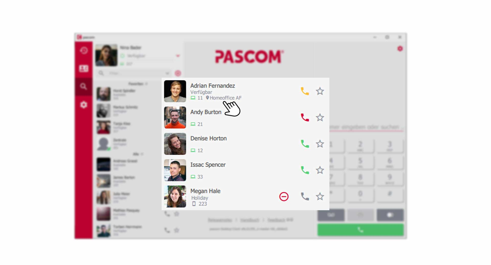
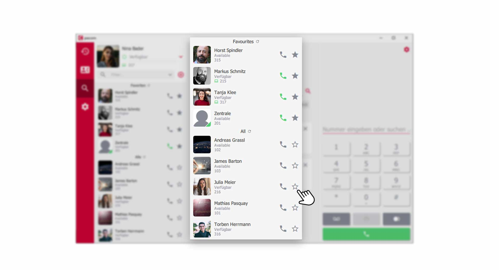


 


## Trainings Video

 

## My Profile

The own profile, offers very good settings, in order to communicate visually to its colleagues, how it stands straight around the own accessibility.

### Set your Presence status

To set your presence status, click on the dopdownfield in your profile. This opens two options.

*Choose your Presence status*
 

1. **green** = Available 
2. **red** = Do not disturb

{}
Please note that the **"Do not disturb" function** does not replace DND functionality. This only signals to your colleagues that you do not wish to be disturbed at the moment. If you do not want to be reached, use the device control [LINK]()
{}

### Individualize your presence status

You can also store your own messages for the respective presence status. Tell your colleagues in **"Do not disturb "** mode that you are on vacation or have an important meeting. 

Just click on the presence status line and enter your own message. Finally, save your message by clicking on the check mark.

*Own presence message*
 

### Which device is currently in use ?

The presence status shows your colleagues which device you are currently using. If you are sitting at your computer and using the **pascom Desktop Client**, you have a **computer icon**. If you are using the pascom Mobile App, a **mobile phone symbol** is displayed. Next to it you will find your internal extension number. 

*device status*
 

### Choose your Location

Show your colleagues where you are right now. Your system administrator can set up locations that offer predefined settings. So you can adopt a completely new setup with a single click. e.g. home office, sales etc.

To do this, click on the location icon next to the device status and select your location. 

*Choose a location*
 

## Your Contact List

In the contact list you will find all your colleagues, pascom groups, queues and your favorites. You can also see the presence status of each colleague and the device they are using. Simply call your colleagues from the contact list. 

*Contact List overview*
 

### The call and presence status of your colleagues

As you have already learned above, the presence status tells other users about the current availability. The call status, on the other hand, shows you exactly whether someone can be called or is on the phone.

*Call status within the contact list*
 

**Call status of the handset icon**  
- **red** = User is currently on the phone  
- **yellow** = User is currently being called  
- **green** = User is free and can be called  

 

*Presence status within the Contact list*
 

**Presence status explained**  
- **green** = User is logged on to the pascom client (desktop or mobile)  
- **grey** = User has closed the pascom client (desktop or mobile) 

### Where is my colleague currently?

In addition to the end device status, you can see your colleague's workstation and therefore know exactly where he is at the moment.

*locations within the contact list*
 

## Create Favourites

Colleagues with whom you need to interact more frequently can be marked with the **star symbol**, which then moves to the upper **Favourites** area. In this way, important contacts are always pinned to the top of the contact list.

*Favourites wihtin the contact list*
 

## Configure your Contact List

The contact list can be adjusted according to your preferences. Change the **sorting** and **list style** of your contact list to keep track of your contacts. The contact list settings are explained in this [tutorial](link to the Client Settings).

