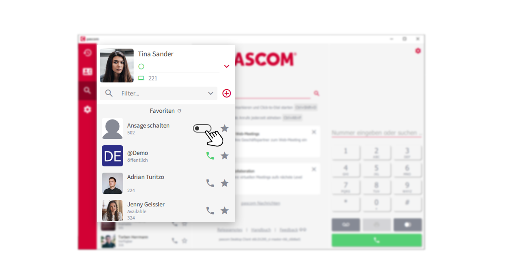
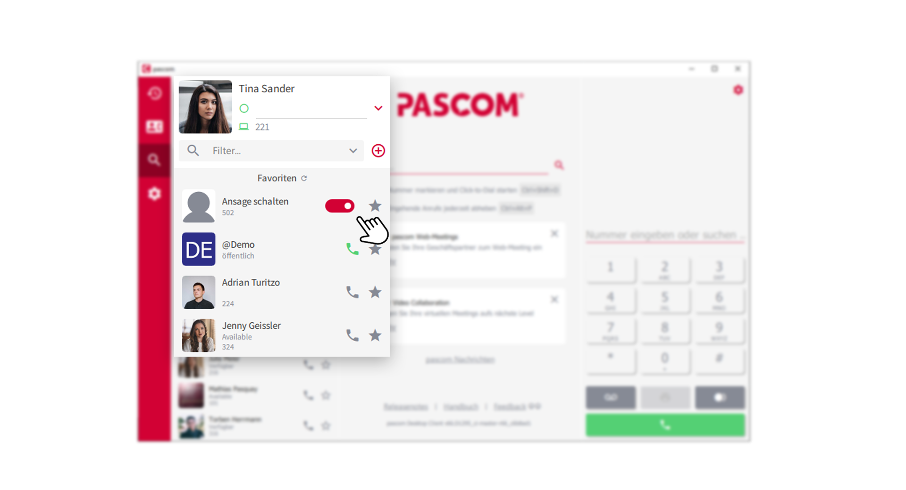
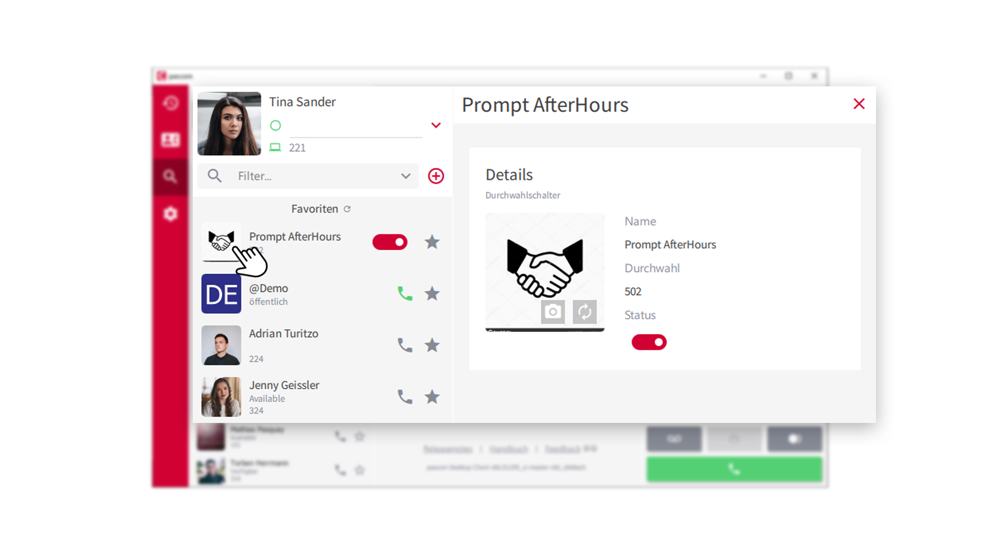


 


## Übersicht

Durchwahlschalter sind ein wertvolles Instrument um das Verhalten der pascom Telefonanlage zu steuern. Mit einem simplen An- und Ausschalten können Sie z.B. Ansagen schalten, Rufumleitungen setzen oder einen komplett anderen Anrufverlauf herbeiführen. Die Einsatzmöglickeiten sind vielfälltig.

## Voraussetzungen

Um den Durchwahlschalter als interaktives Element in Ihrer Kontaktliste zu nutzen, müssen entsprechende Rollen definiert sein, welche Ihnen die Nutzung des Durchwahlschalter erlauben. Sollten Sie einen Durchwahlschalter nicht in Ihrer Kontakliste finden, sprechen Sie Ihren Systemadministrator oder IT-Betreuer darauf an. 

## Durchwahlschalter nutzen

In Ihrer Kontaktliste finden Sie den Durchwahlschalter für z.B. Ansage schalten.

 

1. Klicken Sie auf den **Switch/- Schalter** um den Durchwahlschalter zu aktivieren. 

 

2. Um den Durchwahlschalter zu deaktivieren, klicken Sie erneut auf den Switch/- Schalter

## Durchwahlschalter favorisieren

Sie können den Durchwahlschalter, wie jedes Element, in Ihrer Kontaktliste zu den **Favoriten** hinzufügen. 
Klicken sie dazu einfach auf das **Stern-Symbol** und der Durchwahlschalter reiht sich in Ihrer Favoritenliste ein. 

## Durchwahlschalter individualisieren

Der Durchwahlschalter kann optisch Ihren Anforderungen angepasst werden. Klicken Sie dazu auf das **Avatarbild** des
Durchwahlschalter und Sie gelangen zu weiteren Einstellungen. 

 

3. Lassen Sie sich ein Avatarbild autogenerieren oder laden Sie ein individuelles Avatarbild für den Durchwahlschalter hoch. 

 