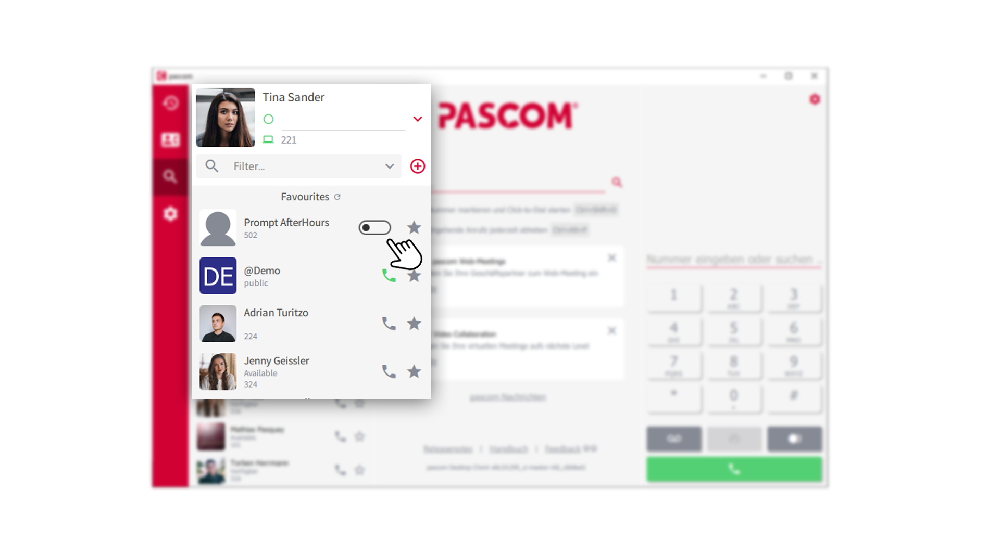
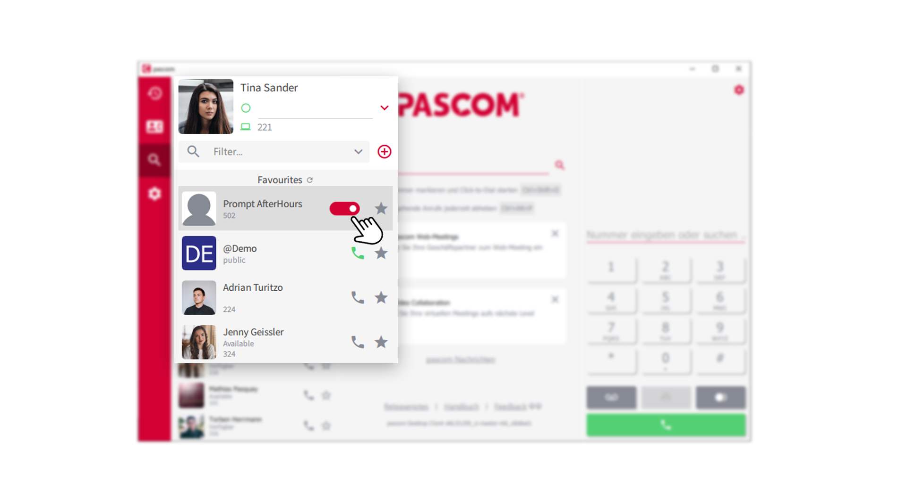
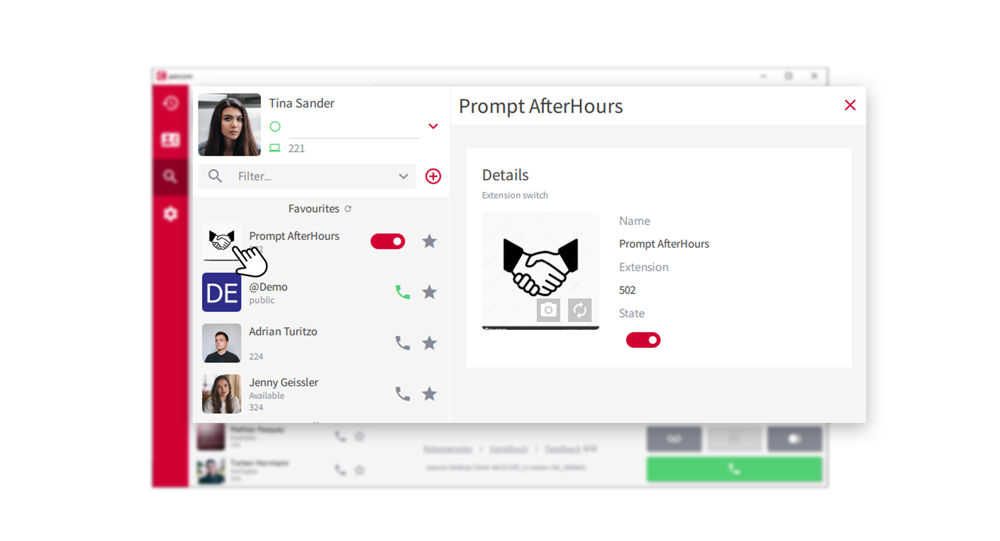


 


## Overview

Extension switches are a valuable tool to control the behavior of the pascom telephone system. With a simple on/off switch you can e.g. switch announcements, set call forwarding or cause a completely different call flow. The application possibilities are endless.

## Requirements

In order to use the extension switch as an interactive element in your contact list, corresponding roles must be defined that allow you to use the extension switch. If you do not find an extension switch in your contact list, contact your system administrator or IT administrator. 

## Extension Switch usage

In your contact list you will find the extension switch for e.g. Prompt AfterHours. 

 

1. click on the **Switch/- Button** to activate the extension switch. 

 

2. to deactivate the extension switch, click the **Switch/- Button** again.

## Favor extension switch

You can add the extension switch to your **Favorites**, just like any other element in your contact list. 
Simply click on the **star symbol** and the extension switch will be added to your list of favorites. 

## Individualize extension switch

The extension switch can be visually customized to your requirements. To do so, click on the **avatar image** of the
extension switch and you will get to further settings. 

 

3. Automatically generate an avatar image or alternatively upload a custom avatar image for the extension switch.

 