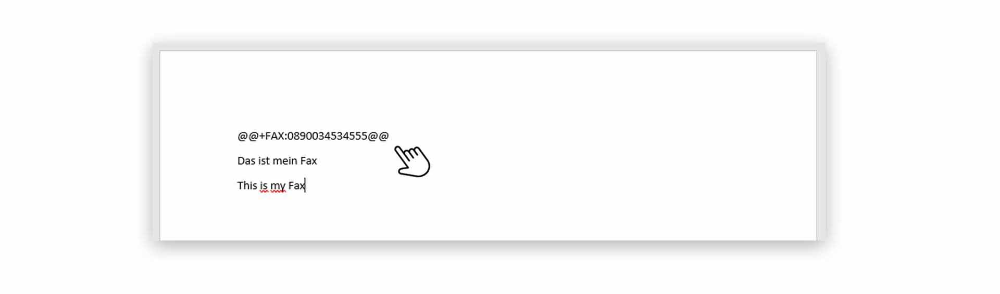
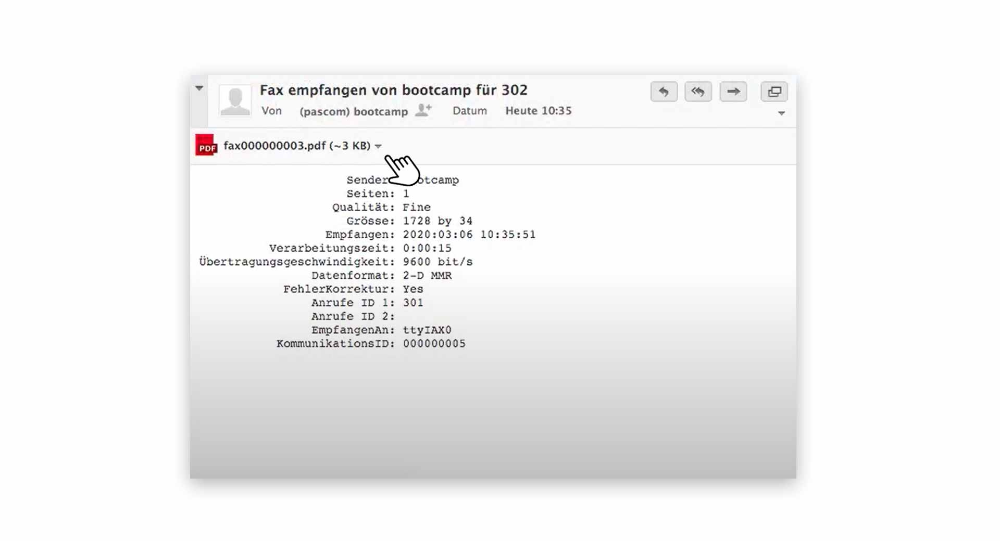


 


## Trainings Video

 

## Übersicht

Die Faxfunktionen der pascom Telefonanlage sind sehr umfangreich. Sie als Benutzer können ein virtuelles Faxgerät oder ein physikalisches Faxgerät, dass bei Ihnen im Büro steht, nutzen. Keine Sorge - die Handhabung ist bei beiden Varianten die selbe. Sie werden wohmöglich gar nicht merken, über was für eine Geräteart Sie Faxen. 

**Es gibt jedoch einen kleinen Unterschied**

1. Nutzen Sie ein virtuelles Faxgerät, empfangen Sie Faxe direkt in Ihrem Emailpostfach. Bei einem physikalischen Faxgerät im Büro, ist es in den meisten Fällen so, dass Sie zum Faxgerät rennen müssen, wenn ein neues Fax eingeht. 

## Ein neues Fax senden

Klicken Sie im Wählfeld des **Telefonie-Bereichs** auf das . Sie können natürlich einen neuen Faxversand auch direkt aus Ihrem **Telefonbuch** heraus starten.

*Neuen Faxversand starten und anlegen*
 

1. Wählen Sie im nächsten Schritt das  aus, welches Sie per Fax versenden möchten.

2. Geben Sie die  ein, an die Sie das Dokument schicken möchten. Aus dem **Telefonbuch** heraus, steht natürlich bereits die **Faxnummer** im Wählfeld. 

*Neues Fax senden*
 

1. An die Emailadresse für die **Benachrichtigung** erhalten Sie den **Faxsendebericht** 

2. Eine eindeutige **Auftrags_ID** wird für jeden Faxversand von der pascom Telefonanlage erstellt.

3. Der **Auftragstitel** verhält sich wie ein **Betreff**. Standartmäßig ist der **Dokumentenname** hinterlegt, von der Datei welche Sie versenden wollen. Sie können den  aber auch, mit einem **Klick** darauf, anpassen oder verändern.

## Faxen Teil-Automatisieren

Sie können den Faxversand mit dem pascom Client ein Stück weit **Automatisieren** um Dokumente gleich aus einem **Textverarbeitungsprogramm** heraus, zu faxen.

**Wie läuft das ab?**

1. Sie schreiben ein Fax-Dokument in einem Textverarbeitungsprogramm.
2. Speichern das Dokument als PDF-Datei in einen **überwachten Ordner**.

### Eine Ordnerüberwachung einrichten

Um den **Faxversand** zu automatisieren, überwacht der pascom Client einen Ordner auf Ihrem Computer. Wenn dort neue Faxdokumente abgespeichert werden, startet der Faxversand automatisch.

1. Öffnen Sie die  über das pascom Menü.

 

1. Wählen Sie im Menü  oder Scrollen Sie runter bis zu den Einstellungen **PDF zu Fax**.

 

In den **Fax zu PDF** Einstellungen setzen Sie mit einem **Klick** auf  einen neuen Ordner. Wählen Sie einen bestehenden Ordner aus oder erstellen Sie einen neuen Ordner z.B. **Faxe**.

### Neue PDF-Dokumente im überwachten Ordner speichern
1. Sobald Sie ein neues **PDF-Dokument** in diesem Ordner abspeichern, startet automatisch der **Faxversand**. Sie müssen nur noch die **Faxnummer** in das Wählfeld eingeben. 

*Faxversand startet automatisch bei neu abgespeichertem PDF-Dokuement*
 

## Faxen Voll-Automatisieren

Um einen vollautomatischen **Faxversand** zu nutzen, müssen Ihre PDF-Dokumente **Steuerfelder**-Parameter besitzen, damit der Faxversand automatisch im Hintergrund funktioniert.

**Wie läuft das ab?**

1. Sie schreiben ein Fax-Dokument in einem Textverarbeitungsprogramm.
2. Fügen Sie dort **Steuerfelder**-Parameter ein.
3. Speichern das Dokument als PDF-Datei in einen **überwachten Ordner**.

### Einstellungen zur Automatisierung vornehmen

Richten Sie zunächst wie oben beschrieben eine Ordnerüberwachung ein. Danach aktivieren Sie die Option .

*Automatisches Senden aktivieren*
 

1. Stellen Sie sicher, dass auf Ihrem Computer das Tool **Ghostscript** installiert ist. Dieses wird benötigt, um PDF Dateien zu steuern. Klicken Sie auf , um den Pfad zum Installationsordner automatisch zu setzen. 

2. Die **Sendeverzögerung** verzögert in **Sekunden** den Zeitpunkt, an dem der **Faxversand** automatisch startet.

3. Testen Sie die Konfiguration

### Dokumente mit **Steuerfelder**-Parameter versehen

In Ihrem Dokument, fügen Sie als **erste Zeile** (wie ein Faxheader) die  ein. 

*Steuerfeld-Parameter in einem Faxdokument*
 

|Verfügbare Steuerfelder||
|---|---|
|@@+FAX:+49991123456789@@|Das Fax muss mindestens dieses Steuerzeichen mit der Zielnummer enthalten.|
|@@+TAG:Bestellung XYZ@@|Optional kann der Fax-Job mit einem Betreff versehen werden.|
|@@+NOTIFY:mustermann@musterfirma.de@@|Optional kann festgelegt werden, wer über den Status des Fax-Jobs informiert werden soll.|

1. Speichern Sie Ihr Faxdokument als **PDF-Datei** in den **überwachten Ordner** und der **Faxversand** startet vollautomatisch im Hintergrund.  

## Faxe empfangen

Faxe empfangen Sie über das **virtuelle Fax** immer als Email, die direkt in Ihrem Emailpostfach landen. Sofern Ihr **Systemadministrator** Ihre Emailadresse eingerichtet hat. 

Sollten Sie ein **Team Fax** verwenden, erhalten Sie neue Faxen im Emailpostach des Teams.

*Empfangenes Fax im Emailpostfach*
 

1. Das eigentliche **Faxdokument** finden Sie als **PDF-Datei** im Anhang der Email. 
2. Zusätzlich haben Sie in der Email einen **Faxbericht**.  

 

