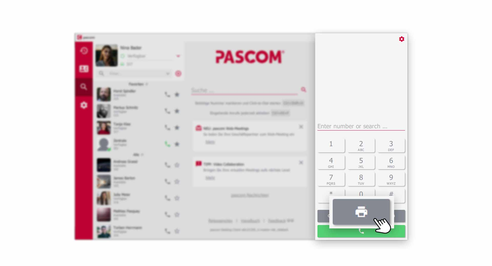
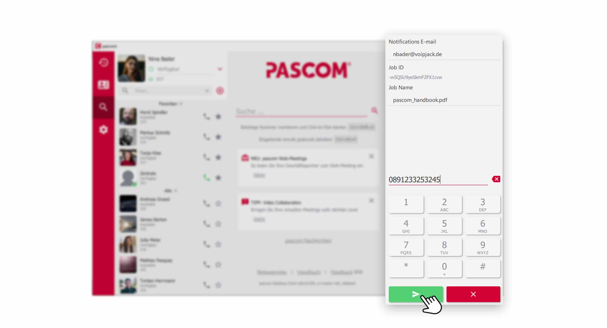
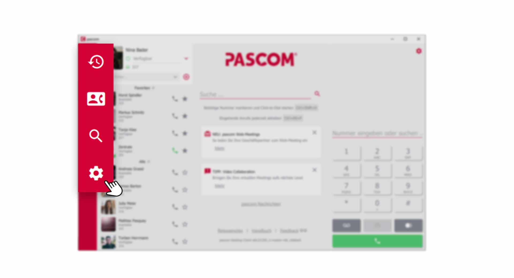
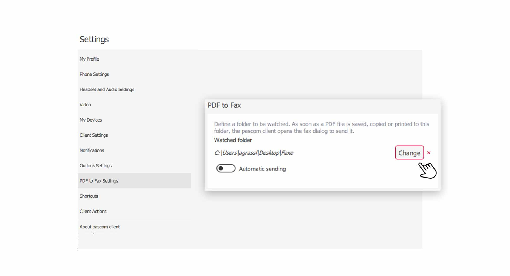
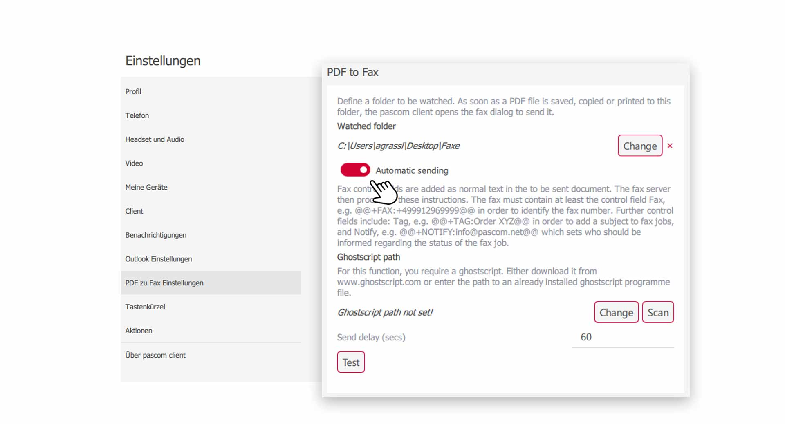
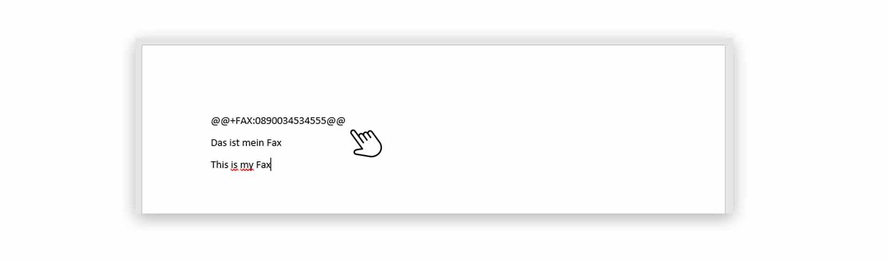


 


## Trainings Video

 

## Overview

The fax functions of the pascom telephone system are very extensive. A user can use a virtual fax machine or a physical fax machine that is located in your office. Don't worry - the handling is the same for both variants. You probably won't even notice what kind of device you are faxing on. 

**But there is a small difference**

1. Use a virtual fax machine, receive faxes directly into your email inbox. With a physical fax machine in the office, in most cases you will have to run to the fax machine when a new fax arrives. 

## Send a new fax

Click on the in the dialing field of the **Telephony area**. Of course you can also start a new fax transmission directly from your **phone book**.

*Start and create new fax transmission*
 

1. In the next step, select the  that you want to send by fax.

2. Enter the  to which you want to send the document. If you send it from the **phone book**, the **fax number** is already in the dialing field.

*Send a new fax*
 

1. To the email address for the **notification** you will receive the **fax transmission report** 

2. A unique **Job_ID** is created by the pascom telephone system for each fax transmission.

3. The **Job title** behaves like a **subject**. The **document name** of the file you want to send is the default. But you can also change the  with a **click** on it.

## Partial automation of faxing

You can **automate** faxing with the pascom client to fax documents directly from a **text editor program**.

**How does it work?**

1. You write a fax document in a word editor program.
2. Save the document as a PDF file in a **watched folder**.

### Set up a folder monitoring

To automate **fax transmission**, the pascom client monitors a folder on your computer. If new fax documents are saved there, fax transmission starts automatically.

1. Open the  via the pascom menu.

 

1. Select from the menu or scroll down to the settings **PDF to Fax**.

 

In the **Fax to PDF** settings, set a new folder with a **click** on . Select an existing folder or create a new folder e.g. **Faxes**.

### Save new PDF documents to the monitored folder

1. As soon as you save a new **PDF document** in this folder, the **Fax transmission** starts automatically. You only have to enter the **Fax number** in the dialing field. 

*Fax transmission starts automatically when a new PDF document is saved*
 

## Full automation of faxing

In order to use fully automatic **fax transmission**, your PDF documents must have **control field** parameters so that fax transmission works automatically in the background.

**How does it work?**

1. You write a fax document in a word editor program.
2. Insert **control field** parameters.
2. Save the document as a PDF file in a **watched folder**.

### Make settings for automation

First set up a folder monitoring as described above. Then activate the option .

*Activate automatic sending*
 

1. Make sure that the **Ghostscript** tool is installed on your computer. This tool is required to control PDF files. Click on  to set the path to the installation folder automatically. 

2. The **Send Delay** delays in **seconds** the time when the **Fax transmission** starts automatically.

3. Test the configuration

### Set control field parameters in documents

In your document, insert as **first line** (like a fax header) the **control field** parameters. 

*Control field parameters in a fax document*
 

|Available controls||
|---|---|
|@@+FAX:+49991123456789@@|The fax must contain at least this control character with the destination number.|
|@@+TAG:Bestellung XYZ@@|Optionally, the fax job can be provided with a subject.|
|@@+NOTIFY:mustermann@musterfirma.de@@|Optionally, you can specify who should be notified of the status of the fax job.|

1. Save your fax document as **PDF file** in the **monitored folder** and the **fax transmission** will start automatically in the background.  

## Receiving Faxes

Faxes are always received via the **virtual fax** as emails, which land directly in your email inbox. If your **system administrator** has set up your email address. 

If you use a **Team Fax**, you will receive new faxes in the team email box. 

*Received fax in email inbox*
 

1. The actual **fax document** is available as **PDF file** attached to the email. 
2. Additionally you have a **Fax Report** in the email.  

 
