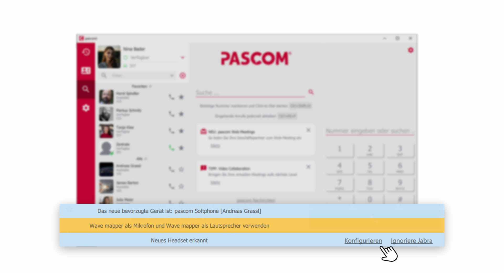
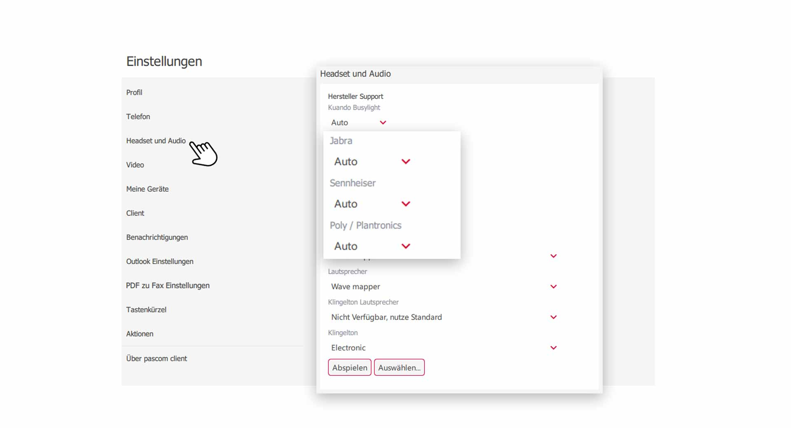
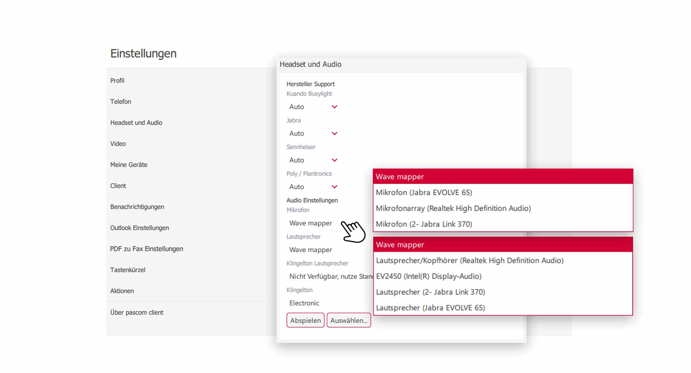


 


## Trainings Video

 

## Übersicht

In den Headset und Audio Einstellungen haben Sie einige Optionen zum Einstellen Ihrer Audiokanäle. Unterstützte Headsets lassen sich mit einem Klick einrichten. Mikrofon und Audiokanäle können separat voneinander eingestellt werden. So können Sie z.B. den Klingelton über Ihre Lautsprecherboxen ausgeben lassen, während Mikrofon und Gesprächs-Audio über Ihr Headset laufen.

## Unterstützte und nicht unterstützte Headsets

Sie haben die Wahl bei der Nutzung Ihres Headset. Vom pascom Client **unterstützte** Headsets haben den Vorteil, dass zusätzliche Funktionen nutzbar sind (z.B. Lautstärkeregelung, Annehmen und Auflegen am Headset). **Nicht unterstützte** Headsets funktionieren auch, jedoch ohne **zusätzliche Funktionen** (z.B. Apple Ear Pods).  

 

|Hersteller|Beschreibung|
|---|---|
|Jabra|Alle Jabra Headsets werden unterstützt, unser Favorit ist die Evolve-Reihe.|
|Plantronics| Alle Plantronics Headsets werden unterstützt. Es kommt vor, dass Sie bei einigen Modell ein zusätzliches SDK vom Hersteller installieren müssen.|
|Sennheiser| Alle Sennheiser Headsets werden unterstützt. Es kommt vor, dass Sie bei einigen Modell ein zusätzliches SDK vom Hersteller installieren müssen.|

## Headset einrichten

Schließen Sie Ihr Headset am Computer via **USB** oder einem **Bluetooth-Dongle** an. der Hersteller Jabra benötigt in der Regel für seine Headsets keine Treiberinstallation. Plantronics und Sennheiser benötigen bei einigen Modellen eine Software, die installiert werden muss. Der pascom Client erkennt dann automatisch ein neues **Headset**. 

 

{}
Der Windows **Wave Mapper** kümmert sich um die Zuordnung des Audio zu Ihren Geräten und weiß natürlich nicht, was Sie für Preferenzen haben. Führen Sie daher bei jedem neuen Headset eine Konfiguration durch. 
{}

**Warum wird mein Headset automatisch erkannt?**
Das liegt an den Einstellung des pascom Client. Unterstützte Headsets werden automatisch erkannt, können jedoch auch **ignoriert** werden, falls Sie das Headset in einer anderen Anwendung nutzen möchten.

## Headset Einstellungen

1. Öffnen Sie die **Client-Einstellungen** über das pascom Menü

 

2. Klicken Sie im **Einstellungs-Menü** auf **Headset und Audio**

 

Um die **automatische Erkennung** neuer Headsets zu unterbinden, wählen Sie bei dem entsprechenden Hersteller statt **"Auto"**, im Drop-Down-Feld **"ignorieren"** aus. 

## Audio Einstellungen

Die Audio Einstellungen können Sie ganz nach Ihren Vorlieben vornehmen. Da die Audio Kanäle separat voneinander eingestellt werden können, haben Sie die volle Kontrolle über das Audio im pascom Client.

 

### Mikrofon einstellen

1. Klicken Sie auf **"Mikrofon"** und wählen aus dem Drop-Down-Feld Ihr gewünschtes Mikrofon aus.

### Lautsprecher einstellen

1. Klicken Sie auf **"Lautsprecher"** und wählen aus dem Drop-Down-Feld Ihren gewünschten Lautsprecher für das Gesprächs-Audio aus. 

### Lautsprecher für Klingelton einstellen

1. Klicken Sie auf **"Lautsprecher für Klingelton"** und wählen aus dem Drop-Down-Feld Ihren gewünschten Lautsprecher für den Klingelton aus. 

### Klingeltöne einstellen

Der pascom Client liefert einige standartmäßig integrierte Klingeltöne mit, aus denen Sie wählen können. Sie können aber auch Ihre eigenen Klingeltöne einstellen, indem Sie auf den Button **"Auswählen"** drücken und ein Musikstück von Ihrem Computer hochladen.
