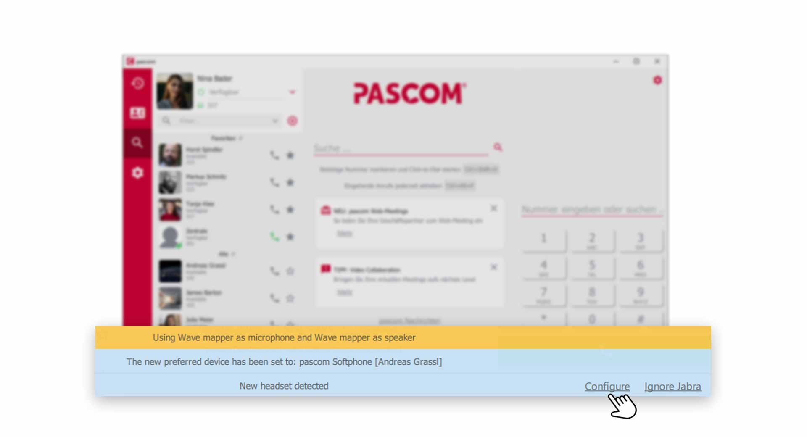
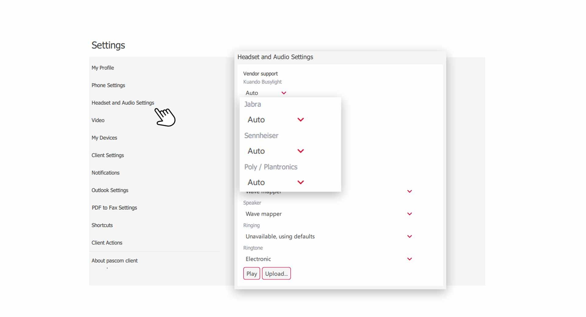
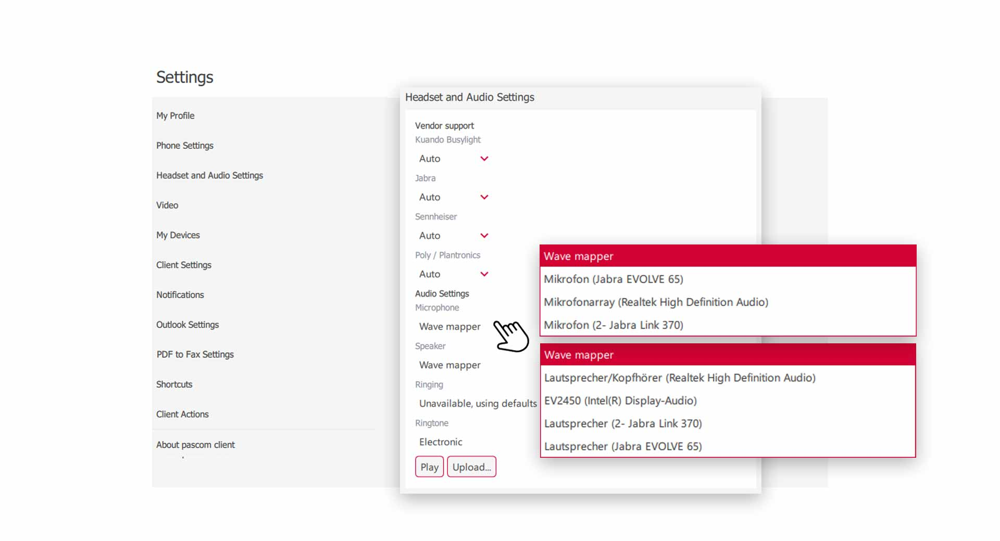


 


## Overview

In the headset and audio settings you have some options to adjust your audio channels. Supported headsets can be set up with one click. Microphone and audio channels can be set separately. For example, you can have the ringtone played through your speakers while the microphone and call audio are played through your headset.

## Supported and unsupported headsets

You have the choice when using your headset. Headsets **supported** by the pascom Client have the advantage that additional functions can be used (e.g. volume control, pickup and hang up on the headset). **Not supported** headsets also work, but without **additional functions** (e.g. Apple Ear Pods).  

 

|Manufacturer|Description|
|---|---|
|Jabra|All Jabra headsets are supported|
|Poly / Plantronics|All Plantronics headsets are supported. You need to install an additional SDK or Software from the manufacturer.|
|Sennheiser| All Sennheiser headsets are supported. You need to install an additional SDK or Software from the manufacturer.|

## Headset Setup

Connect your headset to your computer via **USB** or a **Bluetooth dongle**. The manufacturer Jabra usually does not require driver installation for its headsets. Plantronics and Sennheiser require software to be installed for some models. The pascom client then automatically detects a new **headset**. 

 

{}
The Windows **Wave Mapper** takes care of assigning the audio to your devices and of course does not know what your preferences are. Therefore you should make a configuration for each new headset. 
{}

**Why is my headset automatically recognized?**  
This is due to the settings of the pascom client. Supported headsets are automatically recognized, but can also be **ignored** if you want to use the headset in another application. 

## Headset Settings

1. Open the  via the pascom Menü

 

2. Click on  in the **Settings menu**

 

To stop the **automatic detection** of new headsets, select  in the drop-down field instead of . 

## Audio Settings

You can adjust the audio settings according to your preferences. Since the audio channels can be set separately, you have full control over the audio in the pascom client.

 

### Configure Microphone

1. Click on  and select your desired microphone from the drop-down field

### Configure Speaker

1. Click on  and select your desired speaker for the conversation audio from the drop-down box. 

### Configure Speaker for Ringtone

1. Click on  and select your desired speaker for the ringtone from the drop-down box. 

### Configure Ringtones

The pascom client comes with several standard integrated ringtones from which you can choose. However, you can also set your own ringtones by pressing the  button and uploading a music track from your computer.  

 
