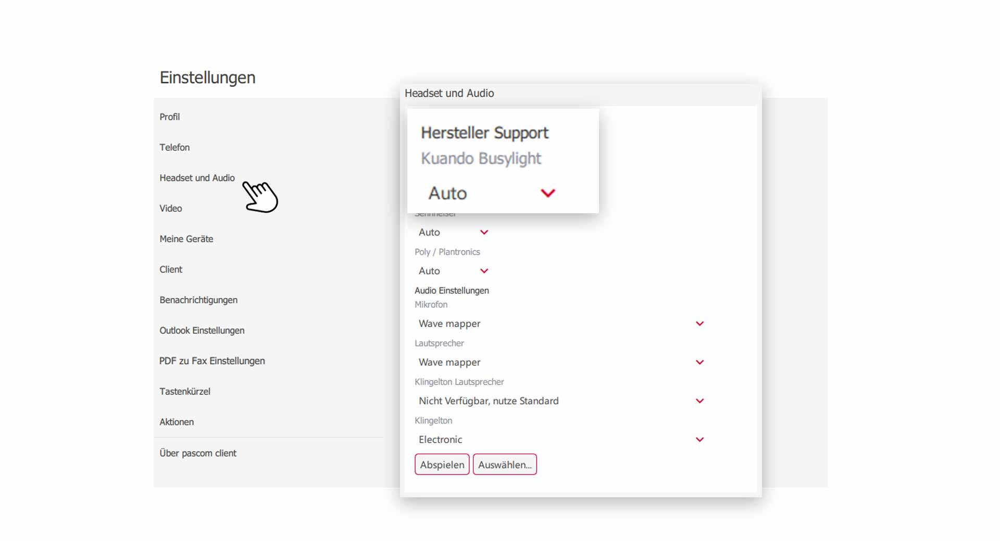


 


 

## Übersicht

Das Kuando Busylight ist ein Echtzeit-Präsenzanzeiger, der die Kommunikation zwischen Mitarbeitern vereinfacht. Durch optische und akustische Signale bei eingehenden Anrufen, werden unnötige Störungen oder Laufwege vermieden und die Zusammenarbeit verbessert. Das Kuando Busylight gibt Klingeltöne vom pascom Client aus und signalisiert in verschiedenen Farben den aktuellen Anrufstatus, was für ein angenehmeres Betriebsklima sorgt.

## Kuando Busylight LED Farben erklärt

Die LED Farben des Kuando Busylight, richten sich nach dem Anrufstatus des jeweiligen Benutzers und zeigen folgende Farben.

### LED Farbe Rot

 

1. Leuchtet das Kuando Busylight **Rot**, so hat der Benutzer gerade ein **aktives Gespräch** und ist nicht erreichabar.

### LED Farbe Gelb

 

1. Leuchtet das Kuando Busylight **Gelb**, so erhält der Benutzer gerade einen **eingehenden Anruf**.

### LED Farbe Grün

 

1. Leuchtet das Kuando Busylight **Grün**, so ist der Benutzer  **verfügbar** und kann angerufen werden.

## Kuando Busylight einrichten

Schließen Sie das Kuando Busylight am Computer via **USB** an. Für die Einrichtung ist in der Regel keine Treibersoftware notwendig. Der pascom Client erkennt dann automatisch das neue **Kuando Busylight**. 

 

**Warum wird mein Kuando Busylight automatisch erkannt?**  
Das liegt an den Einstellung des pascom Client. Das Kuando Busylight ist ein unterstütztes Gerät, welches daher automatisch erkannt wird. Das Gerät kann aber auch **ignoriert** werden, falls Sie das Kuando Busylight in einer anderen Anwendung nutzen möchten.

 

{}
Nachfolgende Kuando Busylight Einstellungen sind nur vorhanden, wenn der Benutzer auch ein pascom Softphone besitzt.
{}

1. Öffnen Sie die  über das pascom Menü

 

2. Klicken Sie im **Einstellungs-Menü** auf 

 

Um die **automatische Erkennung** des Kuando Busylight zu unterbinden, wählen Sie bei **Kuando Busylight** statt , im Drop-Down-Feld  aus. 

## Kuando Busylight Audio Einstellungen

Durch die im Kuando Busylight integrierten Lautsprecher können Sie den Klingelton des pascom Clients ausgeben lassen und haben so eine zusätzliche Signalisierung.

 

1. Wählen Sie die Art des **Klingeltons** aus und stellen Sie die **Lautstärke** ein.

 