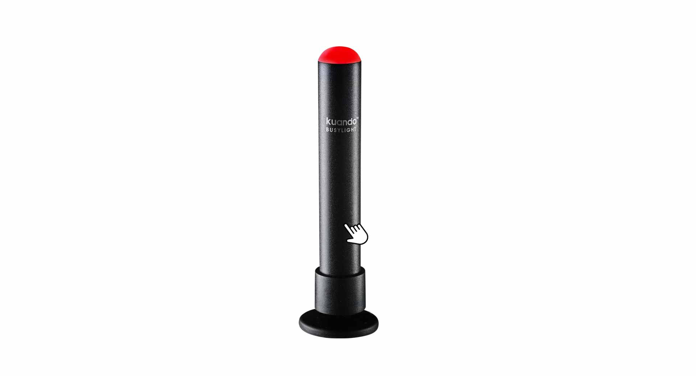
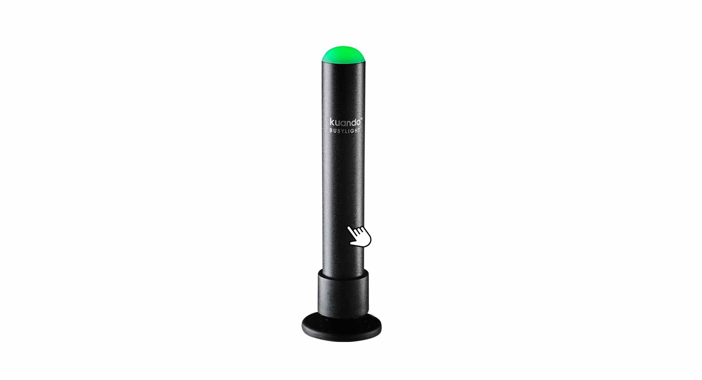


 


 

## Overview

The Kuando Busylight is a real-time presence indicator that simplifies communication between employees. Visual and audible signals for incoming calls help to avoid unnecessary disturbances or walking distances and improve collaboration. The Kuando Busylight emits ringtones from the pascom client and signals the current call status in different colors, which makes a more pleasant working atmosphere.

## Kuando Busylight LED Colors explained

The LED colors of the Kuando Busylight, depend on the call status of the respective user and show the following colors.

### LED Color Red

 

1. If the Kuando Busylight is **red**, the user has an **active call** and cannot be reached.

### LED Color Yellow

 

1. If the Kuando Busylight is **Yellow**, the user is currently receiving an **incoming call**.

### LED Color Green

 

1. If the Kuando Busylight is **Green**, the user is **available** and can be called.

## Kuando Busylight Setup

Connect the Kuando Busylight to your computer via **USB**. Usually no driver software is necessary for the setup. The pascom client will then automatically recognize the new **Kuando Busylight**. 

 

**Why is my Kuando Busylight automatically recognized?**    
This is due to the settings of the pascom client. The Kuando Busylight is a supported device and is therefore automatically recognized. The device can also be **ignored** if you want to use the Kuando Busylight in another application.

 

{}
The following Kuando Busylight settings are only available if the user also has a pascom softphone.
{}

1. Open the  via the pascom menu.

 

2. Click on  in the **Settings menu**.

 

To disable the **automatic detection** of Kuando Busylight, select  instead of  in the drop-down box. 

## Kuando Busylight Audio Settings

The speakers integrated in the Kuando Busylight allow you to output the ring tone of the pascom client, giving you additional signaling.

 

1. Select the type of **ringtone** and adjust the **volume**.

 