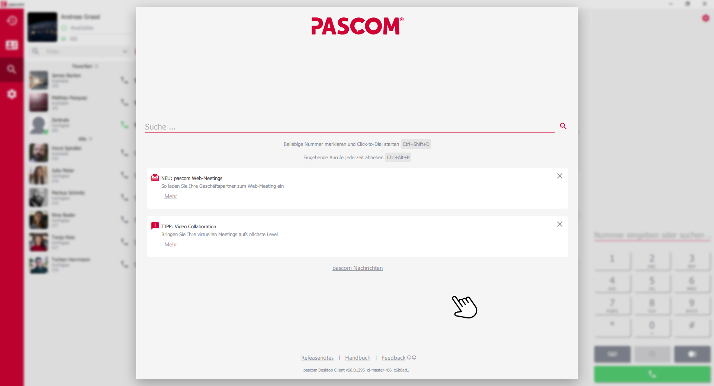
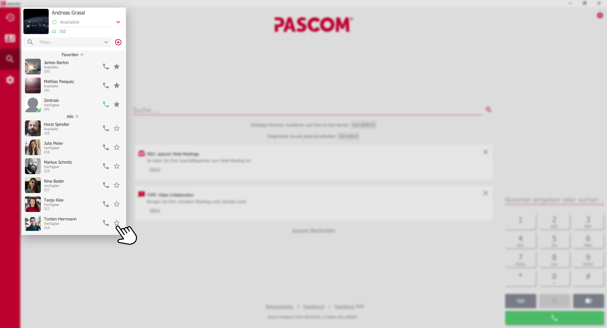
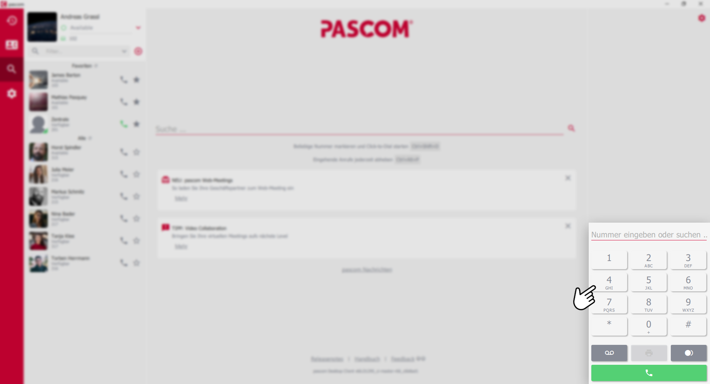
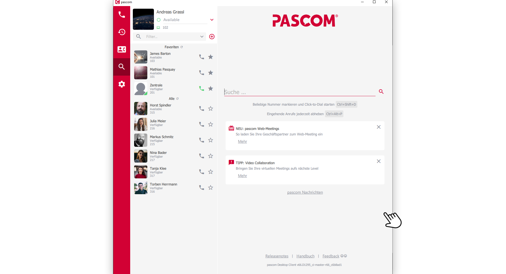
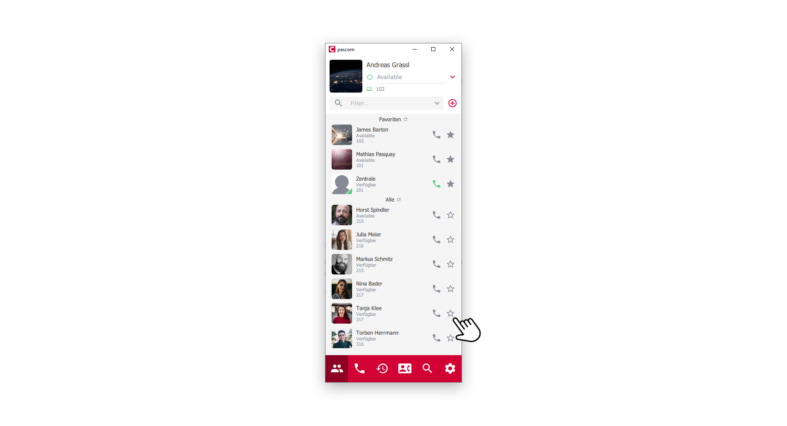
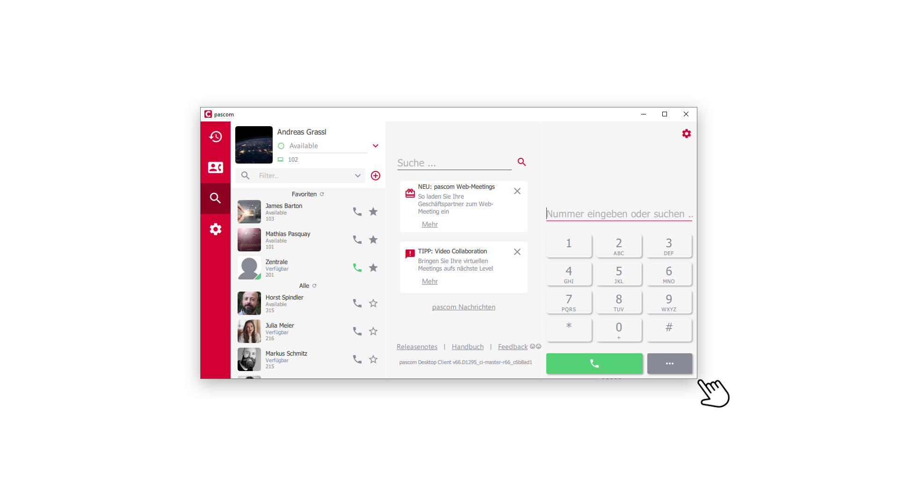
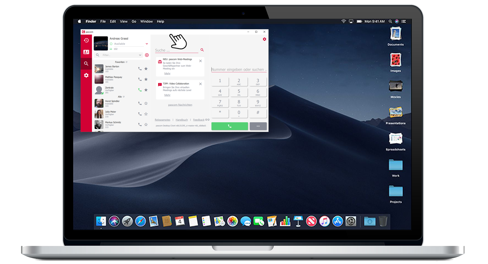


 


## Trainings Video

 

## pascom Client im Vollbild-Modus (Expanded Mode)

Im Vollbild-Modus besteht der pascom Client aus drei grundsätzlichen Bereichen. (*Shortcut: STRG + 3*)

*dynamischer Kontentbereich*
 

Der dynamische mittlere Content-Bereich ist flexibel. Sie können über die rote Menüleiste Chat, Journal oder das Telefonbuch anzeigen lassen. Die Standardansicht bietet Ihnen die Suchfunktion und aktuelle pascom Newsmeldungen.  

*Kontaktliste*
 

Der Bereich links beinhaltet das eigene Profil mit Präsenzstatus, sowie die  Kontaktliste und das Menü.  

*Telefonfeld*
 

Auf der rechten Seite finden Sie die Telefonie-Funktion und die interaktiven Anrufelemente bei laufenden Gesprächen.

## pascom Client im normalen Modus

*Normaler Modus (Shortcut: STRG + 2)*
 

Im normalen Modus sind der Profil- und Kontakt-Bereich sichtbar, zusätzlich kann über die Menüleiste zwischen *Chat*, *Telefonie-Funktion*, *Journal* oder *Telefonbuch* umgeschaltet werden.

## pascom Client im Mini Modus

*Mini Modus (Shortcut: STRG + 1)*
 

Im mini Modus ist nur ein Bereich sichtbar, und die Menüleiste ist nun unten zu finden. Über diese kann zwischen den Bereichen gewechselt werden.

## Responsive Layout des pascom Client nutzen

Der pascom Client bietet ein responsives Layout, welches sich an die Größe des Programfenster anpasst. Clicken und halten Sie die Maustaste am Rahmen des pascom Client und ziehen Sie die Fenstergröße auf das von Ihnen gewünschte Format.

*selbst definiertes Layout*
 

### Wo hin mit dem Client?

Platzieren Sie den pascom Client dort, wo Sie ihn haben möchten. Klicken und halten Sie dazu die Maustaste auf der oberen Programleiste und verschieben Sie den pascom Client auf dem Desktop. 

