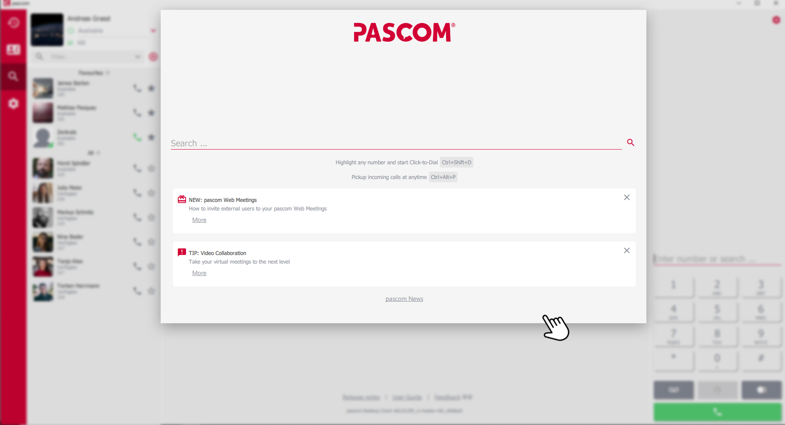
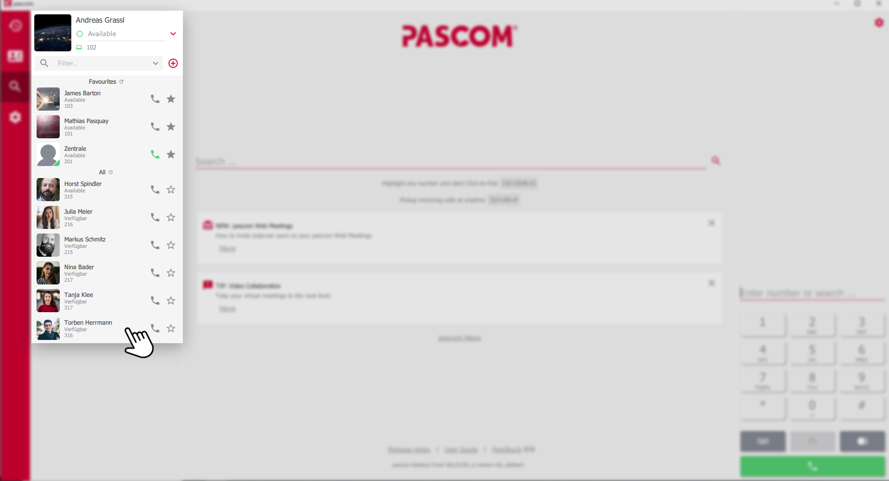
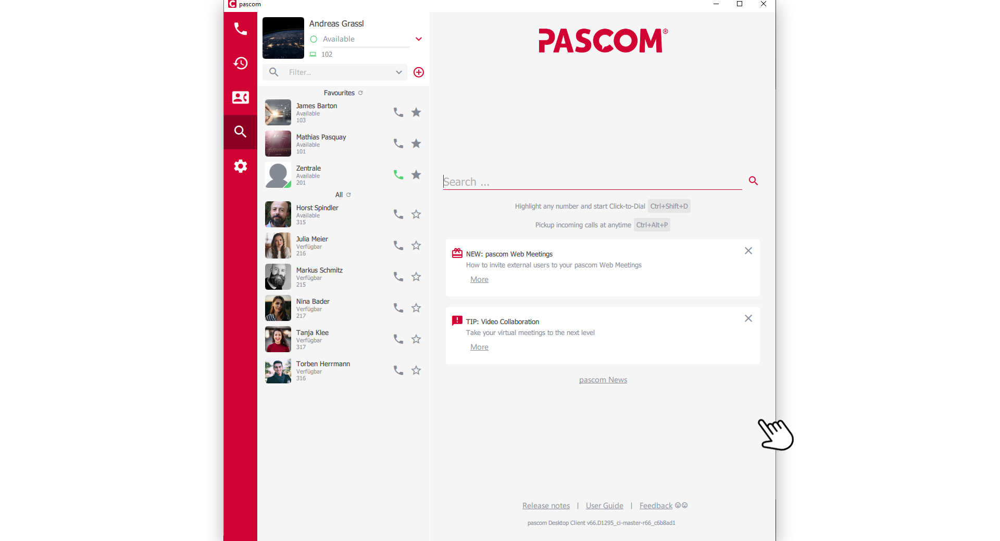
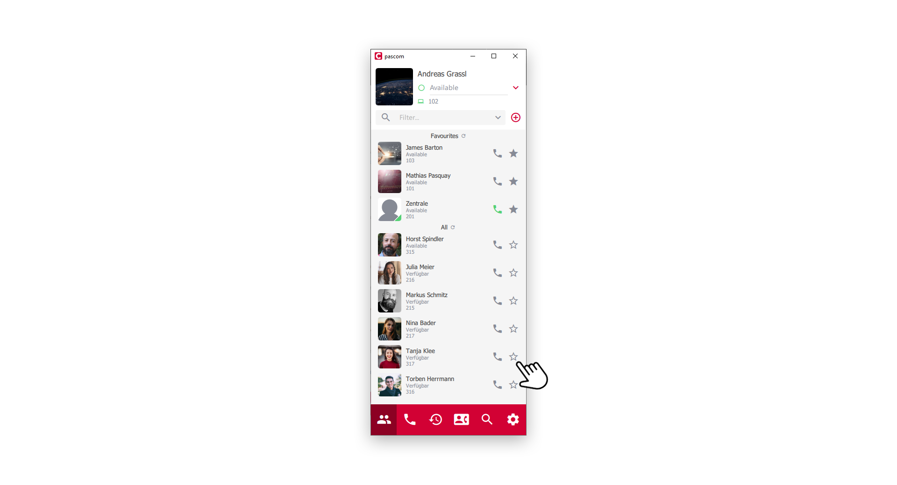
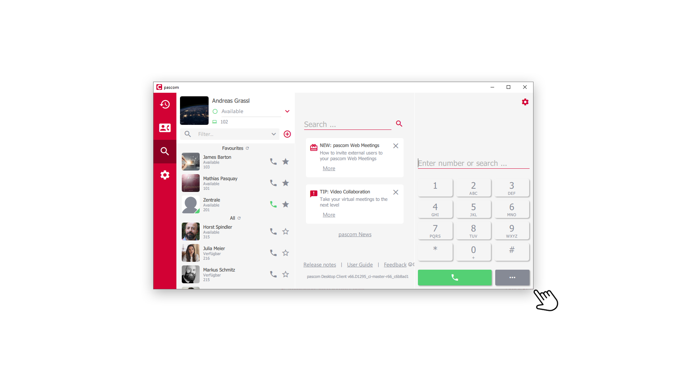
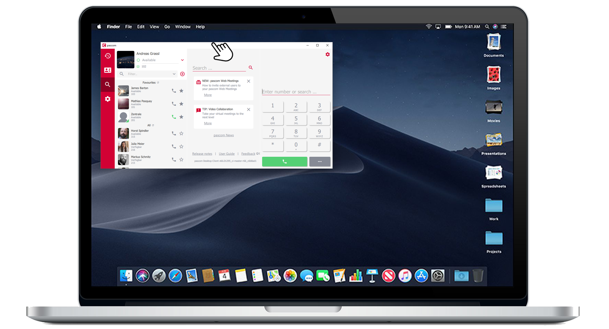


 


## Trainings Video

 

## pascom Client in Fullscreen Layout (Expanded Mode)

In full screen mode, the pascom client consists of three basic areas. (*Shortcut: CTRL + 3*)

*dynamic Contentarea*
 

The dynamic middle content area is flexible. You can use the red menu bar to display chat, journal or the phone book. The standard view offers you the search function and current pascom news.  

*Contactlist*
 

The area on the left contains the own profile with presence status, as well as the contact list and the menu.

*Phone Area*
 

On the right side you will find the telephony function and the interactive call elements during ongoing calls.

## pascom Client in normal Mode

*Normal Mode (Shortcut: CTRL + 2)*
 

In normal mode, the profile and contact area are visible. In addition, the menu bar can be used to switch between *Chat*, *Telephony function*, *Journal* or *Telephone book*.

## pascom Client im Mini Mode

*Mini Mode (Shortcut: CTRL + 1)*
 

In mini mode only one area is visible and the menu bar is now at the bottom. It can be used to switch between the areas.

## Make use of the responsive Layout

The pascom client offers a responsive layout that adapts to the size of the program window. Click and hold the mouse button on the pascom client frame and drag the window size to the desired format.

*self defined layout*
 

### Where to place the client?

Place the pascom client where you want it. Click and hold the mouse button on the upper program bar and move the pascom client on the desktop. 

