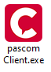


 


## Trainings Video

 

## Start the pascom Client

To start the pascom client, click on the pascom logo to get to the login screen.

## The Login Screen

  

In the login screen you will find several fields that you must fill with your login data. If you have not used the setup wizard to create your 
login data yourself, your system administrator will provide you with the data. 

### What is needed?

|Field|Description|
|---|---|
|Username|Username|
|Password|User password|
|Server|Domain or IP address of the server|
|Save login details?|Select the check box if your wish to enable the client to start automatically with the entered login credentials.|

## Log onto the pascom Cloud

### What should the @-sign behind the username mean?

If the pascom telephone system is located in the pascom.cloud, there is not only your telephone system there. So that the client knows to which telephone system you want
to connect, you must add **@PBX name** after your **username**. 

 

  
