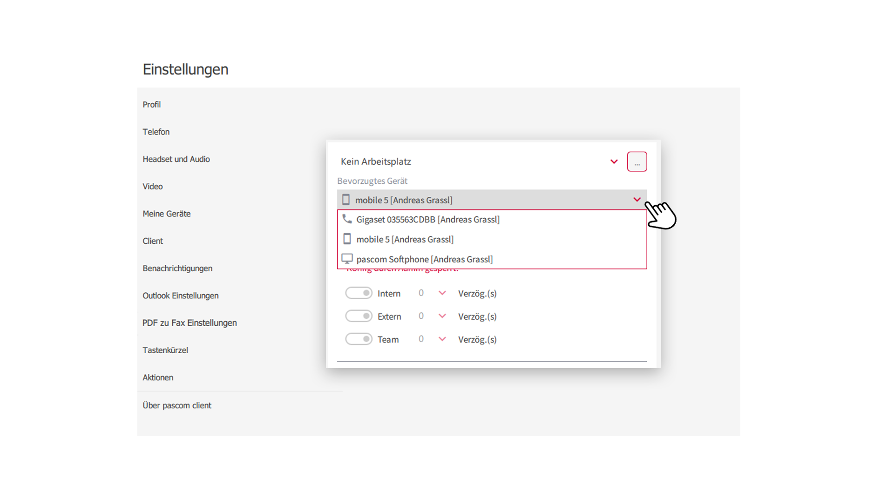
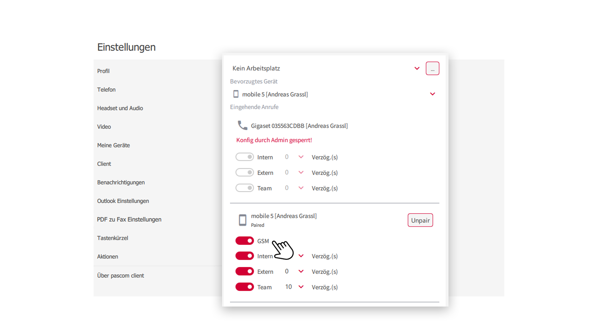


 


## Trainings Video

 

## Übersicht

Die Gerätesteuerung ist eine tolle Funktion, um das Anrufverhalten seiner Geräte selbst zu steuern. Wählen Sie aus, welche Geräte Sie nutzen und stellen Sie ein, welches Gerät wann und wie klingeln soll. 

{}

**"Config durch Admin gesperrt"**
 
 
Um selbst Konfigurationen an seinen Geräten vorzunehmen, muss der Systemadministrator diese Funktion für Sie freischalten.  
{}

## Meine Geräte

Die Gerätesteuerung finden Sie in den **Client-Einstellungen**.

1. Öffnen Sie die  über das pascom Menü

 

2. Klicken Sie im **Einstellungs-Menü** auf 

 

## Gerät für ausgehende Anrufe

Hier bestimmen Sie Ihr bevorzugtes Endgerät, welches Sie für ausgehende Anrufe verwenden möchten. Das **pascom integrierte Softphone** oder ein Ihnen zugewiesenes **Tischtelefon**. Das pascom Softphone ist in die Software eingebaut und lässt sich ideal mit einem Headset nutzen. 

1. Klicken Sie bei **"Ausgehende Anrufe"** auf das  und wählen Sie Ihr **Endgerät** aus. 

 

## Gerätesteuerung für eingehende Anrufe

Bei der Gerätesteuerung für eingehende Anrufe kann man das Anrufverhalten seiner Geräte steuern.

1.  Sie einfach den Schalter der Anrufart, bei welcher Ihr Endgerät klingeln soll. z.B. **internen Anrufen**

2. Sie können den **Start** des Klingelns zusätzlich **verzögern**. Dies macht Sinn, wenn Sie für eine Anrufart (z.B. interne Anrufe) 2 Geräte nutzen und ein Gerät von beiden soll später anfangen zu klingeln.

## Alle Geräte ausschalten | DND

Wollen Sie einmal nicht erreichbar sein, so können Sie alle  deaktivieren. 

 

1. **Was passiert wenn Sie alle Geräte ausschalten?** Dazu befragen Sie am Besten Ihren Systemadministrator, denn die Möglichkeiten sind vielfälltig z.B. *Ansagen, Weiterleitungen, Voicemailbox usw.*.

## GSM-Einstellung für eingehende Mobilgespräche

In den Geräteeinstellungen können Sie für eingehende Gespräche auf Ihrem Mobilgerät festlegen, ob diese über das GSM-Netz erfolgen sollen. Somit steuern Sie über den Desktop Client, das Anrufverhalten Ihres Mobilgerätes.

1. **Aktivieren/Deaktivieren** Sie den GSM-Schalter bei den eingehenden Mobilgesprächen.

 

Weitere Informationen zum GSM-Fallback finden Sie [hier]().

 