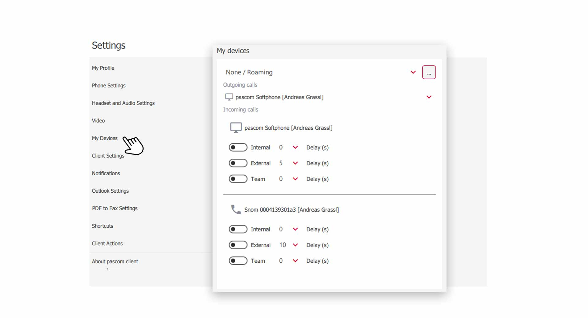


 


## Trainings Video

 

## Overview

Device control is a great feature to control the call behavior of your devices yourself. Choose which devices you use and set which device to ring when and how. 

{}

**"Config locked by Admin"**
 
 
If you want to configure your devices yourself, the system administrator must enable this function for you.   
{}

## My Devices

The device control can be found in the **Client Settings**.

1. Open the  via the pascom Menü

 

2. Click on  in the **Settings menu**

 

## Device for outgoing Calls

Here you determine which device you want to use for outgoing calls. The **pascom integrated softphone** or a **desk phone** assigned to you. The pascom softphone is built into the software and is ideal for use with a headset. 

1. Click the  at **"Outgoing Calls "** and select your **device**. 

 

## Device Control for incomming Calls

With the device control for incoming calls you can control the call behavior of your devices.

1.  simply the switch of the call type at which your  Endpoint devices should ring. e.g. **internal calls**

2. You can additionally **delay** the **start** of the ringing. This makes sense if you use 2 devices for one type of call (e.g. internal calls) and one of them should start ringing later.

## Switch off all Devices | DND

If you want to be unreachable, you can deactivate all . 

 

1. **What happens if you switch off all devices?** It is best to consult your system administrator, because there are many possibilities, e.g. *announcements, call forwardings, voicemail box, etc.*.

 

## GSM Setting for outgoing mobile Calls

In the device settings, you can specify incoming calls on your mobile device that they should be made via the GSM network. This allows you to control the call behavior of your mobile device via the Desktop Client.

1. **Activate/Deactivate** the GSM switch for incoming mobile calls.

 

More information about GSM fallback can be found [here]().

 