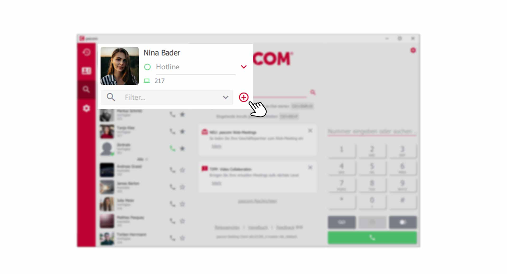
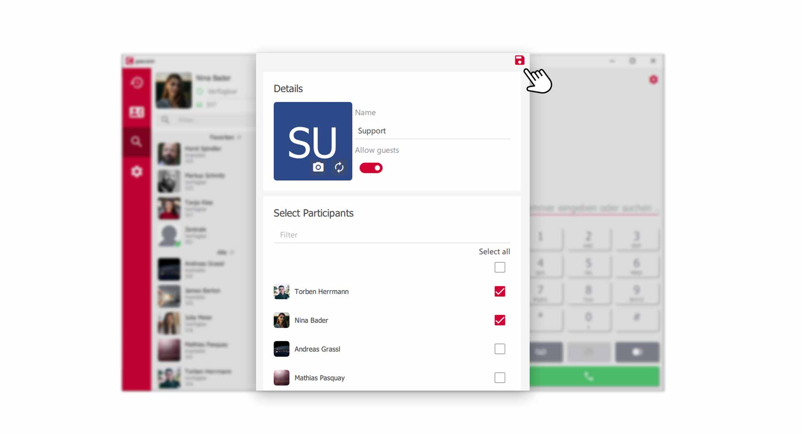
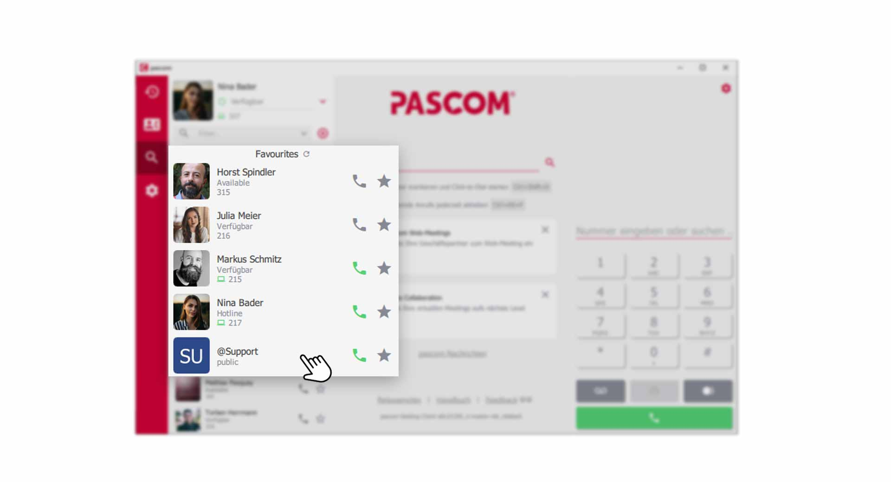
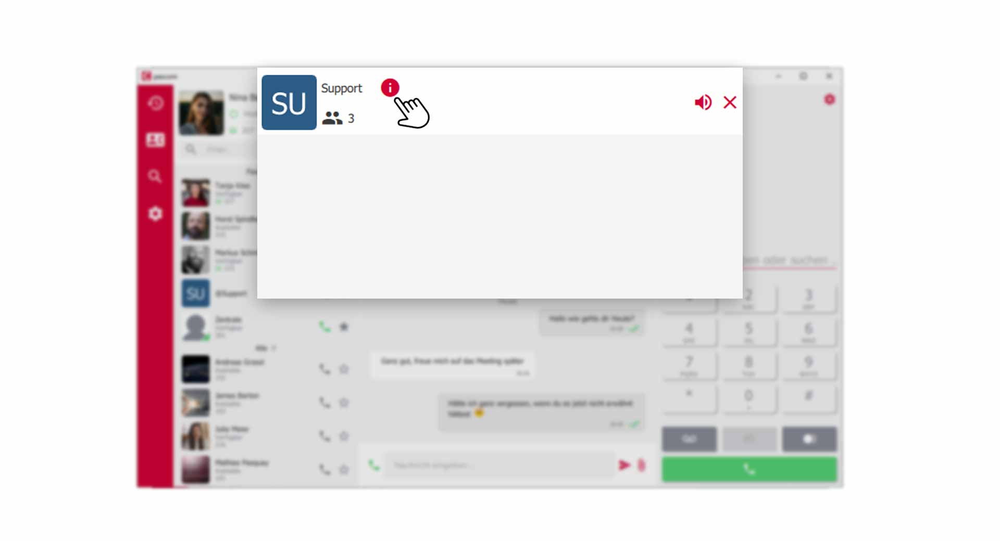
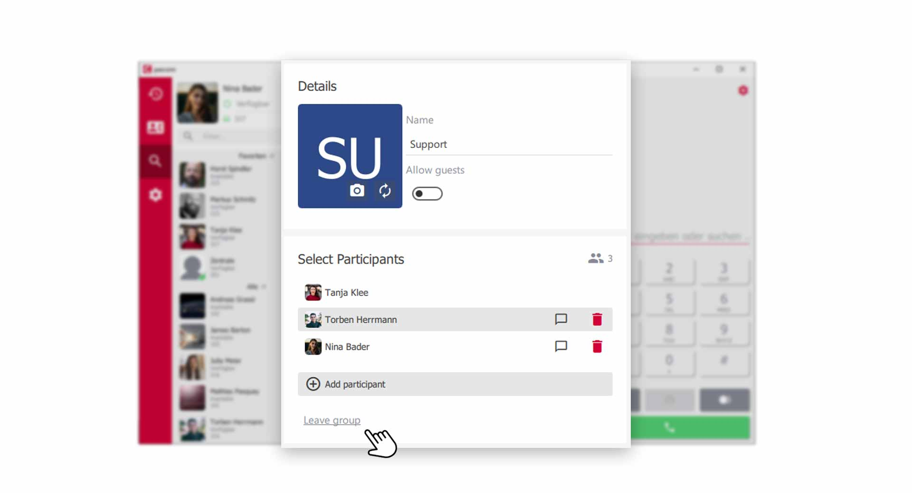
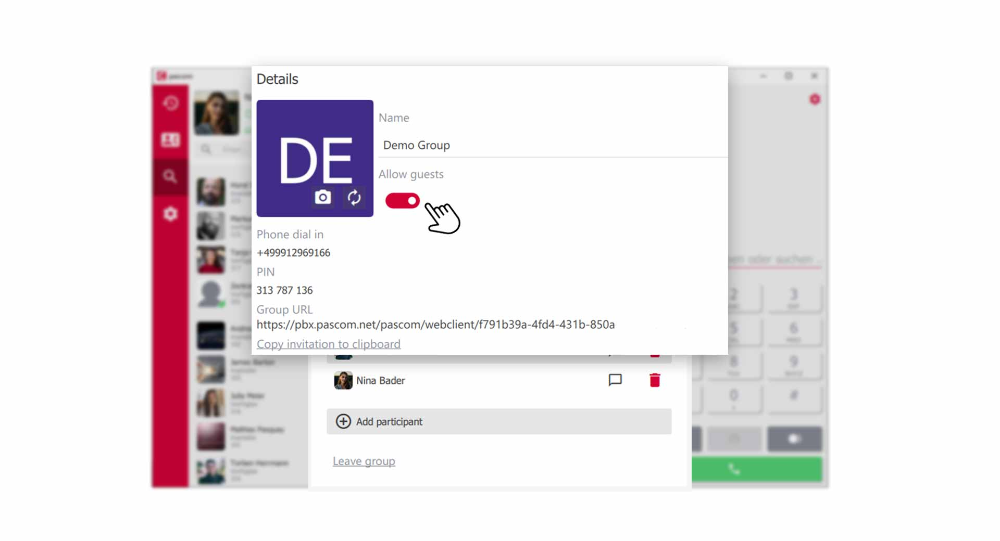
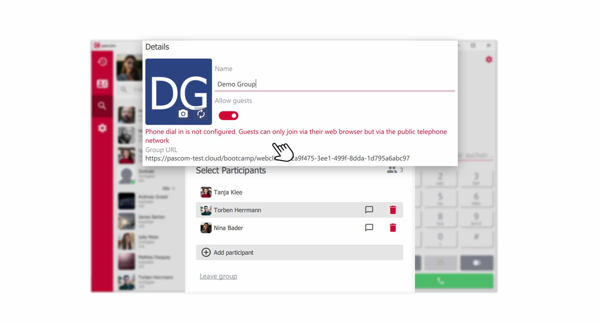


 


## Trainings Video

 

## What are pascom Groups?

Think of pascom groups as dynamic conference rooms with a lot of additional features. pascom groups can be used as chat rooms, but can also be upgraded to audio and video conference rooms.
For example, create a **"support group"** for all support staff, where they can exchange information in group chat and hold audio and video meetings.

With the group function you create permanent groups for:

1. Group chat
2. Audio conferences
3. Video conferences
4. Online meetings with screen sharing

### Create a pascom Group

{}
Creating new pascom groups is not restricted and can be done by any user.
{}

Create a new group using the **+ icon** in your profile.

 

Enter a **name** in the settings window of the group e.g. "Support" or "Smalltalk". Then add the **participants** who should be members of this group.

 

Finally, click the **red disk icon** to **save** the group. Your new group now appears in the contact list.

 

{}
Only groups in which you yourself are a member will appear in your contact list. If you can't find a group, just let other members of that group join you. 
{}

## Manage pascom Groups

If you are in a window of a pascom group, you can choose from several functions in the upper menu bar. You will also be shown how many **participants** the group has.

 

### Mute a Group

1. Click on the **speaker symbol** in the upper menu bar. Now you will no longer receive notification of new events in the group.

### Close a Group

2. To close a group, click on the **red X symbol** in the top menu bar. Don't worry, you can always open the group again from the contact list.

### Edit Group and manage Participants

3. To make changes to a group, click on the **red info icon** in the top menu bar and you will be taken to the group settings.

### Change the name of the group

4. If you are not satisfied with the name of a group, you can simply overwrite the **former name**. e.g. change **support** to **sales**.

### Add or remove Participants

5. If you want your group to include new members, click on the menu item **Add participants** and select new participants from a list. 

6. To remove participants from the group, click the **red trashcan icon**.

### Leave the Group yourself

7. If you would like to end your membership in a group yourself, click on **Leave Group** at the very bottom of the **Group Settings**.

## Make pascom Group public

External participants can also be invited to your pascom groups. By clicking on **Allow guests** you activate the **Guest mode** and receive dial-in data for your group.

*To upgrade a chat group to a virtual audio/video conference room for external participants*

|Fields|Description|
|---|---|
|Dial-in-Number|Participants can access the conference by phone using the pascom Web Client's dial-in number.|
|PIN|The PIN is required to participate in the conference using the dial-in number.|
|URL|Link to the pascom Web Client to access the group web meeting.|
|Copy Invitation to Clipboard| Copy all details to the clipboard for sharing all access information with the intended participants.|

### Error message when activating guest mode

If you receive the above warning message, the **dial-in number** is not set up by your system administrator and the group cannot be used as an audio conference room for external participants. 

1. Contact your system administrator to solve the problem 

## Delete a pascom Group

Delete a pascom group by removing **all participants** from a group and finally leaving the **group yourself**. The group then disappears from the system.

 

