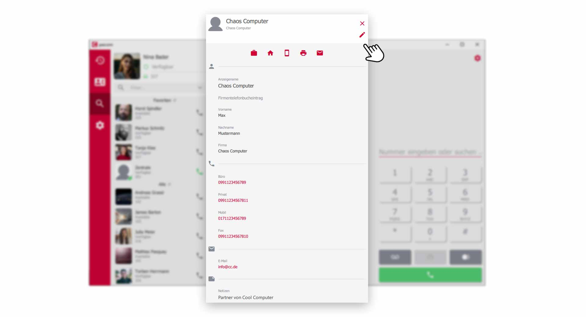


 


## Trainings Video

 

## Übersicht

Das pascom Telefonbuch ist so aufgebaut, dass es ein firmenweites globales Telefonbuch und ein privates Telefonbuch, für jeden einzelnen Benutzer, enthält. Somit wird vermieden, dass einzelne Benutzer Ihre privaten Daten im Firmentelefonbuch hinterlegen. Systemadministratoren und Telefonbuchverwalter kümmern sich um globale Telefonbucheinträge und Sie können Ihre eigenen Datensätze verwalten. 

1. *Bei einem eingehenden Anruf, wird zuerst nach einem passenden Kontakt in Ihrem privaten Telefonbuch gesucht. Wird das System nicht fündig, so wird das globale Firmentelefonbuch nach einem passenden Eintrag durchsucht. Somit können Sie Firmeneinträge mit Ihren privaten Daten überschreiben und nur Sie können diese Daten sehen.* 

## Das Telefonbuch öffnen

Klicken Sie in der Menüleiste auf das  um das Telefonbuch aufzurufen.

*Telefonbuch öffnen über das Menü*
 

## Übersicht über das private und globale Telefonbuch

Über den Menüpunkt in der der oberen linken Ecke des Telefonbuch, können Sie mit einem Klick zwischen Ihrem **privaten** und **globalen** Telefonbuch hin- und herwechseln. 

*Übersicht über das Telefonbuch*
 

Alle Kontakte werden übersichtlich in einer Art **Visitenkarte** dargestellt. Sie haben von hier aus gleich Zugriff auf wichtige Kontaktarten, die wir Ihnen nachfolgend kurz erklären. 

*Symbole der Kontakte erklärt*
 

Wie Sie in der Übersichtsgrafik sehen, gibt es **farbige** und **ausgegraute** Symbole, anhand denen sich ablesen lässt, ob die entsprechende Kontaktart Daten enthält oder nicht. 

## Details zum Telefonbucheintrag

Jeder Kontakt im Telefonbuch enthält weitere Informationen. Klicken Sie dazu auf einen  und Sie gelangen zu der **Detailansicht**.

*Details eines Telefonbucheintrag*
 

Die **Detailansicht** eines Telefonbucheintrag gibt Ihnen weitere Infos. 

1. Besitzen Sie die Rolle des **Telefonbuchverwalters** oder befinden Sie sich in einem Telefonbucheintrag Ihres privaten Telefonbuch, können Sie oben rechts auf dem  den Telefonbucheintrag bearbeiten. 

## Neuen Telefonbucheintrag anlegen.

{}
Um im globalen Firmentelefonbuch, neue Telefonbucheinträge zu erstellen, müssen Sie die Rolle **Telefonbuchverwalter** besitzen oder **Systemadministrator** sein.
{}

Um neue Telefonbucheinträge zu erstellen, klicken Sie im Telefonbuch auf das .

*Neuen Telefonbucheintrag hinzufügen*
 

Füllen Sie die vordefinierten Felder mit Ihren Kontaktdaten aus und klicken Sie abschließen auf das  um den Telefoneintrag zu speichern. 

*Neuen Telefoneintrag erstellen*
 

## Telefonbucheinträge zur Kontaktliste hinzufügen

Möchten Sie Kontakte aus Ihrem Telefonbuch direkt in Ihrer **Kontaktliste** platzieren, so müssen Sie den entsprechenden **Telefonbucheintrag** als  markieren.

*Telefonbucheintrag als Favorit markieren*

Dann erscheint der **Telefonbucheintrag** im Abschnitt Ihrer **Favoriten** in der Kontaktliste.

*Telefonbucheintrag als Favorit in der Kontaktliste hinzufügen*

 

## Outlook Kontakte importieren (ab v.2013)

Findet der pascom Desktop Client auf dem PC ein unterstütztes Telefonbuch von Outlook können die Einträge automatisch als **privates Telefonbuch** dem Client hinzugefügt werden.

1. Öffnen Sie die  über das pascom Menü

 

2. Klicken Sie im **Einstellungs-Menü** auf 

 

3.  Sie den Konnektor und der pascom Client versucht automatisch eine Verbindung zu Ihrem **Outlook** herzustellen.

### Outlook PST-Ordner manuell festlegen

In der Outlook PST Datei sind alle Outlook Daten gespeichert. Unter anderem auch Ihre Kontakte.

1. Klicken Sie bei **Ausgewählte Ordner** auf  und wählen Sie das Verzeichnis aus, indem sich die Outlook-PST Datei befindet.

### Outlook Kontakte aktualisieren

Der pascom Client aktualisiert automatisch Ihre Outlook-Kontakte bei jedem Programmstart. Sollten neu angelegte Kontaktdaten noch nicht im pascom Telefonbuch erscheinen, so klicken Sie im Einstellungsmenü auf .  

 