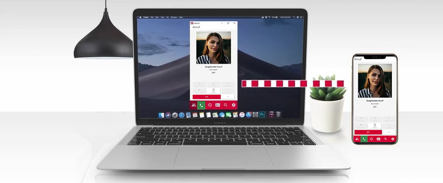


 


## Control the mobile client with the desktop client

You want to shift more of your work to your smartphone to enjoy the benefits of location-independent connectivity? No problem, the pascom client offers the possibility to control the mobile pascom app on your mobile phone via the pascom desktop client. This is done via so-called **push calls**, which are sent to your mobile device.

 

 

### Requirements - mobile device for outgoing calls.

For this feature to work, a mobile device must be set as **preferred device** in the **device control** settings. 

You can find more information about the device settings [here]().

### Start and transfer call

If you now make an outgoing call via the **pascom Desktop Client**, it will be transferred to your mobile phone.

1. **Android:** On mobile devices with Android OS, the **pascom app** is automatically woken/started by the **push call** and the call is transferred.

2. **Apple iOS:** On Apple mobile devices with the iOS operating system, the **Push Call** first initiates a call, which you must accept. After that, the outgoing call to the desired subscriber is continued. 
(*Due to the Apple Callkit, push calls cannot wake up/start the application if it is not in focus*).

### Mobile Device in Dockingstation

 

If you use your mobile device in a **docking station**, the call can be seamlessly transferred from the **pascom Desktop Client** to the mobile phone.

1. If the pascom mobile app is open during the charging process, the display of your mobile device does not turn off.

2. Thus, you have a complete desktop client replacement on your smartphone.

3. This works for both **Android** and **iOS** devices.

 