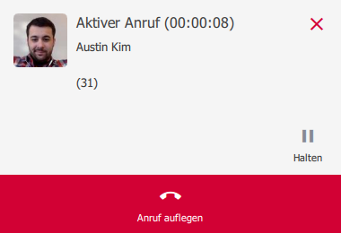


 


## Trainings Video

 

## Die Suchfuntkion nutzen

Um effizienter im pascom Client zu navigieren, ist die Suchfunktion ein sehr gutes Werkzeug. Die Suchefunktion finden Sie im dynamischen Kontentbereich wenn alle Fenster geschlossen sind oder über die Menüleiste mit Klick auf das **Lupen-Symbol**.

*Sucheingabe*
 

### Die Suchergebnisse

Die Ergebnisse Ihrer Suche sind in Register unterteilt. Im Register **"Alle"** sehen Sie alle Ergebnisse aus den *Kontakten, Telefonbucheinträgen, Chats und dem Journal*. Filtern Sie ganz einfach mit Klick auf die Register, Ihre gewünschten Suchergebnisse.

*Suchergebnisse*
 

### Intelligente Suche

Die intelligente Suche liefert Ihnen Ergebnisse, auch wenn Sie nur ein paar Buchstaben Ihres Kontakts kennen. Dies erlaubt es z.B. nur die Anfangsbuchstaben des Vor- und Nachnamen einzugeben.

*Intelligente Sucheingabe*
 

## Smart-Filter der Kontaktliste

Der Smart-Filter ist ein nützliches Werkzeug, um schnell seine Kontaktliste nach vordefinierten Kategorien zu filter. Lassen Sie sich mit einem Klick anzeigen welche Kollegen gerade Online sind oder filtern Sie nur noch ungelesenen Nachrichten.

Die Anwendung ist simpel, klicken Sie neben der Filter-Suchleiste auf das **Dropdown-Symbol** und wählen Sie die gewünschte Kategorie aus.

*Smart-Filter nutzen in der Kontaktliste*
 

## Die Suche im Wählfeld

Die Suche im Wählfeld ist eine tolle Erleichterung im Arbeitsalltag. Tippen Sie im **Wählfeld** einfach einen **Namen**, **Durchwahl** oder **Rufnummer** ein und der pascom Client sucht Ihnen entsprechende Ergebnisse direkt im Wählfeld. Dies ist besonders hilfreich, wenn Sie einen aktiven Anruf verbinden möchten und gerade die Telefonnummer nicht zur Hand haben. 

*Suchen im Wählfeld*
 

## Benachrichtigungen

Benachrichtigungen sind Popups, die erscheinen, sobald eine Aktion stattfindet. Sie geben Informationen über die Art der Aktion, des Anrufers bzw. Konversations-Kontakt und bietet die Möglichkeit über das Popup gleich zu reagieren.

|Benachrichtigung|Beschreibung|
|---|---|
||Benachrichtigung über einen aktuell ausgehen Anruf mit der Möglichkeit den Anruf zu beenden mit Click auf den roten Hörer.|
||Benachrichtigung über einen aktuell eingehen Anruf mit der Möglichkeit den Anruf anzunehmen mit Click auf den grünen Hörer.|
||Benachrichtigung über einen aktive Anruf mit der Möglichkeit den Anruf... ...zu halten mit Click auf das Pause-Symbol. ...zu beenden mit Click auf den roten Hörer.|
||Benachrichtigung über einen verpassten Anruf mit der Möglichkeit zurück zu rufen mit Click auf den grünen Hörer.|
||Benachrichtigung über eine neue Chat-Nachricht mit der Möglichkeit zurück zu schreiben.|

Die Benachrichtigungen können nach Ihren Vorlieben in den [Client Einstellungen](Link zu client settings) angepasst werden.

## pascom Benachrichtigungen

Die pascom Benachrichtigungen finden Sie im Suchfenster. Hier erhalten Sie wertvolle Tips, Anleitungen und Mitteilungen rund um die pascom Software.

*pascom Benachrichtigungen*
 

Mit einem Klick auf **"Mehr"** gelangen Sie zur entsprechenden Mitteilung. Sollten Sie keine Meldungen mehr wünschen, können Sie ganz einfach die Benachrichtigung mit Klick auf das **"X-Symbol"** deaktivieren.