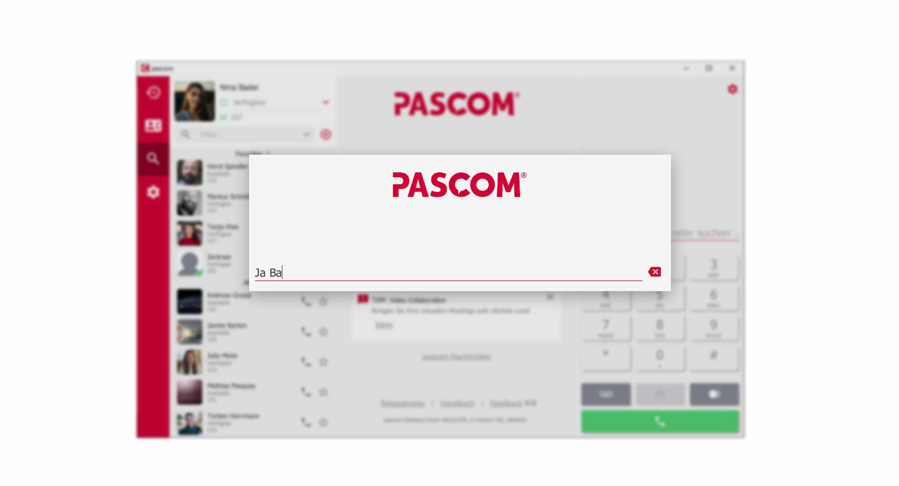
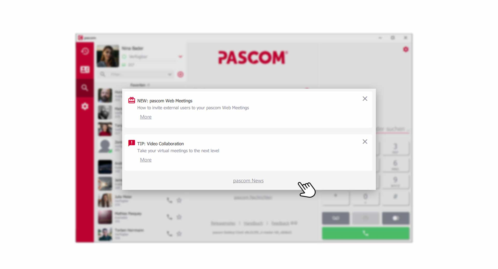


 


## Trainings Video

 

## How to use the Search function

The search function is a very good tool for navigating more efficiently in the pascom client. The search function can be found in the dynamic account area when all windows are closed or via the menu bar by clicking on the **magnifying glass symbol**.

*The Search input field*
 

### The Search results

The results of your search are divided into registers. The tab **"All"** shows all results from the *contacts, phonebook entries, chats and the journal*. Simply click on the tabs to filter your desired search results.

*Search results*
 

### Intelligent Search

The intelligent search delivers results even if you only know a few letters of your contact. For example, this allows you to enter only the first letters of the first and last name.

*Intelligent seach input*
 

## Smart-Filter of the Contact List

The Smart Filter is a useful tool to quickly filter your contact list according to predefined categories. With one click you can see which colleagues are currently online or filter only unread messages.

The use is simple, click on the **drop-down icon** next to the filter search bar and select the desired category.

*Use the smart filter in your contact list*
 

## The search in the dialpad

The search in the dialpad is a great relief in everyday work. Simply enter a **name**, **phone number** or **internal extension** in the **dialpad** and the pascom client will search for the corresponding results directly in the dial field. This is especially helpful if you want to transfer an active call and do not have the phone number at hand. 

*search in the dialpad*
 

## Notifications

As soon as an event (call, message etc) occurs a popup notification will appear. These popup notifications provide additional information to the type of event i.e. caller name or chat contact name. The popups also allow users to react to the event without needing to go to the desktop client.

|Notification|Description|
|---|---|
||Popup indicating an active outbound call with the ability to end the call by clicking on the hangup icon.|
||Popup notification indicating an active inbound call with the ability to pick up via the green phone / pickup icon.|
||Popup indicating an active call with the ability to: * hold the call via the pause symbol * to end the call by clicking on the hangup icon.|
||Popup notification indicating a missed call with the ability call back via the green call back button.|
||Popup notification indicating a new chat message with the ability to respond direct from the popup.|

The notifications can be customized according to your preferences in the [Client settings](link to client settings).

## pascom Notifications

The pascom notifications can be found in the search window. Here you will receive valuable tips, tutorials and messages about the pascom software.

*pascom notifications*
 

By clicking on **"More"** you will get to the corresponding message. If you do not want any more messages, you can easily deactivate the notification by clicking on the **"X-Symbol"**.

## Notifications | Settings

Customize your notifications to receive only the information that is of interest to you. 

1. Open the **Client-Settings** via the pascom Menü

 

2. Click on **Notifications** in the **Settings menu**

 

### Use the Windows Info Center

pascom notifications can be integrated into the Windows Info Center, so you also have a notification history. The pop-up windows also adapt to the Windows design. 

1. enable / disable **Use Windows Info Center**.

### Set Notifications

You can define yourself what kind of notifications you want to have. **Activate / Deactivate** simply the desired type of notification.

1. **Call notifications** appear around the topic *"telephony"*. These show p.e. incoming or outgoing calls.  

2. **Pickup notifications** appear when you can *pickup* calls from colleagues.  

3. **file transfer notifications** appear when colleagues send you files.  

4. **Incoming messages** notification appears when you receive new individual or group chat messages.  

### Set notification tone

You can choose from a list of **ringtones** for the notifications or disable the notification tone completely.  

 