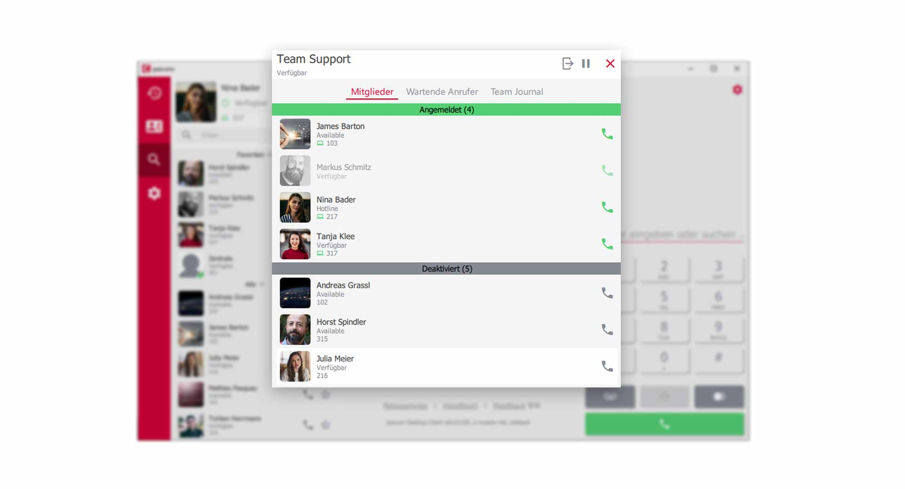
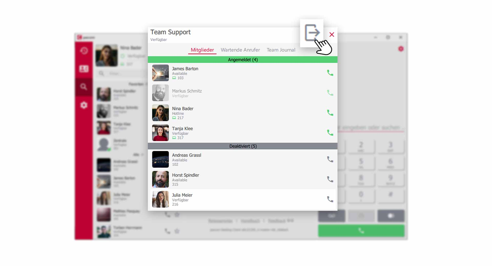
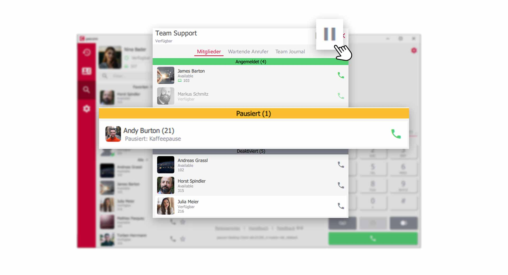
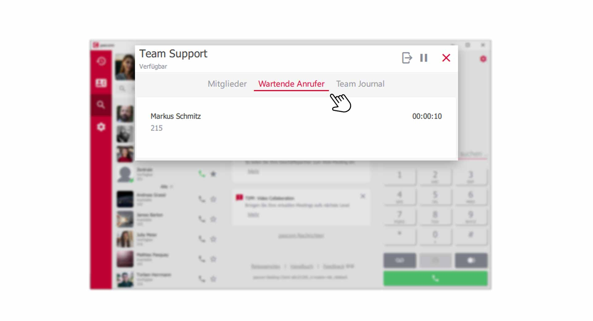
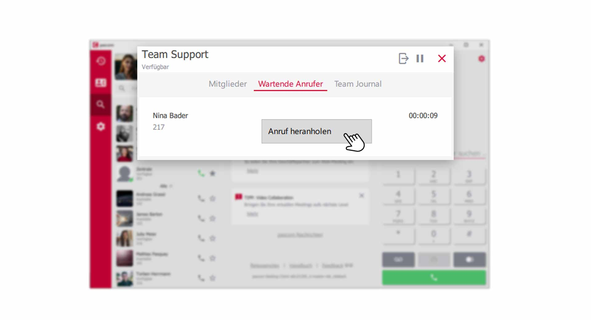


 


## Trainings Video

 

## Übersicht

pascom Teams sind im Grunde Warteschlangen. Ein Ort wo Ihre Kunden verbleiben, bis ein Benutzer/Agent, den Anruf entgegennimmt. Sind Sie Mitglied in einem Team z.B **Vertrieb**, so erhalten Sie zusätzlich zu Ihren persönlichen Anrufen, die Anrufe aus der Warteschlange. 

## Ein pascom Team öffnen

In Ihrer **Kontaktliste** finden Sie das **Team** in dem Sie Mitglied sind, und können mit einem **Klick** auf das Team, die Warteschlange öffnen. z.B. **Team Support**

*pascom Team öffnen über die Kontaktliste*
 

{}
Das **Team-Office** in der Kontaktliste hat eine rote Signalisierung und zeigt Ihnen gleichzeitig, dass Sie **kein Mitglied** dieser Warteschlange sind und dementsprechend keine Daten einsehen können. 
{}

## Übersicht über das Team

In der Übersicht der Warteschlange finden Sie Ihre Kollegen sowie Tabs und Menüpunkte mit weiteren Funktionen.

*Übersicht über das pascom Team*
 

1. Im **aktiven grünen Bereich** finden Sie Kollegen, die an in der Warteschlange aktiv angemeldet sind und Anrufe zugestellt bekommen. Zudem sehen Sie anhand des **Höhrer-Symbols** den aktuellen **Rufstatus**

2. Im **deaktivierten grauen Bereich** finden Sie Kollegen, die sich aus der Warteschlange ausgeloggt haben und keine Anrufe zugestellt bekommen. Zudem sehen Sie anhand des **Höhrer-Symbols** den aktuellen **Rufstatus**

## Im Team einloggen

Benutzer in Teams, können **flexible** oder **fest zugewiesene** Mitglieder einer Warteschlange sein. Sofern Ihr Systemadministrator Sie als  **flexibles Mitglied** eingestellt hat, können Sie sich an der Warteschlange an- und abmelden und wechseln so, vom **aktiven** in den **deaktivierten** Bereich.

1. Nutzen Sie für das An- und Abmelden im Team den  **Login- / Logout-** Button.

*Als flexibles Mitglied im Team an- und abmelden*

## Arbeit im Team pausieren

Auf der pascom Telefonanlage lassen sich **Pausengründe** definieren, die Sie verwenden können, um kurzzeitig keine Anrufe aus der Warteschlange zu erhalten. z.B. **Kaffeepause** oder **Nachbearbeitung** etc. 

1. Klicken Sie dazu auf den **Pause-Button** und wählen einen **Pausengrund** aus.

*Arbeit im Team kurz pausieren*

## Wartende Anrufer

Klicken Sie bei den **Register-Tabs** auf den Punkt **Wartende Anrufer** und Sie erhalten eine Übersicht über Anrufer die in der Warteschlange warten. 
Sie sehen die Rufnummer, den Namen (sofern ein Telefonbucheintrag vorhanden ist) und die Wartedauer.

*Wartende Anrufer in der Warteschlange anzeigen*

### Wartenden Anrufer heranholen

Wenn Ihnen die automatische Zustellung der Anrufe nicht schnell genug geht oder Sie sich einen Anrufer vor einem Kollegen aus der Warteschlange holen möchten, können Sie diesen **heranholen / pickuppen**.

1. Klicken Sie dazu mit der **rechten Maustaste** auf den wartenden Anrufer den Sie heranholen möchten. Wählen Sie dann **Anruf heranholen** aus. 

*Wartenden Anrufer heranholen*

## Das Team-Journal

Die Funktionen des Team-Journal erklären wir Ihnen in folgender [Anleitung](Link zum Team-Journal).

 