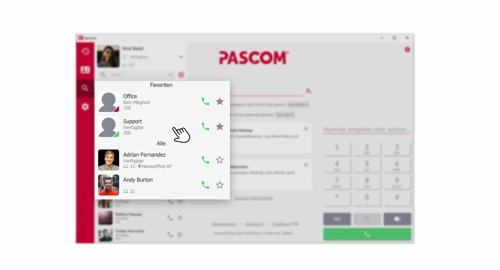


 


## Trainings Video

 

## Übersicht

pascom Teams sind im Grunde Warteschlangen. Ein Ort wo Ihre Kunden verbleiben, bis ein Benutzer/Agent, den Anruf entgegennimmt. Sind Sie Mitglied in einem Team z.B **Vertrieb**, so erhalten Sie zusätzlich zu Ihren persönlichen Anrufen, die Anrufe aus der Warteschlange. 

## Ein pascom Team aufrufen

In Ihrer **Kontaktliste** finden Sie das **Team** in dem Sie Mitglied sind, und können mit einem **Klick** auf das Team, die Warteschlange öffnen. z.B. **Team Support**

*pascom Team öffnen über die Kontaktliste*
 

Das **Team-Office** in der Kontaktliste hat eine rote Signalisierung und zeigt Ihnen gleichzeitig, dass Sie **kein Mitglied** dieser Warteschlange sind und dementsprechend keine Daten einsehen können. 

## Übersicht über das Team

