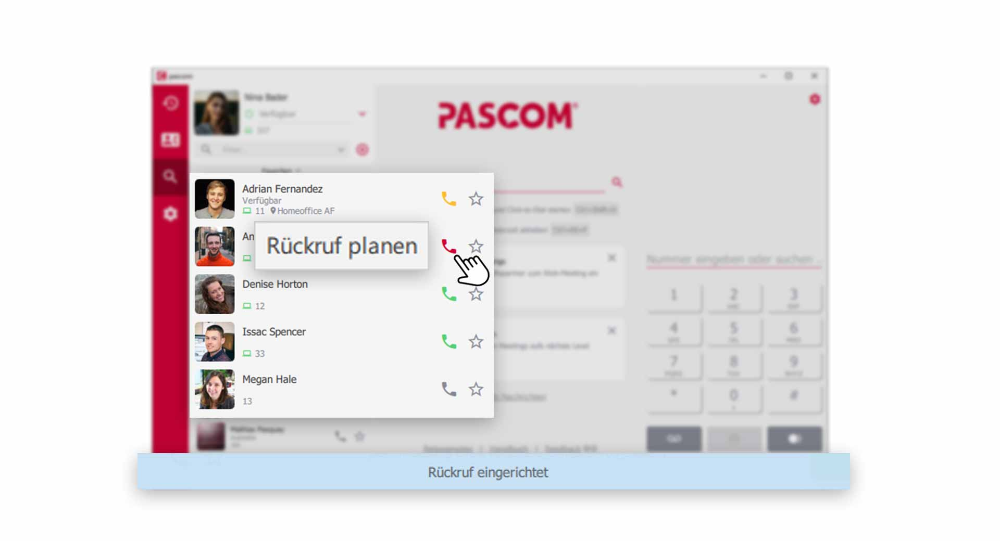
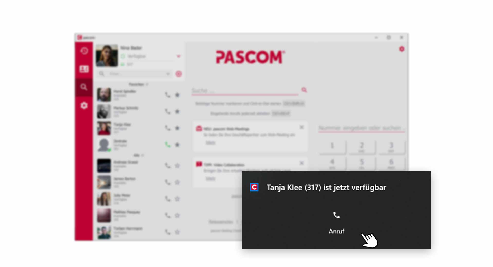


 


## Trainings Video

 

## Telefonieren mit dem pascom Client

Bevor Sie Ihren ersten Anruf starten, müssen Sie sich in der [Gerätesteuerung]() für ein Endgerät entscheiden, dass Sie für ausgehende Gespräche verwenden möchten. Dies kann das **integrierte Softphone** des pascom Client sein, oder ein **Tischtelefon** welches Ihnen zugewiesen wurde.

### Gespräch starten

Im pascom Client gibt es mehrere Wege, einen neuen Anruf zu starten. Geben Sie eine Telefonnummer im **Wählfeld** ein oder klicken Sie auf einen  in der Kontaktliste. Zusätzlich können Anrufe aus dem **Telefonbuch** und dem **Anrufjournal** heraus, gestartet werden. 

*Neuen Anruf starten*
 

### Der pascom Telefonbereich erklärt

Der Telefonbereich bietet einige Funktionen die wir Ihnen nachfolgend erklären.

**Wählfeld**

Geben Sie im Wählfeld direkt die Rufnummer ein, die Sie anrufen möchten. Machen Sie sich keine Sorgen über die Syntax der Telefonnummer. Der pascom Client kümmert sich darum. Zum starten des Anrufs drücken Sie auf den . Sie können im Wählfeld auch direkt nach **Personen** suchen. Weitere informationen finden Sie [hier]().

 

**Voicemailbox**

Zu Ihrem Anrufbeantworter / Voicemailbox gelangen Sie mit einem Klick auf . Eine Anleitung zu den Funktionen der Voicemailbox finden Sie [hier]().

 

**Faxen**

Über den  können Sie, sofern für Sie vom Systemadministrator ein **virtuelles Fax** eingerichtet wurde, Dokumente per Fax versenden. Eine detaillierte Anleitung finden Sie [hier]().

 

**Wahlwiederholung**

Mit der  rufen Sie den zuletzt gewählten Kontakt / Telefonnummer erneut an. 

 

## Eingehender Anruf

Werden Sie angerufen, erscheint im Telefonfeld das eingehende Anrufelement. Zusätzlich erscheint eine Pop-Up-Benachrichtigung über den eingehenden Anruf. Sie haben nun die Möglichkeit den Anruf **anzunehmen** oder **abzulehnen**. Zusätzlich können Sie den Anruf aber auch gleich zu einem Kollegen weiter **verbinden**.

*Eingehender Anruf im pascom Client*
 

## Aktives Gespräch

Während einem aktiven Gespräch bietet der Telefonbereich des pascom Client eine Menge Funktionen. Hier kommen **interaktive Anrufelemente** zum Einsatz, welche eine intuitive und einfach Interaktion mit den Gesprächsteilnehmern ermöglicht. 

### Interaktive Anrufelemente erklärt

Jeder Gesprächsteilnehmer wird im Telefonbereich des Pascom Client als **interaktives Anrufelement** dargestellt. So behalten Sie stehts die volle Kontrolle über das aktuelle Telefonat.

*Gesprächsteilnehmer als interaktives Anrufelement*
 

Mit einem Klick auf den  gelangen Sie zu weiteren Optionen für dieses Anrufelement.

*Erweiterte Funktionen des Anrufelements*
 

Sie haben die Möglichkeit den aktuellen Anrufer weiter zu **Verbinden**, den **Chat-Bereich** zu öffnen, den Anruf zu **Halten** oder sich weitere **Details** aus dem Telefonbuch anzeigen zu lassen. 

### Erweiterte Telefonfunktionen im aktiven Gespräch

Auch der Telefonbereich/ Wählbereich ändert sich während einem aktiven Gespräch und ermöglicht weitere Funktionen.

*Erweiterte Funktionen im Wählbereich*
 

Hier können Sie nun einen **neuen Anruf** starten, **DTMF Töne** senden, das **Mikrofon stumm** schalten, sowie **Video- und Screensharing** nutzen oder den Anruf über den **roten Höhrer** auflegen.

## Anruf halten

Einen aktiven Gesprächsteilnehmer auf **"Halten"** setzen hat mehrere Vorteile. Anders als beim Stummschalten Ihres Mikrofons, hört der Gesprächsteilnehmer eine Wartemusik und weiss daher das Sie gerade z.B. Rücksprache halten. Zusätzlich können Sie während Ihr Gesprächspartner wartet, andere Kontakte anrufen. 

Klicken Sie zum **"Halten"** des Gesprächspartners im **Anrufelement"** auf den . Der Anrufteilnehmer wird dann ausgegraut. 

*Anruf Halten*
 

Sie können den wartenden Gesprächsteilnehmer wieder zurückholen, indem Sie erneut auf den  klicken.

## DTMF Töne senden

DTMF-Töne werden verwendet um z. B. in einem Konferenzraum eine PIN zur Authentifizierung einzugeben, wenn Sie in einer Hotline durch die Eingabe von 1, 2 oder 3 an den/die gewünschten Gesprächspartner gelangen möchten oder mit einem Nummerncode eine Tür öffnen müssen.

Um mit dem pascom Client unter Verwendung des pascom Softphones DTMF-Töne zu versenden klicken Sie während des laufenden Gesprächs auf das **Wählfeld**.

*Wählfeld ändern um DTMF-Töne zusenden*
 

Nachdem Sie die Nummerneingabe abgeschlossen haben, können Sie mit einem Klick auf das  das Wählfeld wieder ausblenden. 

*Wählfeld wieder ausblenden*
 

## Amtsholung für ausgehende Gespräche

Im oberen Telefon-Bereich finden Sie die Funktion zur **Amtsholung für ausgehende Gespräche**. Sofern Ihr Systemadministrator entsprechende Rufregeln auf der pascom Telefonanlage eingerichtet hat, können Sie hier die Rufnummernsignalisierung nach außen ändern. So können so z.B. Ihre Rufnummer unterdrücken oder die Rufnummer einer Abteilung signalisieren.

*Ändern der Rufnummernsignalisierung für ausgehende Gespräche*
 

## Ihre Voicemailbox

Mit einem Klick auf den **Voicemail-Button** rufen Sie Ihre Voicemailbox an, sofern Ihr Systemadministrator Ihnen eine eigene Voicemailbox eingerichtet hat. Sie können Ihre **Mailbox** auch über einen [Funktionscode]() erreichen. 

1. Abrufen Ihrer Nachrichten bzw. das Tätigen von Einstellungen erfolgt über ein **Sprachmenü** in Ihrer **Mailbox**.

## Rückruf Funktion nutzen

Es kommt vor, dass Sie dringend Rücksprache mit einem Kollegen halten müssen, der aber gerade telefoniert. Natürlich müssen Sie nun warten, bis Ihr Kollege fertig ist mit seinem Telefonat, um ihn persönlich zu sprechen. Hier bietet sich die **Rückruf Funktion** an, welche Sie informiert, sobald das Gespräch beendet wurde.

### Rückruf einrichten

*Anrufen eines belegten Kollegen richtet Rückruf ein*
 

1. Klicken Sie auf den  des Kollegen, welcher gerade spricht.  

2. Ein Pop-UP erscheint mit **Rückruf planen** und am unteren Bereich des pascom Client sehen Sie, dass der Rückruf **eingerichtet** wurde.

### Rückruf starten

Sobald Ihr Kollege mit seinem Gespräch fertig ist, erscheint bei Ihnen eine **Benachrichtigung**, dass Ihr Kollege wieder verfügbar ist und angerufen werden kann.

*Starten Sie einen Rückruf, sobald der Kollege wieder verfügbar ist.*
 

1. Klicken Sie auf  um Ihren Kollegen anzurufen.

 
