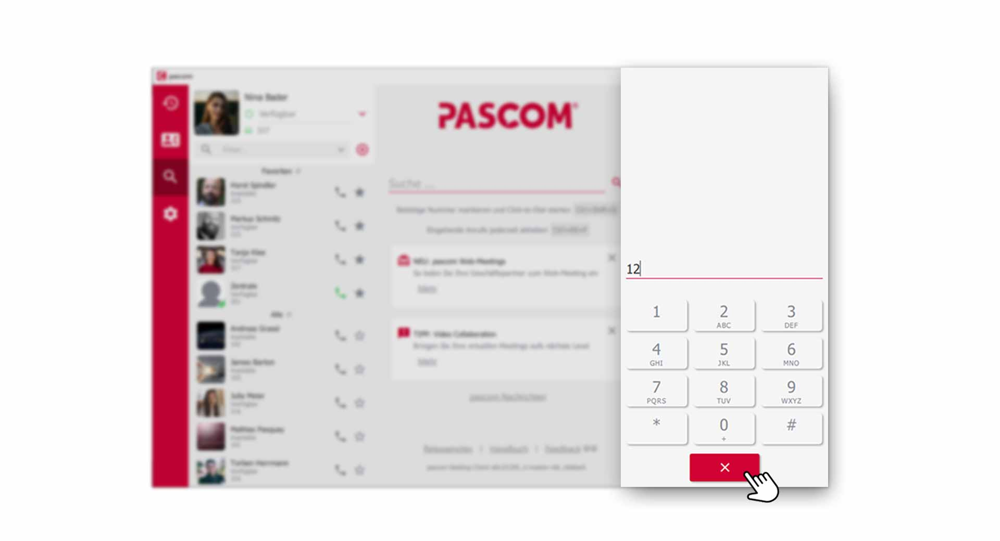
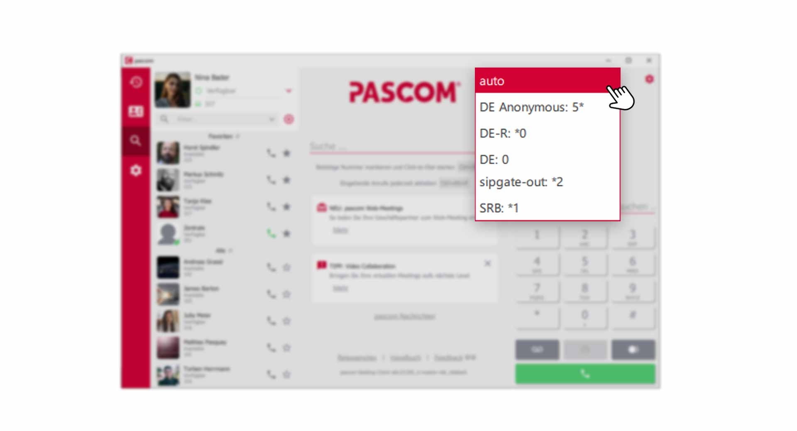


 


## Trainings Video

 

## Telephoning with the pascom Client

Before you start your first call, you will need to go to the [Device Menu]() and decide on the device you wish to use for outbound calls. For example, this can be the **integrated softphone** of the pascom client, or a **desktop phone** that has been assigned to you.

### Start a Call

There are several ways to start a new call in the pascom client. Enter a phone number in the **dialpad** or click on a  in the contact list. Additionally, calls can be started from the **phone book** and the **call journal**. 

*Start a new Call*
 

### The pascom Phone Area explained

The Phone area or Phone field offers some functions which are explained below.

**Dialpad**

Enter the phone number you want to call directly in the dialing field. Do not worry about the syntax of the phone number. The pascom client takes care of it. To start the call, press the  button. You can also search directly for **persons** in the dialing field. You can find more information [here]()

 

**Voicemailbox**

You can reach your answering machine / voice mailbox by clicking on  . You can find instructions on the functions of the voicemail box [here]().

 

**Faxing**

The  can be used to send documents by fax, if a **virtual fax** has been set up for you by the system administrator. You can find detailed instructions [here]().

 

**Redial**

Use  to call the last contact / phone number dialed, again. 

 

## Incomming Call

If you are called, the incoming call element appears in the phone field. A pop-up notification of the incoming call also appears. You now have the option to **accept** or **reject** the call. You can also directly **transfer** the call to a colleague.

*Incomming Call within the pascom Client*
 

## Active Call

During an active call, the telephone area of the pascom client offers a lot of functions. Here, **interactive call elements** are used, which allows intuitive and easy interactions with the participants. 

### Interactive Call Elemtents explained

Each participant is displayed in the telephone area of the Pascom client as **interactive call element**. This way you always have full control over the current call.

*Participant as interactive Call Element*
 

Click on the  to access further options for this call element.

*Extended Options of the Call Element*
 

You have the option to forward the current caller via **transfer**, open the **Chat area**, put the call on **Hold** or display further **details** from the phone book. 

### Extended telephone functions during active calls

The phone field/area also changes during an active call and enables further functions.

*Extended Opotions of the Dialpad*
 

Here you can now start a **new call**, send **DTMF tones**, mute the **microphone**, and use **video and screen sharing** or hang up the call via the **red handset button**.

## Hold a Call

Putting an active Call on **"Hold "** has several advantages. Differently than with the muting of your microphone, the conversation partner hears music on hold and knows therefore that you e.g. hold consultation. In addition, you can call other contacts while the other party is on hold. 

To **"hold"** a call, click on the  in the **call element"**. The caller is then grayed out.

*Hold a Call*
 

You can retrieve the waiting caller by clicking the  again.

## Send DTMF Tones

DTMF tones are used, for example, to enter a PIN for authentication in a conference room, if you want to reach the desired caller in a hotline by entering 1, 2 or 3 or if you have to open a door with a number code.

To send DTMF tones with the pascom client, click on the  during an ongoing call.

*Change Dialpad to send DTMF Tones*
 

After you have completed the number entry, you can hide the dialing field again by clicking on the . 

*hide Dialpad again*
 

## Signaling for outgoing calls

In the upper telephone area you will find the function **signaling for outgoing calls**. If your system administrator has set up corresponding call rules on the pascom telephone system, you can change the call number signaling to the outside here. For example, you can hide your phone number or signal the phone number of a department.

*Changing the phone number signaling for outgoing calls*
 

## Your Voicemail Box

Click the  to call your voicemail box, provided your system administrator has configured your own voicemail box. You can also reach your **Voicemailbox** via a [Function Code](). 

1. retrieve your messages or make settings via a **voice menu** in your **mailbox**.

## Use Callback Function

It may be that you urgently need to consult with a colleague who is on the phone. Of course, you will have to wait until your colleague has finished his phone call to speak to him in person. This is where the **call back function** comes in, which informs you as soon as the call is finished.

### Setup Callback

*Calling a busy colleague sets up a callback*
 

1. Click on the  - symbol of the colleague who is currently speaking.

2. A pop-up appears with **"Plan a callback"** and at the bottom of the pascom client you can see that the callback **has been set up**.

### Start Callback

As soon as your colleague has finished his conversation, you will receive a **notification** that your colleague is available again and can be called.

*Start a callback as soon as the colleague is available again.*
 

1. Click on  to call your colleague.

 