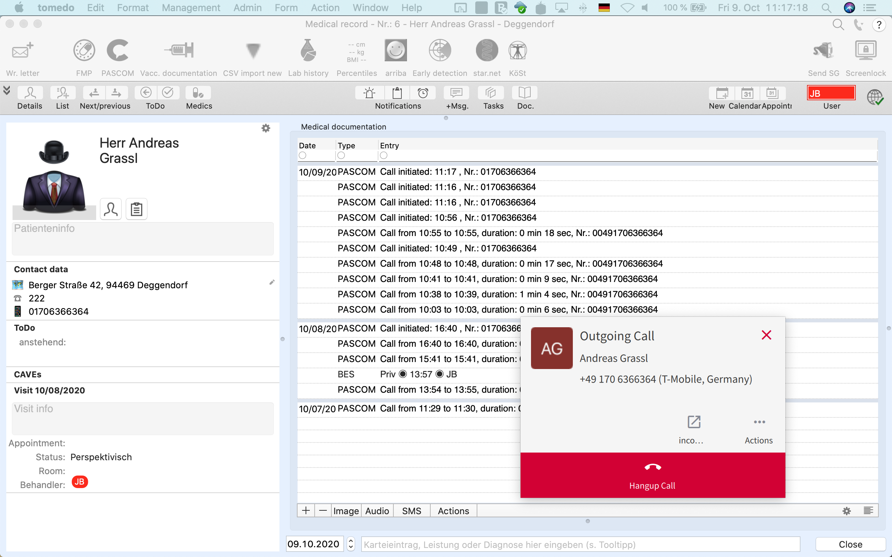


 


## Trainings Video

 

## Neuer eingehender Anruf

Bei einem neuen eingehenden Anruf erhalten Sie eine **PopUp-Meldung** des pascom Client, in welchem Sie den Anruf Ihres Patienten entgegennehmen können.
Sie können bereits vor dem **Abheben** des Anrufs die Patientendaten des Anrufers über den  öffnen.

 

## Aktiver Anruf

Sobald Sie den Anruf annehmen, öffnen sich in tomedo® die Patientendaten des Anrufers und entsprechende Einträge werden in der Telefonhistorie gesetzt.

 

## Anrufe tätigen aus tomedo®

Sie können Anrufe direkt aus tomedo® heraus starten. Klicken Sie dazu bei einem Patienten auf das **Telefonsymbol**.

 

Der **pascom Client** startet automatisch einen neuen ausgehenden Anruf. 

 

