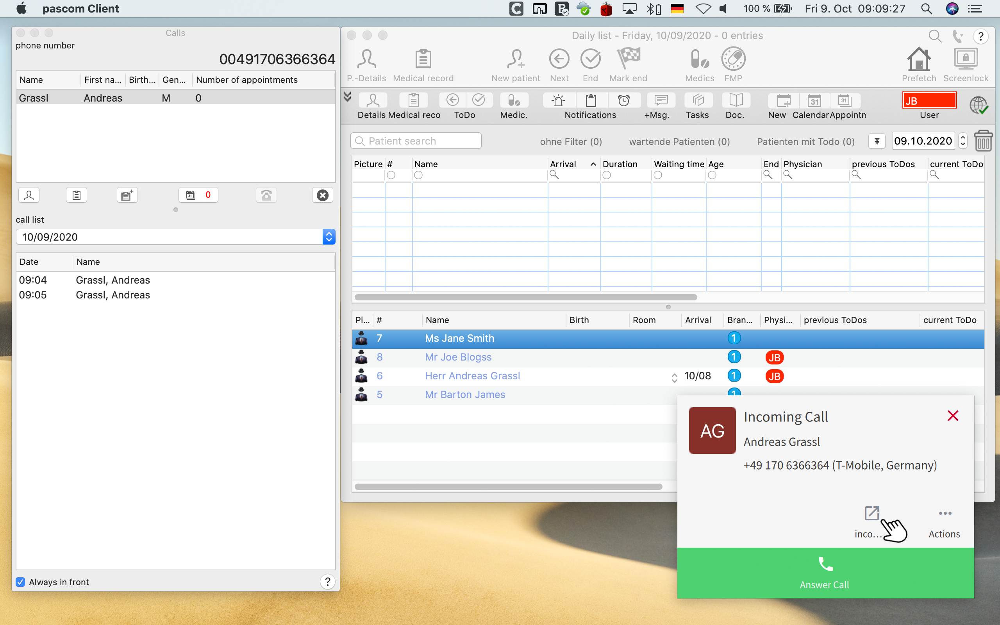
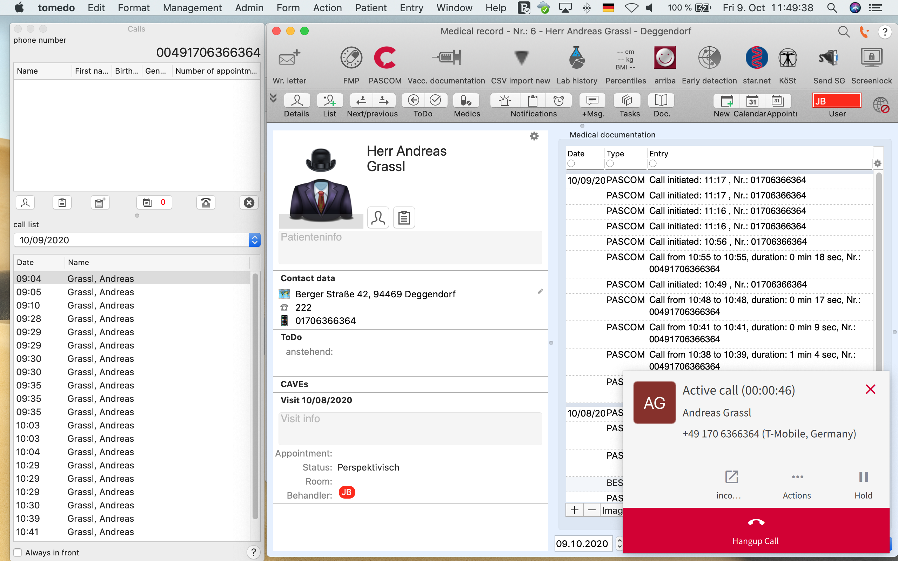
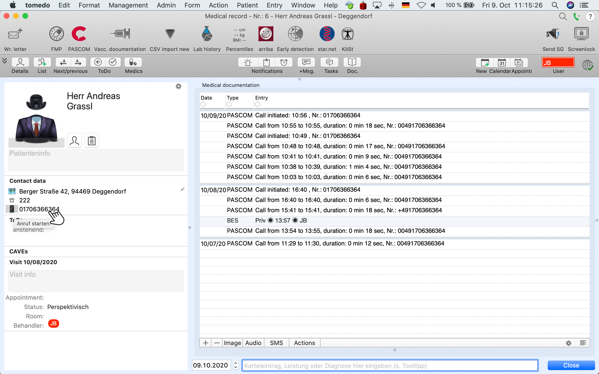
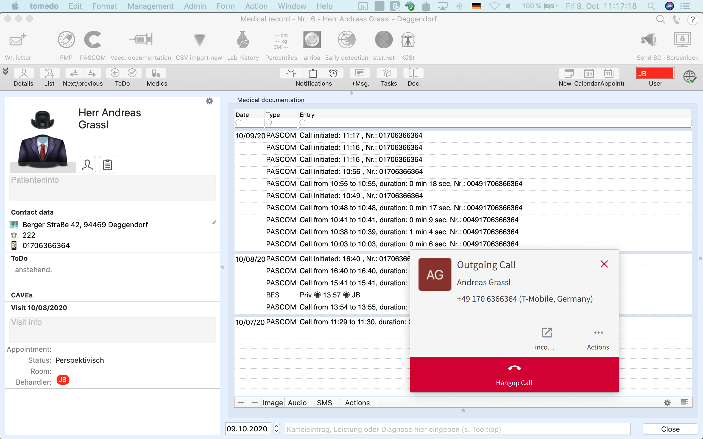


 


## Trainings Video

 

## New incomming Call

When a new incoming call is received, you will receive a **PopUp message** from the pascom client, in which you can answer your patient's call.
You can already open the caller's patient data records before you **answer** the call via the {.

 

## Active Call

As soon as you answer the call, tomedo® opens the caller's patient data and sets corresponding entries in the telephone history.

 

## Making calls from tomedo®

You can start calls directly from tomedo®. To do this, click on the **phone symbol** of a patient.

 

The **pascom client** automatically starts a new outgoing call. 

 

