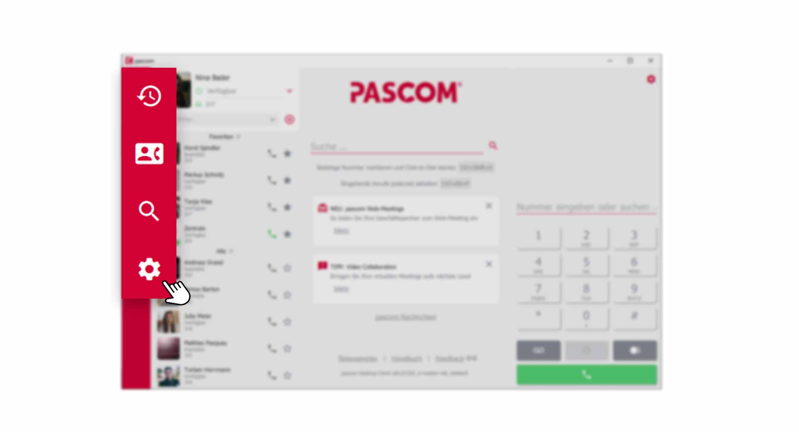


 


## Trainings Video

 

## Anruf Verbinden

Um einen Anruf mit einem Kollegen zu Verbinden, gibt es mehrere Wege und Varianten. Möchten Sie vorher **Rücksprache** mit Ihrem Kollegen über den bevorstehenden Transfer halten oder den Anruf einfach **blind** weiterleiten, so erklären wir Ihnen nachfolgend wie es funktioniert. 

### Verbinden ohne Rücksprache (blind transfer)

Einen Gesprächspartner **blind** ohne Rücksprache weiterzuleiten, ist bei Kollegen nicht gern gesehen, denn der Anruf wird ohne weitere Infos einfach durchgestellt. Jedoch ist es eine schnelle Variante, den Anrufer zum gewünschten Kollegen weiterzuleiten.

1. Wählen Sie im **Anrufelement** die Option .

 

2. Geben Sie die **Durchwahl** oder den **Namen** Ihres Kollegen in das Wählfeld ein und klicken Sie auf den  um das Gespräch zu verbinden.

 

3. Alternativ können Sie während dem aktiven Gespräch mit der **rechten Maustaste** in Ihrer Kontaktliste auf einen Kollegen klicken und im **Pop-Up-Menü** den Punkt  auswählen. 

 

### Verbinden mit Rücksprache (attended transfer)

Einen Gesprächspartner mit Rücksprache zu verbinden ist eine tolle Variante, um Ihren Kollegen vorab Informationen über den Anrufer zu geben. Dazu wird während dem aktiven Gespräch der Kollegen angerufen und erst dann wird der Anrufer verbunden.

1. Während eines aktiven Gesprächs, rufen Sie Ihren Kollegen bequem über die **Kontaktliste** an. Alternativ können Sie einen neuen Anruf über das **Wählfeld**, aus dem **Anrufjournal** oder dem **Telefonbuch** starten.

 

2. Sie müssen den aktuellen Gesprächsteilnehmer nicht extra auf **Halten** setzten. Dies übernimmt der pascom Client automatisch bei einem neuen ausgehenden Anruf. Der neue Anruf wird nun auch als **Anrufelement** im Telefonbereich dargestellt, mit dem Sie interagieren können.

 

3. Klicken Sie im neuen **Anrufelement** Ihres Kollegen auf  und wählen Sie den Anruf aus, der auf **Halten** steht. Das Gespräch wird daraufhin verbunden und für Sie beendet. 

## Dreierkonferenz

Die Dreierkonferenz wird ähnlich wie der **Attended Transfer** in zwei Schritten eingeleitet. Im ersten Schritt wird, wie bereits bekannt, der Anruf hinzugefügt.

1. beide aktiven Anrufe werden nun mit einem Klick auf  zu einer Dreierkonferenz zusammengeschalten.

 

2. Es ist nun Möglich, dass alle Gesprächsteilnehmer miteinander sprechen. Als Initiator der Dreierkonferenz, können Sie einen Teilnehmer aus der Konferenz wieder entfernen indem Sie bei dem entsprechenden **Anrufelement** auf  klicken.

 

3. Um die komplette Dreierkonferenz zu beenden, klicken Sie auf den 

## Heranholen von Anrufen (pickup)

Oft kommt es vor, dass Ihre Kollegen Anrufe bekommen und gerade nicht am Platz sind. Hier hilft das **Heranholen** der Anrufe von Ihren Kollegen oder einer Warteschlange. Voraussetzung, der Systemadministrator hat eine entsprechende *Berechtigungsrolle* für das **Pickuppen** der Benutzer angelegt. 

1. Erhält ein Kollege einen Anruf, erscheint eine **Pop-Up-Benachrichtigung** zum **Heranholen** des Anrufs. Alternativ können Sie in der **Kontaktliste**, bei dem Kollegen der gerade angeklingelt wird, mit der **rechten Maustaste** den Anruf .

*Anrufe Ihrer Kollegen heranholen*
 

## Rufumleitung für Anrufe

Sie möchten alle eingehenden Anrufe zu einem Kollegen, oder einer Telefonnummer umleiten. Kein Problem, der pascom Client bietet in den **Einstellungen** die Möglichkeit eine **Rufumleitung** einzurichten. Voraussetzung, der Systemadministrator hat eine entsprechende *Berechtigungsrolle* zum setzten einer **Rufumleitung** für Sie eingerichtet. 

1. Öffnen Sie die  über das pascom Menü

 

2. Klicken Sie im **Einstellungs-Menü** auf 

 

### Rufumleitung setzen

Geben Sie in der **Eingabezeile** die gewünschte Telefonnunmmer ein, zu der Sie Umleiten möchten. Sind bereits durch den Systemadministrator **vordefinierte Rufumleitungen** gesetzt, können Sie diese mit Klick auf die Eingabezeile aus dem Drop-Down Menü auswählen.

 
