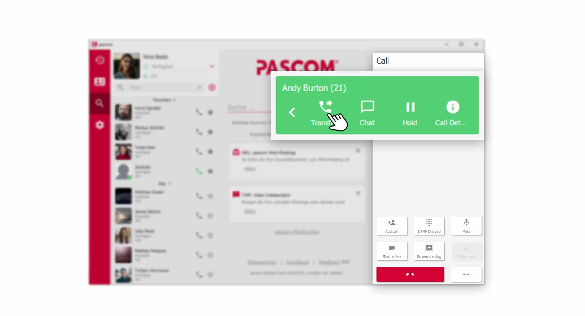
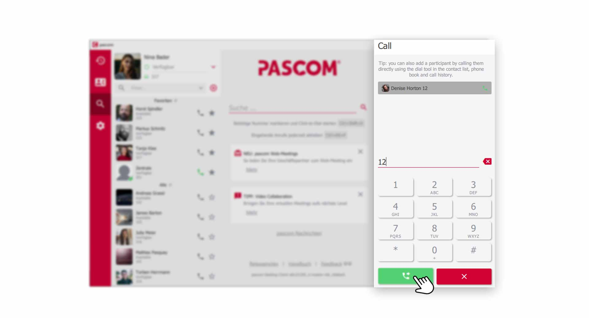
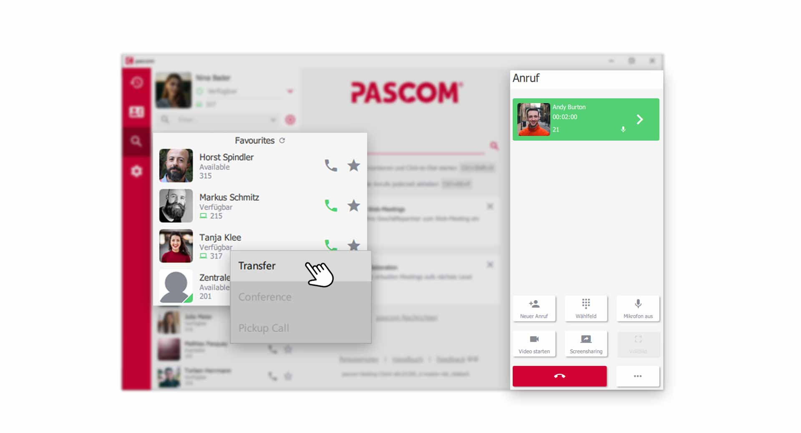
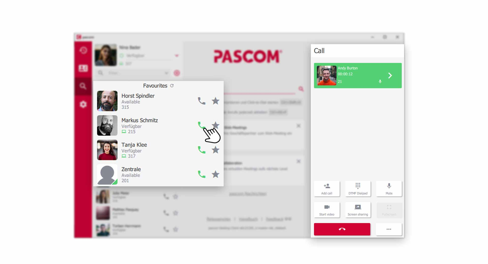
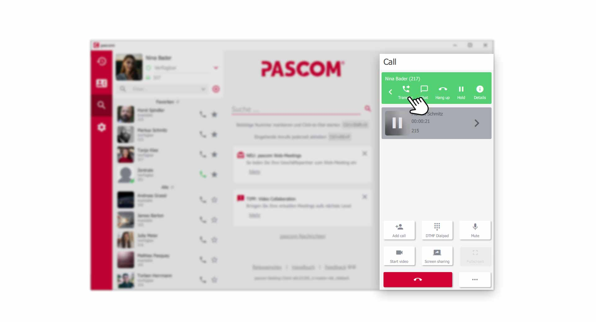
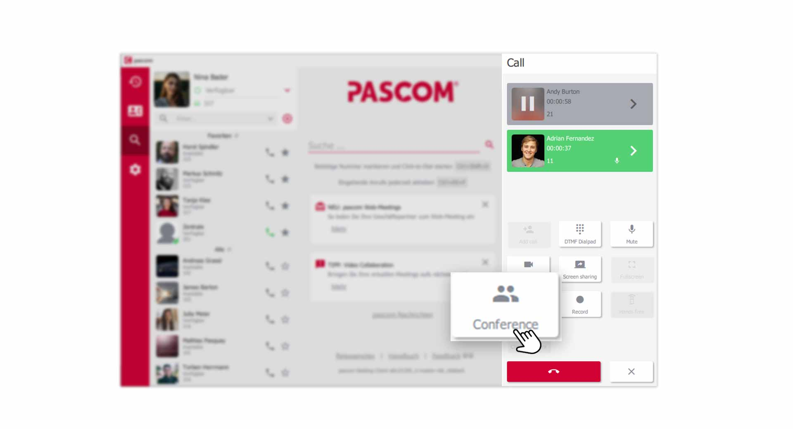
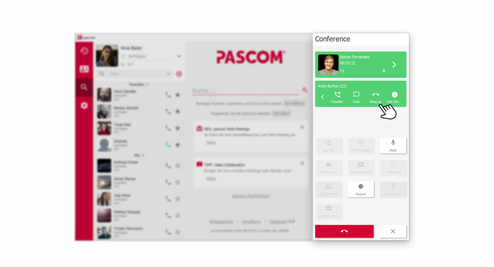
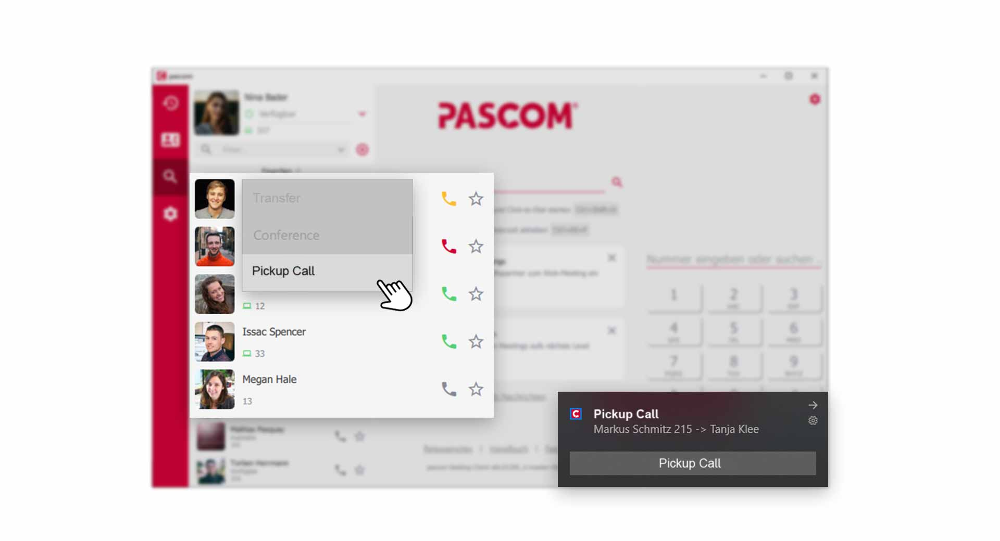
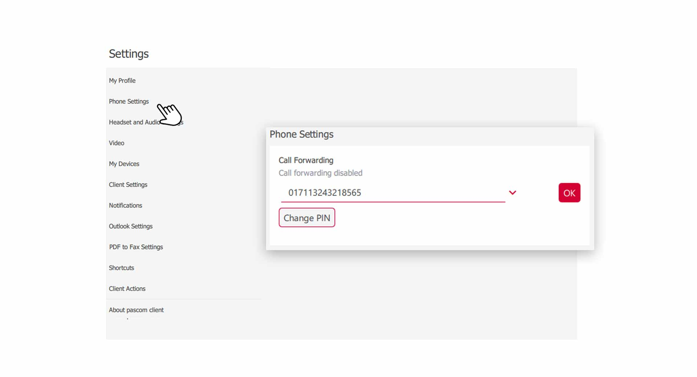


 


## Trainings Video

 

## Transfer a Call

There are several ways and variants to connect a call to a colleague. If you would like to **consult** your colleague in advance about the upcoming transfer or simply **blindly** transfer the call, we explain below how it works. 

### Transfer without consultation (blind transfer)

Forwarding a call partner **blind** without consultation is not appreciated by colleagues, because the call is simply put through without further information. However, it is a quick option to forward the caller to the desired colleague.

1. select **transfer** in the **call element**.

 

2. enter the **dialling number** or the **name** of your colleague in the dialing field and click on the **green handset** to connect the call

 

3. Alternatively, you can click on a colleague in your contact list with the **right mouse button** during an active call and select the **Transfer** item in the **Pop-Up menu**. 

 

### Transfer with consultation (attended transfer)

Connecting a caller with consultation is a great way to give your colleagues information about the caller in advance. To do this, the colleague is called during the active call and only then is the caller connected.

1. during an active call, call your colleague conveniently via the **contact list**. Alternatively, you can start a new call via the **dialpad**, from the **call journal** or the **phone book**.

 

2. You dont need to set the current call party to **Hold**. The pascom client will do this automatically when a new outgoing call is made. The new call is now also displayed as a **call element** in the telephone area with which you can interact.

 

3. click **transfer** in your colleague's new **call element** and select the call that is on **hold**. The call is then connected and ended for you. 

## Conference

The three-party conference is initiated in two steps similar to the **Attended Transfer**. In the first step, the call is added, as already known.

1. Both active calls are now joined into a three-party conference by clicking on **Conference**.

 

2. it is now possible for all participants of the conversation to talk to each other. As the initiator of the three-party conference, you can remove a participant from the conference by clicking on **Hang up** at the corresponding **call element**.

 

3. to end the complete three-party conference, click on the **red handset**.

## Pickup a Call

It often happens that your colleagues receive calls and are not at their desk. This is where the **pickup** of calls from your colleagues or a queue helps. Prerequisite, the system administrator has created a corresponding *authorization role* for the **pick-up** of the users. 

If a colleague receives a call, a **pop-up notification** appears to **pick up** the call. Alternatively, you can **pickup the call** in the **contact list** with the colleague who is currently being called by clicking the **right mouse button**.

*pickup a call from your colleague*
 

## Call forwading

You want to forward all incoming calls to a colleague or a phone number. No problem, the pascom client offers the possibility to set up a **call forwarding** in the **settings**. The system administrator must have set up a corresponding *authorization role* to set up **call forwarding** for you. 

1. Open the **client settings** via the pascom menu.

 

2. Click on **Phone Settings** in the **Settings menu**

 

### Set call forwarding

In the **input line** enter the desired phone number to which you want to redirect. If a **predefined call forwarding** have already been set by the system administrator, you can select them from the drop-down menu by clicking on the input line.

 

