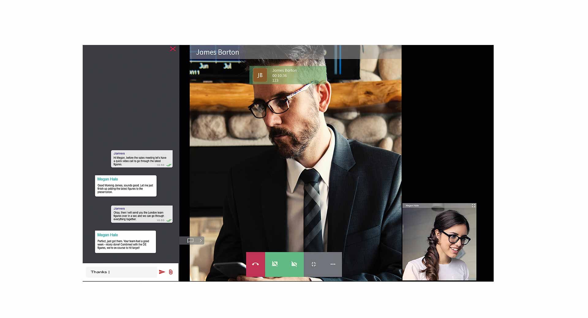
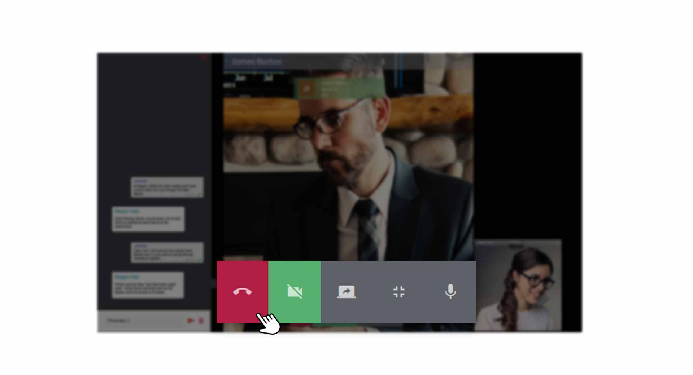
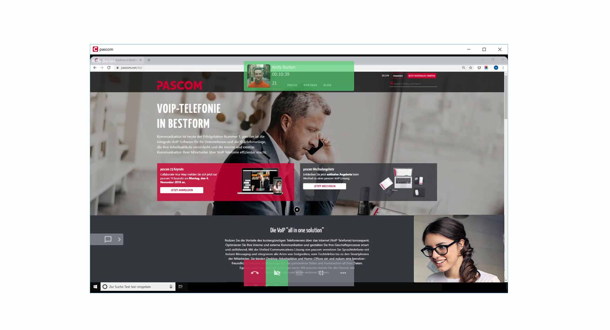


 


## Trainings Video

 

## Video-Telefonie mit Ihren Kollegen

Egal ob im Home-Office oder bei virtuellen Besprechungen, das visuelle Element der Video-Telefonie fördert eine bessere Zusammenarbeit. Voraussetzung hierfür ist eine installierte oder integrierte Webcam, welche Sie in den [Client Einstellungen](Link zu den Einstellungen) auswählen müssen. In der Regel wird die Webcam vom pascom Client automatisch gefunden, sodass Sie sich nicht darum kümmern brauchen. 

### Video-Telefonie starten

Rufen Sie wie gewohnt Ihren Kollegen an. Während dem **aktiven Gespräch** haben Sie nun im **Wählfeld** die Option, mit einem Klick, die **Video-Funktion** einzuschalten.

*Video-Telefonie mit Kollegen starten*
 

Das Video-Telefonat mit Ihrem Kollegen startet standartmäßig im Vollbildmodus.

*Aktives Video-Telefonat im Vollbildmodus*
 

## Video-Optionen

Während einem aktiven Video-Telefonat stehen Ihnen viele Optionen und Funktionen zur Verfügung.

*Optionen während eines Video-Telefonat*
 

### Chatten

Sie können während dem Video-Telefonat ganz normal die Chat-Konversation mit Ihrem Kollegen nutzen. Klicken Sie dazu auf der linken Seite auf das **Chat-Symbol**.

### Video-Bild Ein- /Ausschalten

Klicken Sie zum Ein- /Ausschalten des Video-Bild auf den **Kamera-Button** im **Video-Menü**.

### Mikrofon Ein- /Ausschalten

Klicken Sie zum Ein- /Ausschalten Ihres Mikrofons auf den **Mikrofon-Button** im **Video-Menü**.

### Screensharing während aktivem Video-Anruf

Schalten Sie während dem aktiven Video-Anruf das Screensharing ein um Ihren Bildschirminhalt zu teilen. 

Klicken Sie dazu im **Video-Menu** auf den **Screensharing-Button**. Ihr Bildschirminhalt wird mit Ihrem Kollegen geteilt, wobei Sie gleichzeitig noch das Video-Bild sehen. 

*Aktives Video-Telefonat mit Screensharing*
 

### Video-Vollbildmodus beenden

Um den Vollbildmodus des Video-Telefonat zu beenden, klicken Sie im **Video-Menü** auf den **Vollbildmodus-Button**. Das Video-Bild wird dann in die Gruppe im pascom Client integriert.

*Aktives Video-Telefonat minimiert im pascom Client*
 

### Video-Telefonat beenden

Zum Beenden des Video-Anrufs legen Sie das Gespräch über den **roten Höhrer-Button** auf.

## Screensharing nutzen

Schnell Bildschirminhalte mit seinem Kollegen zu teilen macht die Team-Zusammenarbeit im Alltag viel effizienter. Vorallem können beide Gesrpächsteilnehmer visuell Nachvollziehen, worüber gerade Gesprochen wird. Ein tolles Feature.

### Screensharing starten

Rufen Sie wie gewohnt Ihren Kollegen an. Während dem **aktiven Gespräch** haben Sie nun im **Wählfeld** die Option, mit einem Klick, die **Screensharing-Funktion** einzuschalten.

*Screensharing mit Kollegen starten*
 

1. Wählen Sie nun den **Bildschirm** aus, den Sie zu Ihrem Kollegen übertragen möchten, sofern Sie mehrere Bildschirme nutzen.  

2. Die Übertragung des Screensharing erfolgt standartmäßig im Vollbildmodus.

*Aktives Screensharing mit Kollegen*
 

## Screensharing - Optionen

Ihnen stehen die selben Optionen- und Funktionen wie bei einem **Video-Telefonat** zur Verfügung.  

## Video | Einstellungen

In den Videoeinstellungen des pascom Client, können Sie testen ob Ihre WebCam funktioniert und zwischen Ihren installierten Kameras wählen.

1. Öffnen Sie die **Client-Einstellungen** über das pascom Menü

 

2. Klicken Sie im **Einstellungs-Menü** auf **Video**

 

### Webcam auswählen

Klicken Sie im Drop-Down Feld bei den **Kameras** auf die entsprechende WebCam, welche Sie verwenden möchten und testen Sie gleichzeitig im Vorschaufenster, ob Sie ein Videobild erhalten.  

 