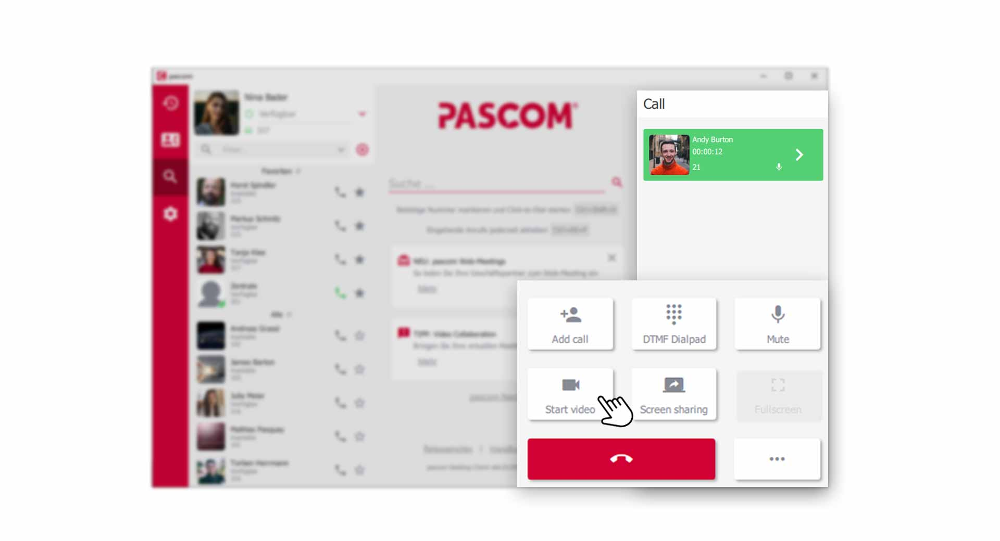
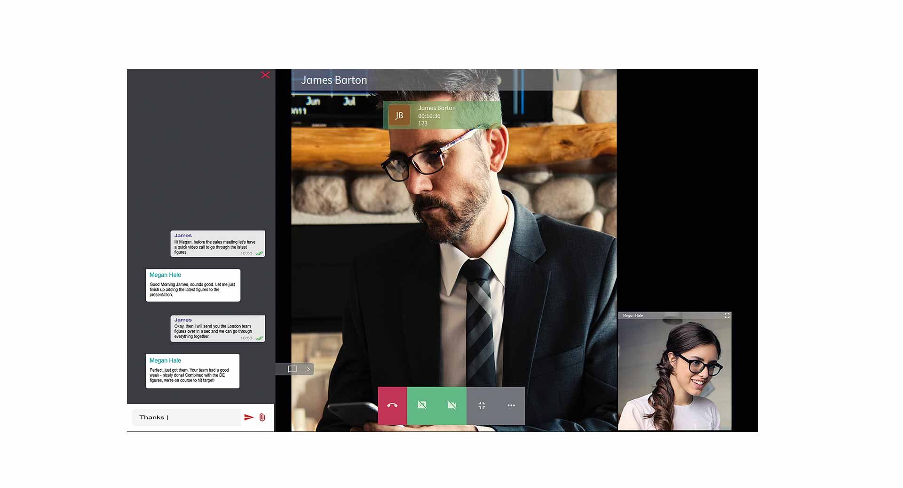
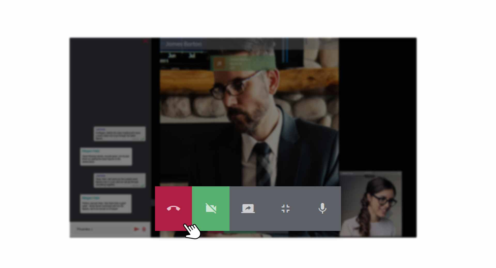
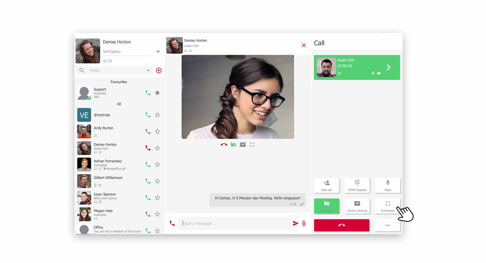
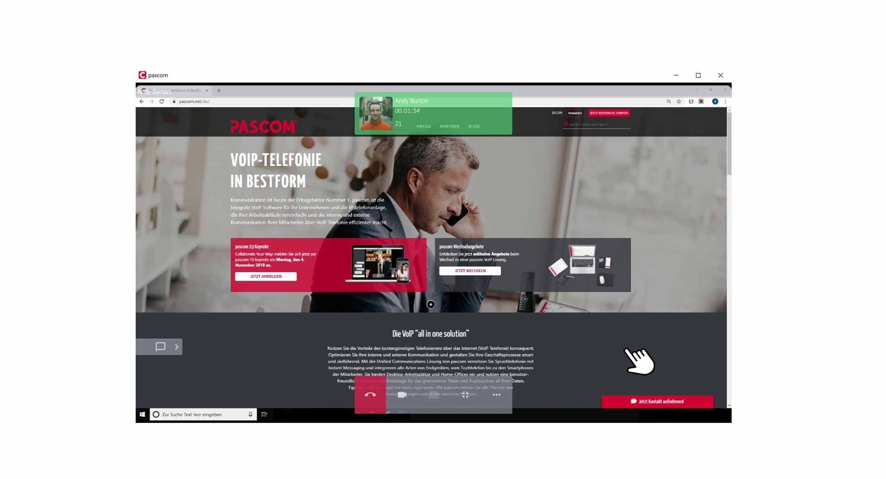


 


## Trainings Video

 

## Video telephony with your colleagues

Whether in the home office or in virtual meetings, the visual element of a video Call promotes better collaboration. This requires an installed or integrated webcam, which you must select in the [Client Settings](link to settings). Usually the webcam is found automatically by the pascom client, so you do not need to worry about it. 

### Start a Video Call

Call your colleague as usual. During the **active call** you now have the option to activate the **video function** in the **dialing field** with one click.

*Start video Call with colleagues*
 

By default, the video call with your colleague starts in full screen mode.

*Active Video Call in Fullscreen Mode*
 

## Video-Options

During an active video call, many options and functions are available to you.

*Options during a Video Call*
 

### Chat

You can use the chat conversation with your colleague during the video call as normal. To do so, click on the **Chat icon** on the left side.

### Switch Video on/off

To switch the video picture on/off, click the **Camera button** in the **Video menu**.

### Switch Microphone on/off

Click on the **Microphone button** in the **Video menu** to switch your microphone on/off.

### Screensharing during an active Video Call

Turn on screen sharing during an active video call to share your screen content. 

To do so, click on the **Screensharing button** in the **Video menu**. Your screen content will be shared with your colleague while you are still watching the video picture.

*Active Screensharing during a video Call*
 

### Exit Video Fullscreen Mode

To exit the full screen mode of the video call, click the **Full Screen Mode button** in the **Video menu**. The video image is then integrated into the group in the pascom client.

*Active Video Call minimized in the pascom client*
 

### End a Video Call

To end the video call, hang up the call using the **red handset button**.

## Use Screensharing

Quickly sharing screen content with colleagues makes team collaboration in everyday life much more efficient. Above all, both participants can visually understand what is being discussed. A great feature.

### Start Screensharing

Call your colleague as usual. During the **active call** you now have the option to activate the **screensharing function** in the **dialing field** with one click.

*Start screen sharing with colleagues*
 

1. Now select the **screen** you want to transfer to your colleague, if you use multiple screens.  

2. Screensharing is transmitted in fullscreen mode by default.

*Active screen sharing with colleagues*
 

## Screensharing - Options

The same options and functions are available to you as for a **video call**.  

 
