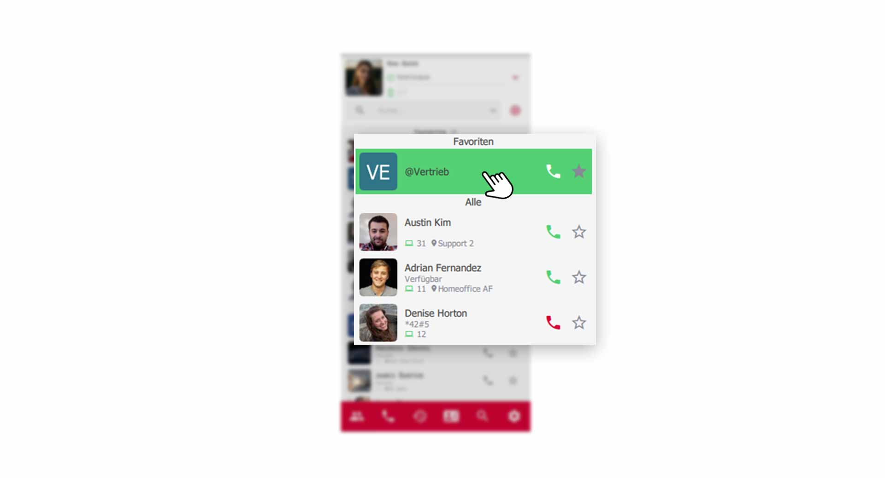
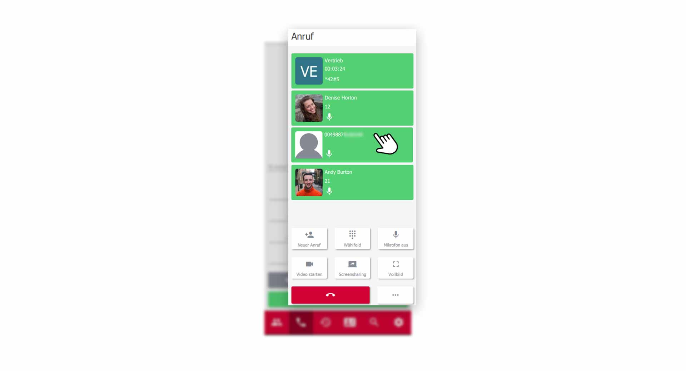

 


## Übersicht

Konferenzen sind ein wichtiger Bestandteil in der heutigen Geschäftswelt. Besprechen Sie Themen mit Ihren Kollegen oder Kunden in virtuellen Konferenzräumen. Besprechungen mit mehreren Teilnehmern, waren noch nie so einfach wie mit dem pascom Mobile Client. 

### Was wird benötigt?

Um Konferenzen im pascom Client abzuhalten, benötigen Sie eine pascom Gruppe. Nutzen Sie folgende [Anleitung]() zum erstellen einer pascom Gruppe.

**Konferenz mit Kollegen**

1. Legen Sie sich eine pascom Gruppe an z.B. **virtueller Konferenzraum** oder **Meeting-Raum**. Sie können auch bestehende pascom Gruppen nutzen, die Sie bereits angelegt haben.   
 

**Konferenz mit Kunden**

2. Legen Sie sich eine pascom Gruppe an z.B. **virtueller Konferenzraum** oder **Meeting-Raum**. Aktivieren Sie zusätzlich den **Gastmodus** der pascom Gruppe, sodass Sie eine **Einwahlnummer** und **PIN** für Ihre Kunden erhalten. 

3. Geben Sie die **Einwahldaten** weiter an Ihre Kunden, um diese einzuladen.

### Die Gruppe leuchtet grün

Eine pascom Gruppe fängt **grün an zu leuchten**, wenn eine **aktive Konferenz** stattfindet, bzw. sich Teilnehmer in der Konferenz befinden. Tretten alle Teilnehmer aus der Gruppe aus, endet die Signalisierung.

*Aktive Konferenz in pascom Gruppe*
 

## Audio-Konferenz mit Ihren Kollegen

Um eine Konferenz zu starten oder beizutreten, rufen Sie die Gruppe über das **Höhrer-Symbol** an. Sie sind nun im Konferenzraum der Gruppe eingeloggt.

*Aktive Konferenz mit Ihren Kollegen*
 

Ihnen stehen nun alle **Funktionen** zur Verfügung, die Sie bereits aus der Anleitung zu den [Video Tools]() oder den [Telefonie Funktionen]() kennen sollten. 

## Video Konferenz mit Ihren Kollegen

Befinden Sie sich in einer aktiven Konferenz, haben Sie die Möglichkeit die **Video-Funktionalität** über das **Wählfeld** einzuschalten. 

{}
Bitte beachten Sie, sobald Sie in einer Konferenz das **Video** einschalten, können alle Teilnehmer Ihr Video sehen.
{}

## Audio-Konferenz mit Ihren Kunden

Eine **Audio-Konferenz** mit Ihren Kunden funktioniert genauso, wie mit Ihren Kollegen. Externe Teilnehmer gelangen über den **Gastmodus** in Ihre Gruppe und können So an der Konferenz teilnehmen. 

*Aktive Video Konferenz mit externen Teilnehmern*
 

