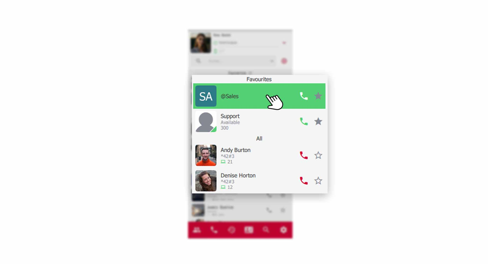
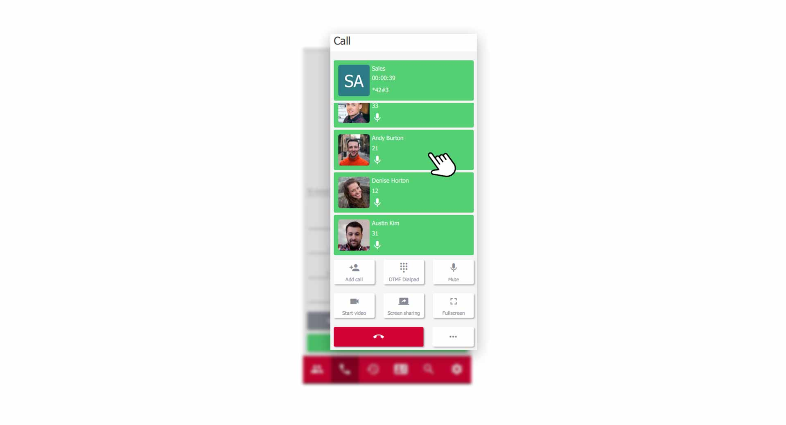

 


## Overview

Conferences are an important part of today's business world. Discuss topics with your colleagues or customers in virtual conference rooms. Meetings with multiple participants have never been easier than with the pascom Mobile client. 

### What is required?

To make conferences in the pascom client, you need a pascom group. Use the following [tutorial]() to create a pascom group.

**Conference with colleagues**

1. Create a pascom group e.g. **virtual conference room** or **meeting room**. You can also use existing pascom groups that you have already created.   
 

**Conference with customers**

2. Create a pascom group e.g. **virtual conference room** or **meeting room**. Additionally activate the **guest mode** of the pascom group so that you receive a **dial-in number** and **PIN** for your customers. 

3. Pass on the **dial-in data** to your customers to invite them.

### The group lights up green

A pascom group starts to light up **green** when there is an **active conference** or when there are participants in the conference. If all participants leave the group, the signaling stops.

*Active Conference in a pascom Group*
 

## Audio conference with your colleagues

To start or join a conference, call the group by clicking on the **handset icon**. You are now logged in to the group's conference room.

*Active conference with colleagues*
 

You now have all **functions** at your disposal, which you should already know from the tutorials for the [video tools]() or the [telephony functions](). 

## Video - conference with your colleagues

If you are in an active conference, you can activate the **video functionality** via the **dial field**. 

{}
Please note, as soon as you switch on **Video** in a conference, all participants can see your video.
{}

## Audio conference with your customers

An **audio conference** with your customers works just like with your colleagues. External participants join your group via the **Guest mode** and can join the conference in this way. 

*Active video conference with external participants*
 

