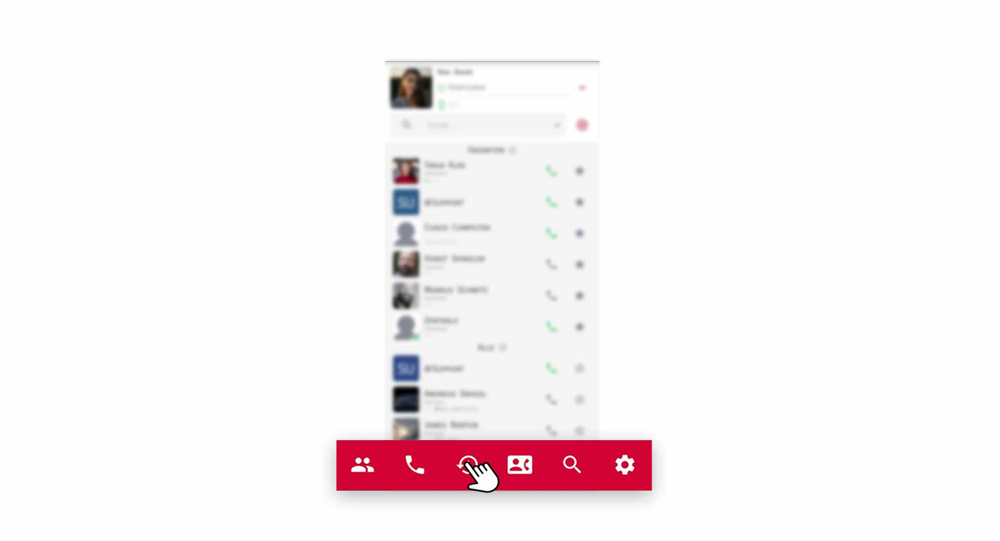
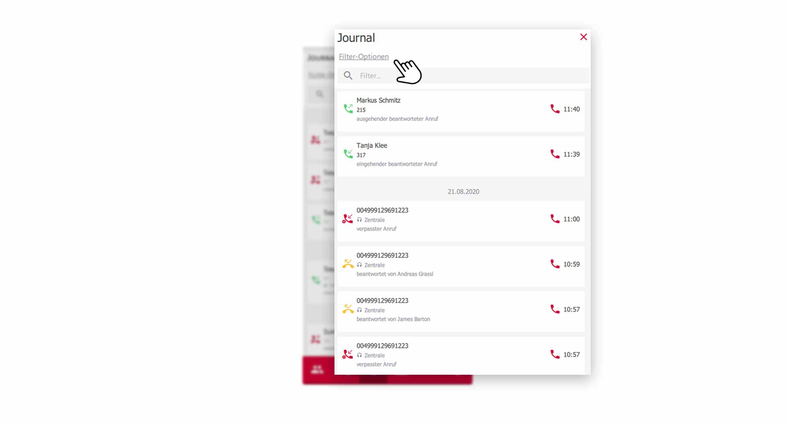
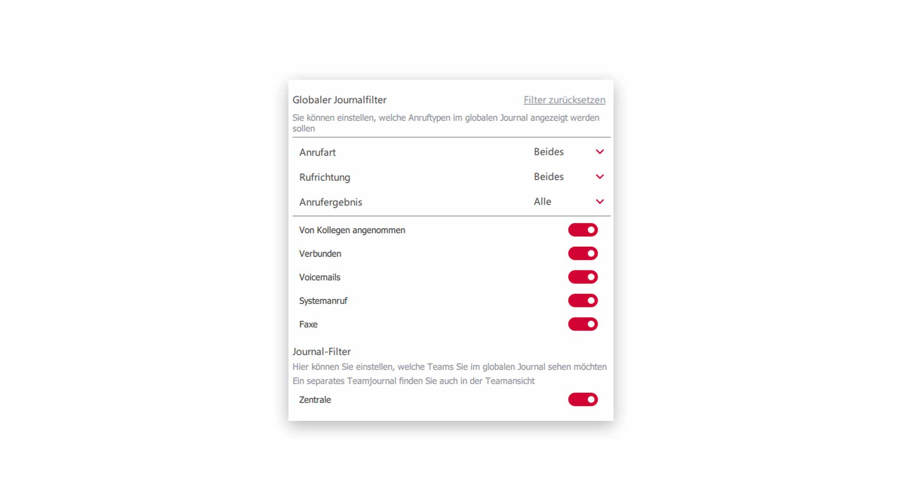
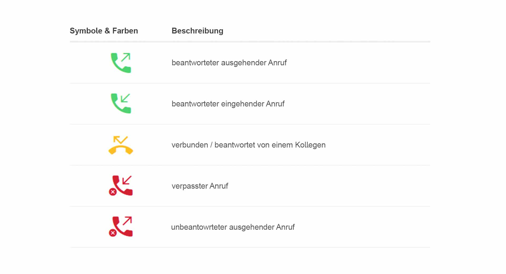
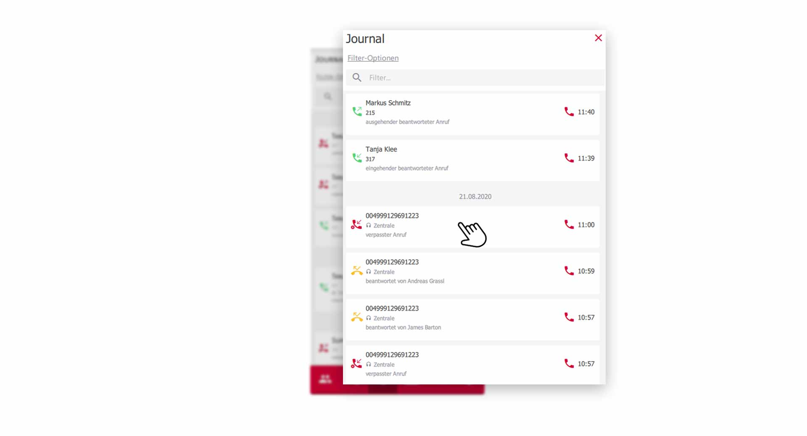
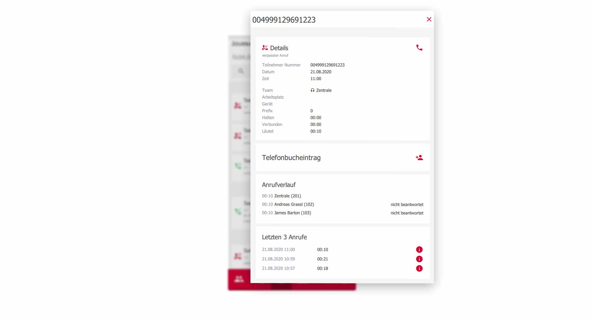
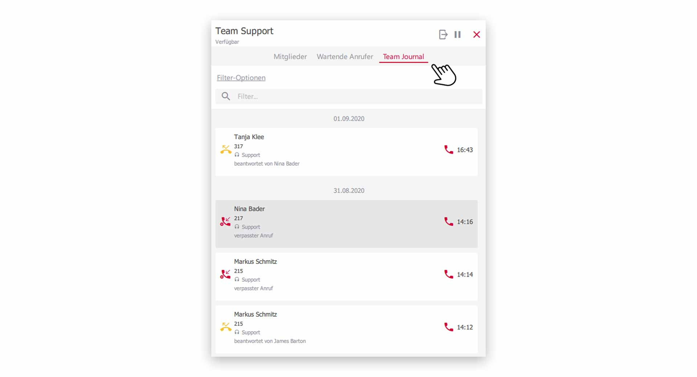


 

## Übersicht

Im Anrufjournal finden Sie die komplette Historie Ihrer Anrufe. Filteroptionen erleichtern das Wiederfinden von Anrufdatensätzen und die Detail-Funktion liefert wertvolle Informationen zu jedem einzelen Anruf.

## Das Anrufjournal aufrufen

Klicken Sie in der Menüleiste auf das Symbol der **Anrufhistorie** um das Journal aufzurufen.

*Anrufjournal öffnen über das Menü*
 

## Filter des Anruf Journal nutzen

Klicken Sie im oberen Bereich der Anrufhistorie auf **Filter-Optionen**.

*Das Anrufjournal im pascom Client*
 

In den **Filter-Optionen** haben Sie einige Einstellungsmöglichkeiten.

*Weitere Filter Optionen im Anruf Journal*
 

### Anrufart

Filtern Sie die Anrufhistorie nach **internen** / **externen**, oder nach **beiden** Anrufarten.

### Rufrichtung

Filtern Sie die Anrufhistorie nach **eingehenden** / **ausgehenden** oder **beiden** Rufrichtungen.

### Anrufergebnis

Filtern Sie die Anrufhistorie nach **angenommenen** / **verpassten** Anrufen, oder lassen Sie sich **Alle** Anrufergebnisse anzeigen.

### Weitere Journaleinträge anzeigen

Blenden Sie Optionen wie **Voicemailbox**, **Systemanrufe**, **Faxe** usw. in Ihrer Anrufhistorie ein oder aus. 

### Team-Journal in die Anrufhistorie einbinden

Sie können auswählen, aus welcher Warteschlange (in der Sie Mitglied sind) Anrufdaten in Ihrem Journal mit eingebunden werden. 

## Symbole der Anrufhistorie erklärt

Im Anrufjournal finden Sie auf der rechten Seite in jedem Anrufdatensatz **Symbole**, anhand derer Sie auf einen Blick erkennen, wie die **Rufrichtung** und das **Anrufergebis** verlaufen sind.

*Symbole in der Anrufhistorie zeigen nützliche Infos*

Zudem zeigen kleine Pfeile die **Rufrichtung** an. **Eingehend / Ausgehend** oder **Verbunden**.

1. Mit Klick auf den **roten Höhrer** in jedem Anrufdatensatz, starten Sie einen **Rückruf**.

## Weitere Anruf-Details anzeigen lassen.

Das Anrufjournal zeigt Ihnen noch mehr Daten zu jedem einzelnen Anruf. Klicken Sie auf den gewünschten Anrufdatensatz und Sie gelangen in die **Detail-Ansicht**

In der **Detail-Ansicht** können Sie den kompletten Verlauf durch das pascom Telefonsystem nachvollziehen.

*Noch mehr Daten, zu jedem Anruf*

Entnehmen Sie Daten zum **Anrufverlauf**, den letzten **3 Anrufen**, Details zum **Anrufer** und Daten aus dem **Telefonbuch**

{}
Tip: Klicken Sie auf das **rote Info-Symbol** bei den letzten 3 Anrufen. Damit gelangen Sie zu dem entsprechenden Anrufdatensatz und können diesen weiter auswerten.
{}

## Team-Journal nutzen

 

Das Team-Journal gibt Ihnen eine komplette Übersicht über alle Anrufe die im Team, in welchem Sie Mitglied sind, getätigt wurden. Weitere Infos zu pascom Teams, finden Sie in folgender [Anleitung]().

Klicken Sie zum öffnen des **Team-Journal** in Ihrem **Team** auf **Team Journal**.

*Anrufdaten der Warteschlange in Ihrem Team*

### Team-Journal Filtern und anpassen

Ihnen stehen im **Team-Journal** wieder alle Funktionen, Filter und Einstellungen zur Verfügung, wie in Ihrer persönlichen Anrufhistorie.

Zusätzlich können Sie das Team-Journal in Ihr persönliches Journal, wie [hier Beschrieben](), integrieren. 

### Team-Journal erklärt

Das **Team-Journal** unterscheidet sich im wesentlichen nicht von Ihrem **persönlichen Anrufjournal**. 

*Das Team-Journal im Detail*

In Anrufdatensätzen die aus einem **Team** entstanden sind, können Sie folgende zusätzliche Informationen erhalten.

1. In welchem **Team** der Anrufdatensatz entstanden ist. z.B. **Support**
2. Was mit dem Anruf passiert ist (**Anrufergebnis**), sowie welcher Kollege aus Ihrem Team den Anruf beantwortet / entgegengenommen hat.   

 

