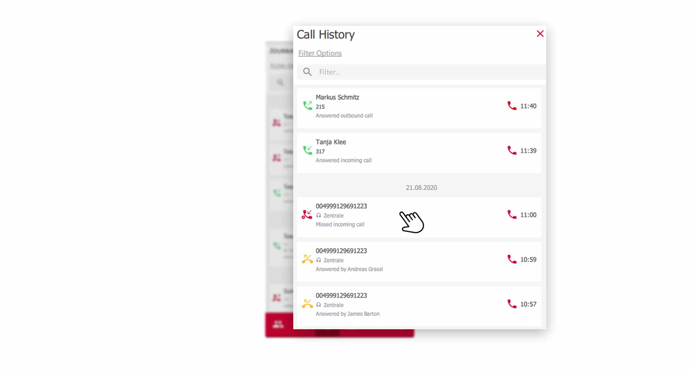


 

## Overview

In the call journal you will find the complete history of your calls. Filter options make it easy to find call records again and the detail function provides valuable information on each individual call.

## Open the Call History

Click on the **Call History** icon in the menu bar to access the journal.

*Open Call History via the pascom Menue*
 

## Use Filters of the Call History

Click on **Filter Options** in the upper part of the call history.

*The Call History within the pascom Client*
 

In the **Filter-Options** you have some setting options.

*Additional filter options in the call journal*
 

### Call Type

Filter the call history by **internal** / **external**, or by **both** call types.

### Call Direction

Filter the call history by **incoming** / **outgoing** or **both** call directions.

### Call Result

Filter the call history by **accepted** / **missed** calls, or view **All** call results.

### Show more Journal Entries

Show or hide more entries like **voicemailbox**, **system calls**, **faxes** etc. in your call history. 

### Integrate team history into the call history

You can choose from which queue (of which you are a member) call data is included in your journal. 

## Call history icons explained

In the call journal, you will find **symbols** on the right-hand side of each call record, which allow you to see at a glance how the **call direction** and the **call result** went.

*Icons in the call history show useful information*

In addition, small arrows indicate the **call direction**. **Inbound / Outbound** or **Connected**.

1. by clicking on the **red handset** in each call record, you start a **callback**.

## Access further call details.

The call journal shows you even more data on each individual call. Click on the desired call record and you will get to the **detail view**.

In the **detail view** you can follow the complete process through the pascom telephone system.

*Even more data, for every call*

Find data to **call history**, last **3 calls**, details on **caller** and data from the **phone book**.

{}
Tip: Click on the **red info icon** in the "last 3 calls" section. This will take you to the corresponding call record and you can evaluate it further.
{}

## Use Team Call History

The team call history provides a complete overview of all calls made in the team you are a member of. More information about pascom teams can be found in the following [guide]()

To open the **Team Journal** in your **Team**, click on **Team Journal**.

*Call data of the queue in your team*

### Team journal filtering and customization

In the **Team-Journal** all functions, filters and settings are available to you again, just like in your personal call history.

Additionally, you can integrate the Team Journal into your personal journal, as described in this [Tutorial]().

### Team-Journal explained

The **team journal** is essentially no different from your **personal call journal**. 

*The Team-Journal in detail*

In call records created from a **Team** you can get the following additional information.

1. In which **Team** the call record was created. e.g. **Support**.
2. What happened to the call (**call result**), as well as which colleague from your team answered / took the call.   

 

